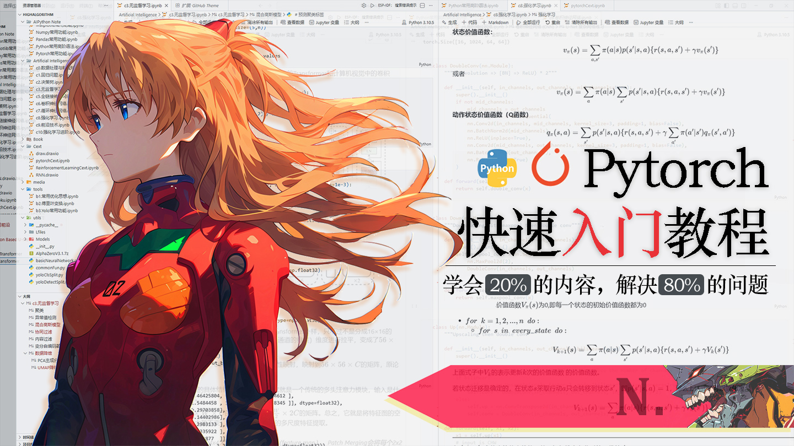

  
  <h1>📘 明日香 · PyTorch 快速入门保姆级教程</h1>
  
<strong>学会 20% 的核心，解决 80% 的问题</strong>

  

    
    
    
    
    
  

---

## 🎯 项目初衷

如果你也曾被**官方文档**的晦涩难懂、或者**面面俱到却抓不住重点**的长篇教程劝退过——  
那么你来对地方了。

这份教程是我在学习深度学习与 PyTorch 过程中，**将个人笔记反复优化、结合 AI 辅助打磨而成**。  
全篇 **10+ 万字**，专为 **PyTorch 0 基础**的同学设计，只有一个目标：

> **用尽可能少的篇幅，帮你掌握最实用的技能。**

只讲 **20% 的核心功能**，但足以覆盖你日常开发中 **80% 的使用场景**。  

没有那些故弄玄虚的专业术语堆砌，不刻意营造“高深感”，也不绕弯子，而是真的站在学习者的角度，把复杂的原理拆解成通俗易懂的步骤，从基础到进阶层层递进。

完整笔记内容在`source`文件夹中，推荐在线阅读。

---

## 📖 完整目录

点击展开目录（共 20 章）

**一. 前言**  
**二. PyTorch 安装**  
**三. 张量 Tensor**  

- 3.1 张量基础  
- 3.2 常用张量创建与操作  
- 3.3 随机数与抽样  
- 3.4 张量的布尔操作  
- 3.5 张量的索引  
- 3.6 张量变换  
- 3.7 张量的基本运算  

**四. GPU 运算**  
**五. 自动微分**  
- 5.1 数学概念  
- 5.2 自动微分的使用  
- 5.3 detach  
- 5.4 no_grad  
- 5.5 grad_fn  
- 5.6 autograd.grad  

**六. 自动微分练习**  
**七. 数据加载与处理**  

- 7.1 DataSet  
- 7.2 DataLoader  
- 7.3 划分数据集  

**八. 常用图像处理**  
- 8.1 图像读取  
- 8.2 图像变换  

**九. 基本神经网络层**  
- 9.1 全连接层  
- 9.2 ReLU 层  
- 9.3 Sequential 容器  
- 9.4 批归一化层  
- 9.5 Dropout 层  

**十. 常用激活函数层**  
- 10.1 LeakyReLU  
- 10.2 SiLU  
- 10.3 Sigmoid  
- 10.4 Tanh  

**十一. 常用损失函数层**  
- 11.1 BCEWithLogitsLoss  
- 11.2 CrossEntropyLoss  
- 11.3 L1 Loss  
- 11.4 MSE Loss  
- 11.5 Smooth L1 Loss  

**十二. 自定义神经网络**  
- 12.1 自定义层  
- 12.2 模型参数初始化  
- 12.3 自定义模型  

**十三. 常用卷积层**  
- 13.1 图像卷积  
- 13.2 最大池化  
- 13.3 平均池化  
- 13.4 自适应池化  
- 13.5 上采样  
- 13.6 转置卷积  
- 13.7 展平层  
- 13.8 2D 批归一化  

**十四. 经典卷积网络解析**  
- 14.1 LeNet-5  
- 14.2 AlexNet  
- 14.3 VGGNet  
- 14.4 ResNet  
- 14.5 U-Net  

**十五. 卷积的使用技巧**  
- 15.1 卷积核大小选择  
- 15.2 通道数设计  
- 15.3 网络深度  
- 15.4 池化层选择  

**十六. 循环神经网络层**  
- 16.1 RNN  
- 16.2 LSTM  
- 16.3 GRU  
- 16.4 Transformer  
- 16.5 一维卷积  
- 16.6 一维池化  
- 16.7 嵌入层  

**十七. 优化器**  
- 17.1 完整训练与评估流程  
- 17.2 SGD  
- 17.3 Adagrad  
- 17.4 Adam  
- 17.5 RMSprop  
- 17.6 优化器进阶用法  
- 17.7 学习率调度器  

**十八. 模型参数与结构**  
- 18.1 参数保存与加载  
- 18.2 断点续训  
- 18.3 模型结构分析  

**十九. 其它实用功能**  
- 19.1 FP16 半精度训练  
- 19.2 FP16 半精度推理  
- 19.3 进度条  

**二十. 总结**  

---

## 🚀 适合谁看？

- **刚入门深度学习**，想找一个“能看懂、能跑通”的 PyTorch 教程  
- **被官方文档劝退过**，需要更通俗、更聚焦的讲解  
- **希望快速上手做项目**，不想被过多理论细节拖慢进度  
- **有一定基础，但想系统梳理 PyTorch 核心 API** 的开发者

---

## ✨ 教程特色

- ✅ **10 万字精讲**：内容扎实，但绝不注水  
- ✅ **保姆级节奏**：手把手带你写代码，每一步都讲清“为什么”  
- ✅ **聚焦核心**：只讲 20% 的高频用法，覆盖 80% 的实际场景  
- ✅ **经典案例**：LeNet、AlexNet、VGG、ResNet、U-Net 等网络逐行解析  
- ✅ **前沿覆盖**：Transformer、半精度训练、断点续训等实用技能  
- ✅ **多平台阅读**：知乎、掘金、微信公众号，随时可看

---

## 📚 在线阅读

- [知乎专栏](https://www.zhihu.com/people/fancyc-38)  
- [稀土掘金](https://juejin.cn/user/4355593566170010)  
- 微信公众号 **Narrastory**

---

## 🤝 贡献与反馈

如果你在阅读过程中发现：

- 代码无法运行
- 表述有歧义
- 希望补充某个知识点

欢迎提Issue或直接 PR。
你的每一条反馈，都会让这份教程变得更好。

---

## 📢 关注作者

如果这份教程对你有帮助，欢迎关注我的公众号 **Narrastory**。
我会在这里持续分享 AI算法，深度学习工具以及全栈开发方面的干货与实践心得。

  
<em>扫码关注，一起成长</em>
 

---

## 📄 许可证

本项目采用<a rel="license" href="http://creativecommons.org/licenses/by-nc-sa/4.0/">知识共享署名-非商业性使用-相同方式共享 4.0 国际许可协议</a>进行许可。

 如果这份教程帮到了你，欢迎给个 ⭐️ Star 支持一下～  Built with ❤️ by Ming · 2026.03 
 
