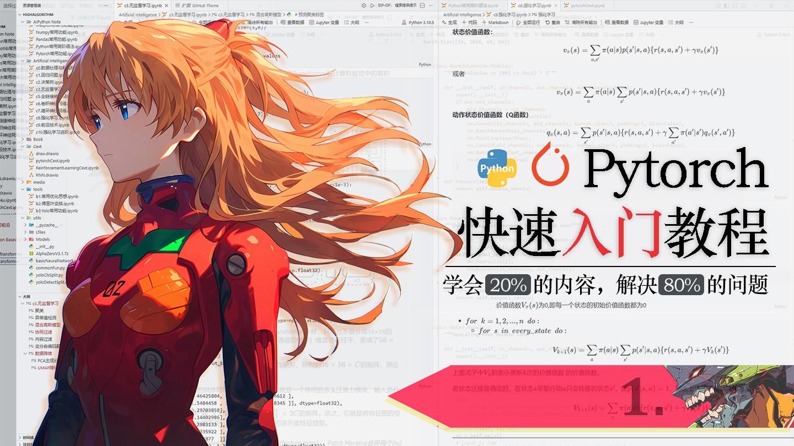
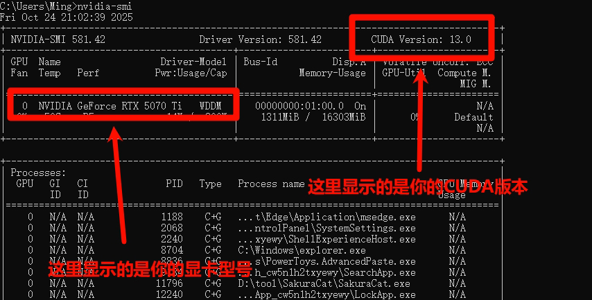
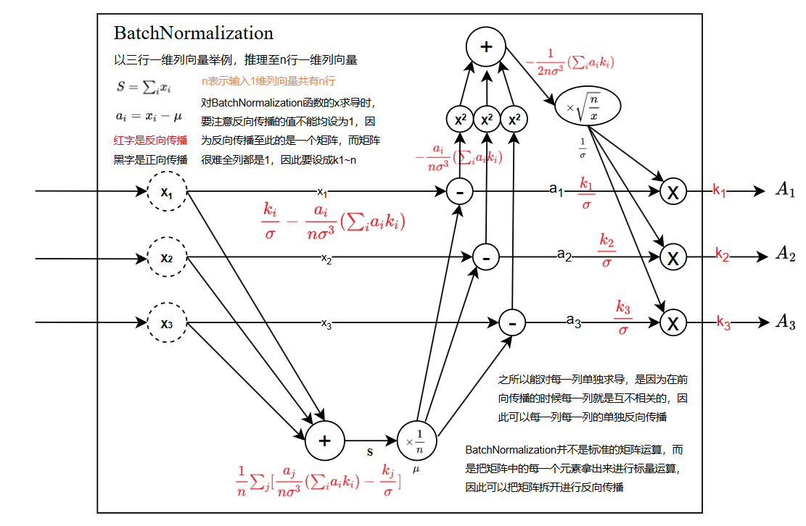
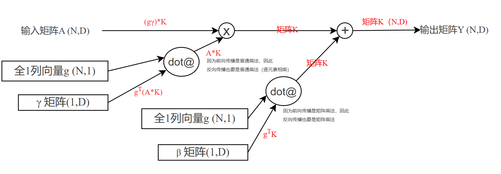

# 明日香 - Pytorch 快速入门保姆级教程(一)

`2026.02 | ming`

------

<div align="center">
  
</div>


## 一. 前言

**什么是PyTorch？**简单来说，只要你涉足深度学习，PyTorch 几乎是绕不开的核心工具。它是一个基于 Python 的深度学习框架（PyTorch是一个Python库），如今，无论是学术研究还是工业应用，PyTorch 都已成为构建、训练和部署各类 AI 模型的主流选择之一。它是每一个人工智能学习者必须掌握的工具。

**但是，你真的要现在学习Pytorch吗？**相信很多刚刚开始接触人工智能的同学，都或多或少听说过PyTorch，它太有名了，仿佛 PyTorch 就是深度学习的代名词，甚至很多人都认为学习深度学习就等于学习PyTorch，这种想法完全就是本末倒置。PyTorch 本质上是一个工具。

举个例子吧，想象一下，你交给一位数学博士生一个卡西欧计算器，让他计算如下积分：
$$
\int_{0}^{2} \text{ln}(1+x^3)\frac{\text{sin}(x)}{x}\text{d}x
$$
他只需要按部就班地输入表达式，计算器自然会返回答案；但如果你把这个同样的计算器交给一个小学生，让他算出这个式子的结果，他可能无从下手，为什么？因为他都看不懂这些符号，甚至觉得这是英语题，更别说要去按哪个键了！**这里的“计算器”，就相当于 PyTorch**。它只是一个工具，会不会用，用的好不好，取决于使用者的理论基础。

因此，一个更舒适、更高效的人工智能学习路径应该是循序渐进的：

```
数学基础（高等数学、线性代数、概率论）
    ↓
编程基础（Python、NumPy、Matplotlib、Pandas）
    ↓
机器学习基础
    ↓
深度学习基础 + PyTorch
    ↓
强化学习
    ↓
深度学习前沿
    ↓
   ...
```

也就是说，要想顺畅地学习本系列教程（或其他任何 PyTorch 教程），你至少应具备：

- 高等数学与线性代数的基本概念
- Python 编程基础
- NumPy 数组操作经验
- 对机器学习基本流程（如训练/测试集划分、损失函数、梯度下降）的初步理解
- 熟悉全连接神经网络的前向与反向传播过程

这里有两道简单的题目，你可以自行检测一下，如果你能独立解答出来，那么就说明你已经具备足够的基础，可以顺利的开始学习PyTorch了。

> 题一：请使用Python编写一个名为 `gradient` 的函数，使用数值微分方法，计算任意多元函数在给定点的各个维度上的偏导数。
>
> 题二：请使用计算图辅助的方式推导 Batch Normalization 层的反向传播数学公式。
>
> *答案在文章末尾*

即使你看不懂上面的题目也完全不用担心，这里我强烈推荐两个入门资源：**[吴恩达的机器学习课程](https://www.bilibili.com/video/BV1owrpYKEtP)** 与书籍 **《深度学习入门：基于Python的理论与实现》**。这两个都是我亲自学习过并认为非常宝藏的资料，可以说我的人工智能之路正是从它们起步的。（尤其是这个鱼书，真的是非常简单易懂，没有那些故作高深晦涩难懂的内容，如果你之前没看过一定要看一遍，它已经完完全全把全链接神经网络讲透了，极力推荐！👍）


当然了，你也可以翻看我以往发布的人工智能相关的教程文章，都是清晰直白简单易懂的风格哦。而且，现在的AI大模型那么发达，有不懂的地方完全可以让AI来帮你辅助理解。

由于 PyTorch 的内容极其丰富，一篇文章难以覆盖全面，因此本系列教程将分为多个篇章，由浅入深逐步展开。你可以关注我的个人主页，等待未来更新，或者查看历史文章以获取完整的教程合集，方便系统学习。


## 二. PyTorch的安装

本文提供安装方式是全局安装，就是最普通的安装方式，默认会将 PyTorch 安装到 C 盘。如果你已经熟悉 Python 虚拟环境（比如 `venv` 或 `conda`），非常推荐在虚拟环境里安装，专门设置一个环境来学习人工智能，这样做的好处是：以后不需要了可以直接删掉整个环境，不留下任何零碎文件，项目管理也更干净。

👉 **但是！** 如果你不想折腾，尤其是对Python还不太熟悉的同学，**我还是推荐全局安装**。它虽然听起来“不够高级”，却能帮你避开 80% 的环境配置坑——毕竟对于初学者来说，“先跑起来”比“跑得漂亮”重要得多。

⚠️ 需要注意的是，PyTorch 及其相关组件体积较大，总共约 3GB 左右。如果你选择全局安装，请务必确保 C 盘有足够的剩余空间。

如下以Windows和Linux操作系统安装PyTorch为例来讲解其安装过程：

首先，你需要确定自己的电脑显卡型号，这将决定你要安装哪个版本的Pytorch。

打开 **命令行窗口**（Win + R → 输入 `cmd` → 回车；Linux 打开 Terminal），在**命令行窗口（cmd）** 输入`nvidia-smi`并且回车来查看本机显卡信息。

如果出现类似下图的信息，说明你的电脑有英伟达显卡，并且可以看到右上角的 **CUDA Version**（例如 11.8、12.1 等）。



**如果看到这个界面**，请检查 CUDA 版本是否 ≥ 11.8，否则就要去更新显卡驱动；

**如果提示 `nvidia-smi` 不是内部或外部命令**，说明你的电脑**没有 英伟达显卡，或显卡太老**，那么你只能用CPU来进行模型的训练和推理，这会比使用显卡（GPU）的慢很多，但用来学习和测试是完全没问题的。这种情况你就要在**命令行窗口（cmd）**输入下述命令并回车来安装CPU版本的Pytorch：

```shell
pip install torch torchvision torchaudio
```

另外，如果你是苹果操作系统macOS，那么只要用上面的指令就会自动安装苹果芯片（M系列）或 Intel 芯片对应的 PyTorch 版本，并且默认启用 Metal 加速（MPS），虽然不是英伟达 GPU，但速度也比纯 CPU 快不少。

如果你的显卡是RTX 30/40 系列等，你可以使用下面的指令来安装PyTorch（这是目前最主流的情况，CUDA 版本 ≥ 12.1 均可使用）

```shell
pip install torch torchvision torchaudio --index-url https://download.pytorch.org/whl/cu121
```

如果你的显卡是RTX50系列的显卡，你**必须**使用下面的指令来安装PyTorch

```shell
pip install torch torchvision torchaudio --index-url https://download.pytorch.org/whl/cu129
```

如果你的显卡是稍微老一点的显卡，你可以使用下面的指令来安装PyTorch

```shell
pip install torch torchvision torchaudio --index-url https://download.pytorch.org/whl/cu118
```

💡 **小提示**：PyTorch 的安装包体积较大，下载过程可能需要一些时间，请耐心等待。如果速度极慢，可以在命令末尾加上 `-i https://pypi.tuna.tsinghua.edu.cn/simple` 换用国内清华镜像源。

安装完成后，命令行末尾会出现类似 `Successfully installed torch-x.x.x ...` 的提示。
但这还不算完，**你必须运行下面这段 Python 代码**，来确认 PyTorch 真的装好了、并且能识别你的显卡（如果你有的话）。

新建一个 `.py` 文件，写入并运行：

```python
import torch

# 1. 查看 PyTorch 版本
print("PyTorch 版本:", torch.__version__)

# 2. 检查 CUDA（英伟达显卡加速）是否可用
print("CUDA 可用:", torch.cuda.is_available())

# 3. 如果可用，再进一步查看显卡信息
if torch.cuda.is_available():
    print("当前设备索引:", torch.cuda.current_device())
    print("显卡名称:", torch.cuda.get_device_name(torch.cuda.current_device()))
    print("显卡数量:", torch.cuda.device_count())
else:
    print("当前使用 CPU 模式。")
```

```python
# GPU版输出示例
PyTorch 版本: 2.5.0+cu121
CUDA 可用: True
当前设备索引: 0
显卡名称: NVIDIA GeForce RTX 4060 Laptop GPU
显卡数量: 1

# CPU版输出示例
PyTorch 版本: 2.5.0
CUDA 可用: False
当前使用 CPU 模式。
```

如果上述方法都无法顺利安装，或者在某个步骤（很多时候是下载速度太慢了）卡住了，别担心，推荐使用DeepSeek或者豆包这种大语言模型来进行一对一疑难解决，请耐心、详细地向它描述你遇到的问题（例如，完整复制错误信息），相信AI会给你答案。无论你最后是通过何种方式安装好的PyTorch，请**务必**要运行一次上面的PyThon测试代码，来检查你的PyTorch是否安装成功。


## 三. 张量 Tensor

### 3.1 张量基础

在深度学习中，张量（Tensor）是一个核心概念，你可以把它理解为数据的容器。其实，张量这个名字听起来有点抽象，但它本质上就是我们在数学和编程中已经熟悉的标量、向量和矩阵的统称：

- **0阶张量**：就是一个单独的数，比如 `5`、`3.14`，也就是标量。
- **1阶张量**：是一个有序的数的集合，比如 `[1, 2, 3]`，也就是向量。
- **2阶张量**：是一个二维的表格，比如 `[[1, 2], [3, 4]]`，也就是矩阵。
- **3阶张量**：可以看作多个矩阵堆叠在一起，形成一个三维数组，比如一系列图像（每个图像是矩阵）组成的批次。

推广到更一般的 $n$ 阶张量，它就是一个 $n$ 维数组。所以，你可以把“张量”当作一个**高维数组**的同义词。

在 PyTorch 中创建张量的方式非常灵活，语法与 NumPy 创建数组很相似，甚至可以直接在两者之间互相转换。首先，我们需要导入 PyTorch 库：

```python
import torch	# 导入 PyTorch 库，
```

最直接的方式是使用 `torch.tensor()` 函数，传入一个列表或 NumPy 数组：

```python
import numpy as np

# 从列表创建
torch_a = torch.tensor([[1, 2], [3, 4]])
print(torch_a)

# 从 NumPy 数组创建
np_a = np.array([[1, 2], [3, 4]])
torch_b = torch.tensor(np_a)   # 或者用 torch.from_numpy(np_a)
print(torch_b)
```

输出都是：

```python
tensor([[1, 2],
        [3, 4]])
```

**小技巧**：如果你已经熟悉 NumPy 的各种操作（例如创建全零数组、随机数组等），可以先用 NumPy 生成复杂的数据，再转换为 PyTorch 张量，这样可以快速上手，不必重新学习所有创建函数。

创建好张量后，我们常常需要了解它的形状（shape）和数据类型（dtype）。

**形状（Shape）**：通过 `.shape` 属性获取，它返回一个 `torch.Size` 对象，本质上是一个元组，表示张量在每个维度上的大小。

```python
a = torch.tensor([[1, 2, 4], [3, 4, 1]])
print(a.shape)          # 输出：torch.Size([2, 3])
print(a.shape[0])       # 输出：2（第一维大小，即行数）
print(a.shape[1])       # 输出：3（第二维大小，即列数）
```

`torch.Size([2, 3])` 表示这是一个 2 行 3 列（或者说形状为 2×3）的二维张量。

**数据类型（dtype）**：通过 `.dtype` 属性获取，它返回张量中每个元素的数据类型。

```python
a = torch.tensor([[1, 2, 4], [3, 4, 1]])
print(a.dtype)   # 输出：torch.int64
```

默认情况下，如果你用整数列表创建张量，PyTorch 会使用 64 位整数（`torch.int64`），而用浮点数列表则会使用 32 位浮点数（`torch.float32`）。

PyTorch 支持多种数据类型，以满足不同的精度和性能需求。下表列出了一些常用类型：


| 数据类型                 | 描述                          | 取值范围/精度             |
|--------------------------|-------------------------------|--------------------------|
| `torch.float32`          | 32位单精度浮点数              | ~1e-38 到 ~1e38, 7位精度 |
| `torch.float64`          | 64位双精度浮点数              | ~1e-308 到 ~1e308, 15位精度 |
| `torch.float16`          | 16位半精度浮点数              | 适合GPU加速，精度较低     |
| `torch.bfloat16`         | 16位脑浮点数（Google提出）    | 动态范围与float32相似     |
| `torch.int8`             | 8位有符号整数                 | [-128, 127]              |
| `torch.uint8`            | 8位无符号整数                 | [0, 255]                 |
| `torch.int16`            | 16位有符号整数                | [-32768, 32767]          |
| `torch.int32`            | 32位有符号整数                | [-2^31, 2^31-1]          |
| `torch.int64`            | 64位有符号整数                | [-2^63, 2^63-1]          |
| `torch.bool`             | 布尔值                        | `True` / `False`         |

在深度学习中，最常用的浮点类型是 `torch.float32`和 `torch.float16`。一般情况下，我们没有必要创建64位的整数和浮点数张量，因为64位太大了，不仅占用非常多的存储空间，而且在运算的时候也会占用更多的显存资源和计算资源。通常情况下，32位，16位就够了。`float32` 是默认精度，兼顾了精度和计算效率；`float16` 则可以大幅减少显存占用并加速运算（尤其在支持半精度加速的 GPU 上），但可能带来微小的精度损失。近年来甚至出现了 4 位浮点数（如 NVIDIA 的 FP4），进一步提升了推理速度，但是精度损失也比较大。

你可以在创建张量时通过 `dtype` 参数明确指定数据类型（大多数创建张量的方法都可以跟一个dtype参数指定类型）：

```python
a = torch.tensor([[1, 2, 4], [3, 4, 1]], dtype=torch.float16)
print(a.dtype)   # 输出：torch.float16
```

**注意**：如果你传入整数却指定浮点类型，整数会被转换为对应的浮点数（如 1 变成 1.0）。反之，如果传入浮点数却指定整数类型，小数部分会被截断（如 1.9 变成 1）。

如果已经创建了一个张量，但需要改变它的数据类型，可以使用 `.to()` 方法。这个方法会返回一个**新张量**，原张量的数据和类型保持不变。

```python
x = torch.tensor([1, 2, 3])          # 默认 int64
new_x = x.to(torch.float32)           # 转换为 float32

print(new_x.dtype)   # 输出：torch.float32
print(x.dtype)       # 输出：torch.int64 （原张量未改变）
```

这种机制非常灵活，你可以根据需要生成不同精度的副本，而不会意外修改原始数据。

### 3.2 常用张量创建与操作

在深度学习中，我们经常需要快速创建各种初始化的张量，或者对已有张量进行重组。PyTorch 提供了大量便捷的函数，让我们能够像使用 NumPy 一样轻松地操纵数据。

PyTorch 可以直接创建全零、全一、单位矩阵等特殊张量。

```python
# 全1张量，形状为 (2, 3)
a = torch.ones((2, 3))  
# 全0张量，形状为 (1, 8)
b1 = torch.zeros((1, 8)) 
# 全0行向量，长度为8（注意：形状为 (8,) 的一维张量）
b2 = torch.zeros(8)      
# 3x3 的单位矩阵（对角线为1，其余为0）
c = torch.eye(3)         

print(a)
print(b1)
print(b2)
print(c)
# ==== 输出 ====
tensor([[1., 1., 1.],
        [1., 1., 1.]])
tensor([[0., 0., 0., 0., 0., 0., 0., 0.]])
tensor([0., 0., 0., 0., 0., 0., 0., 0.])
tensor([[1., 0., 0.],
        [0., 1., 0.],
        [0., 0., 1.]])
```
**注意**：`torch.zeros(8)` 创建的是一个长度为 8 的一维张量，形状为 `(8,)`；而 `torch.zeros((1, 8))` 创建的是形状为 `(1, 8)` 的二维张量（即一个只有一行的矩阵）。两者虽然元素都是 0，但维度不同，在后续运算中可能会有区别。

有时候我们希望生成一个和现有张量形状完全相同的全零或全一张量，比如在初始化梯度或掩码时。这时可以使用 `torch.zeros_like()` 或 `torch.ones_like()`。

```python
a = torch.tensor([[1, 2, 3], [4, 5, 6]])  # 形状 (2, 3)
b = torch.zeros_like(a)                   # 创建与a形状相同的全0张量
c = torch.ones_like(a)                    # 创建与a形状相同的全1张量
print(b)
print(c)
# ==== 输出 ====
tensor([[0, 0, 0],
        [0, 0, 0]])
tensor([[1, 1, 1],
        [1, 1, 1]])
```
**注意**：`zeros_like` 会继承原张量的数据类型（dtype）和设备（CPU/GPU），如果你希望改变数据类型，可以在参数中指定，例如 `torch.zeros_like(a, dtype=torch.float32)`。

`torch.empty()` 会返回一个未初始化的张量，里面的值是当时内存中随机残留的数据，因此看起来是“随机”的。它的优势是创建速度极快，因为不需要逐个元素赋值。通常在你确定后面会覆盖所有元素时使用，比如作为临时缓冲区。

```python
empty_tensor = torch.empty(3, 4)   # 创建 3行4列 的未初始化张量
print(empty_tensor)
# ====输出可能类似（每次运行结果可能不同）====
tensor([[2.3694e-38, 2.3694e-38, 2.3694e-38, 2.3694e-38],
        [2.3694e-38, 2.3694e-38, 2.3694e-38, 2.3694e-38],
        [2.3694e-38, 0.0000e+00, 0.0000e+00, 0.0000e+00]])
```

当你需要复制一个张量，并且希望新张量与原张量完全独立（互不影响）时，可以使用 `.clone()` 方法。它会进行深度拷贝，新张量拥有自己的内存空间。

```python
a = torch.tensor([[1, 2, 3], [4, 5, 6]])
b = a.clone()          # b 和 a 内容相同，但内存独立
b[0, 0] = 100          # 修改 b 不会影响 a
print(a)
print(b)
# ==== 输出 ====
tensor([[1, 2, 3],
        [4, 5, 6]])
tensor([[100, 2, 3],
        [4, 5, 6]])
```
**重要**：直接赋值（如 `b = a`）只是让 `b` 成为 `a` 的一个引用，两者指向同一块内存，修改其中一个另一个也会变。所以需要独立副本时务必使用 `clone()`。

像 NumPy 一样，PyTorch 也提供了生成等差或等间隔序列的函数。

```python
# torch.arange(start, end, step) 生成从 start 到 end（不包括 end），步长为 step 的一维张量
a = torch.arange(0, 10, 2)      # 输出：tensor([0, 2, 4, 6, 8])

# torch.linspace(start, end, steps) 生成从 start 到 end（包括两端），共 steps 个等间隔点的张量
b = torch.linspace(0, 10, 5)    # 输出：tensor([ 0.0000,  2.5000,  5.0000,  7.5000, 10.0000])
```

如果一个张量只包含一个元素（例如损失值），你可以用 `.item()` 方法将其转换为标准的 Python 数值（如 float 或 int），方便打印或与其它 Python 库交互。

```python
a = torch.tensor([1.234])
print(a)           # 输出：tensor([1.2340])
b = a.item()       # 提取为标量
print(b)           # 输出：1.2339999675750732 
```

在实际项目中，我们经常需要将多个张量组合在一起。PyTorch 提供了两种主要方式：`torch.cat`（拼接）和 `torch.stack`（堆叠）。理解它们的区别非常重要。

拼接是在**现有维度**上连接张量，不会增加新的维度。你需要指定在哪个维度（轴）上进行连接，且除了该维度外，其它维度的形状必须完全相同。

```python
# 张量拼接
a = torch.tensor([[1, 2, 3], [4, 5, 6]])	# 形状(2,3)
b = torch.tensor([[7, 8, 9], [10, 11, 12]]) # 形状(2,3)

# 沿维度0连接（垂直堆叠）
c0 = torch.cat((a, b), dim=0)
# c0形状: [4, 3]
# tensor([[ 1,  2,  3],
#         [ 4,  5,  6],
#         [ 7,  8,  9],
#         [10, 11, 12]])

# 沿维度1连接（水平拼接）
c1 = torch.cat((a, b), dim=1)
# c1形状: [2, 6]
# tensor([[ 1,  2,  3,  7,  8,  9],
#         [ 4,  5,  6, 10, 11, 12]])
```

堆叠是在**新维度**上合并张量，它会创建一个新的维度，并将各个张量作为新维度的元素。因此，要求所有待堆叠的张量形状完全相同，并且新维度的大小就是堆叠的张量个数。

```python
# 张量堆叠，与张量拼接不同，张量堆叠，如同字面意思，将张量在新维度堆叠起来，创建一个新的维度
a = torch.tensor([[1, 2, 3], [4, 5, 6]])	# 形状(2,3)
b = torch.tensor([[7, 8, 9], [10, 11, 12]]) # 形状(2,3)

# 沿新维度 0 堆叠，结果形状 (2, 2, 3)
stacked = torch.stack((a, b), dim=0)
# stacked形状为(2,2,3)
# tensor([[[ 1,  2,  3],
#          [ 4,  5,  6]],
#
#         [[ 7,  8,  9],
#          [10, 11, 12]]])

# 沿新维度 1 堆叠，结果形状 (2, 2, 3) 但排列不同
stacked2 = torch.stack((a, b), dim=1)
#  tensor([[[ 1,  2,  3],
#           [ 7,  8,  9]],
#
#          [[ 4,  5,  6],
#           [10, 11, 12]]])
```

我知道这里有点难以理解，就是参数`dim`究竟是如何指定的，以及应该用哪一个函数进行拼接。

**举个例子**：

假设有两个张量，形状都是 `(3, 4, 5)`（三维），我们想要把它们合并成形状 `(6, 4, 5)` 的张量。

- 合并后维度数不变（还是三维），只是第 0 维从 3 变成了 6 → 所以应该用 `torch.cat`，并且 `dim=0`（因为改变的是第 0 维，形状元组中的第0个元素改变了，因此dim=0）。

如果我们想得到一个形状为 `(2, 3, 4, 5)` 的张量，即把两个 `(3,4,5)` 的张量当作两个样本堆叠在一起，增加了一个新维度在最前面 → 应该用 `torch.stack`，并且 `dim=0`（新维度插入在最前面）。

**再练习一下**：

- 两个形状 `(3, 4, 5)` 张量，想要合并成 `(3, 8, 5)` → 用 `cat`，`dim=1`（改变第 1 维）。
- 两个形状 `(3, 4, 5)` 张量，想要合并成 `(3, 4, 10)` → 用 `cat`，`dim=2`（改变第 2 维）。
- 两个形状 `(3, 4, 5)` 张量，想要合并成 `(3, 2, 4, 5)`（在第二个维度位置插入新维度） → 用 `stack`，`dim=1`。

### 3.3 随机数与抽样

随机数在深度学习中无处不在：初始化模型参数、打乱数据、实现 dropout、采样潜在变量……可以说，没有随机性，深度学习模型就缺少了探索和泛化的灵魂。因此我们必须要掌握常用的随机数生成和抽样方法。

先从最基础的随机数生成开始，这些函数在 NumPy 中都有对应的版本，如果你熟悉 NumPy，可以快速上手。

```python
# 1. 均匀分布 [0, 1)
rand_tensor = torch.rand(2, 3)   # 生成 2 行 3 列的张量，每个元素在 [0, 1) 内均匀分布

# 2. 标准正态分布 (均值 0, 标准差 1)
randn_tensor = torch.randn(3, 2) # 生成 3 行 2 列的张量，元素服从 N(0,1)

# 3. 均匀分布的整数 [low, high)
int_tensor = torch.randint(low=0, high=10, size=(2, 4))  # 2行4列，整数范围 [0, 10)
```

**详细解释：**

- `torch.rand(size)`：最常用的均匀分布，常用于生成初始化输入或噪声。
- `torch.randn(size)`：标准正态分布，常用于初始化权重（配合后续缩放）。
- `torch.randint(low, high, size)`：生成整数随机数，适合创建标签或索引。

除了这些，你还可以使用 `torch.normal(mean, std, size)` 生成指定均值和标准差的正态分布：

```python
# 生成均值为 2，标准差为 0.5 的正态分布，形状 (2, 3)
normal_tensor = torch.normal(mean=2.0, std=0.5, size=(2, 3))
```

另外，打乱数据顺序是训练模型时的标准操作，`torch.randperm` 可以生成一个从 0 到 n-1 的随机排列，常用于索引打乱。

```python
perm = torch.randperm(10)   # 生成 0~9 的随机排列
print("randperm:", perm)
# 示例输出：tensor([0, 2, 9, 1, 7, 5, 6, 4, 3, 8])
```

在强化学习或生成模型中，经常需要根据给定的概率分布进行采样。`torch.multinomial` 就可以实现采样。

```python
# 定义三个类别的概率（必须是非负且和为1）
probs = torch.tensor([0.1, 0.6, 0.3])   # 索引 0,1,2 的概率分别为 10%, 60%, 30%

# 采样 1 个样本（默认无放回）
sample = torch.multinomial(probs, 1)     # 返回采样到的索引
print(f"单次采样索引: {sample.item()}")   # 例如 1

# 采样 5 次，允许有放回 (replacement=True)
samples = torch.multinomial(probs, 5, replacement=True)
print(f"有放回采样5次: {samples}")        # 例如 tensor([1, 2, 1, 1, 0])
```

**参数说明**：

- `input`：概率张量，可以是一维（每个类别的概率）或二维（每行是一个概率分布），值不需要归一化（会自动归一化），但必须非负。
- `num_samples`：采样次数。
- `replacement`：是否放回。

**注意**：如果输入是多维张量，`multinomial` 会对每一行独立进行采样，返回形状为 `(输入行数, num_samples)` 的张量。

最后，为了让实验结果可复现，我们必须固定随机数生成器的种子。PyTorch 中通过 `torch.manual_seed(seed)` 设置 CPU 上的随机种子。如果有 GPU 参与，还需要设置 CUDA 的种子：

```python
seed = 42
torch.manual_seed(seed)       # 设置 CPU 随机种子
torch.cuda.manual_seed(seed)   # 设置当前 GPU 随机种子（如果使用 GPU）
```

### 3.4 张量的布尔操作

在数据处理和模型编写中，我们经常需要根据某些条件筛选数据、判断元素是否满足要求，或者对张量进行掩码操作。这时，**布尔操作**就派上了用场。布尔操作的结果是一个布尔型（`torch.bool`）张量，其中的每个元素都是 `True` 或 `False`。

PyTorch 支持逐元素的比较运算符，用法和 Python 原生运算符类似，只不过它们会作用在张量的每个元素上，并返回一个相同形状的布尔张量。

```python
a = torch.tensor([1, 2, 3, 4, 5])
b = torch.tensor([5, 4, 3, 2, 1])

print(a > b)    # tensor([False, False, False,  True,  True])
print(a == 3)   # tensor([False, False,  True, False, False])
print(a != b)   # tensor([ True,  True, False,  True,  True])
```

也可以将标量与张量比较，此时标量会被广播（broadcast）到与张量相同的形状：

```python
c = torch.tensor([[1, 2], [3, 4]])
print(c > 2)   # 输出：tensor([[False, False], [ True,  True]])
```

布尔张量最常用的场景就是作为“掩码”（mask）来筛选原张量中的元素。只需将布尔张量放在索引的中括号内，就会返回所有对应位置为 `True` 的元素组成的一维张量。

```python
x = torch.tensor([10, 20, 30, 40, 50])
mask = x > 25
print(mask)          # tensor([False, False,  True,  True,  True])
selected = x[mask]    # 或者直接 x[x > 25]
print(selected)      # tensor([30, 40, 50])
```

```python
y = torch.tensor([[1, 6], [8, 3], [2, 9]])	# 二维张量
mask = y > 5
print(mask)
# 输出：
# tensor([[False,  True],
#         [ True, False],
#         [False,  True]])
selected = y[mask]
print(selected)   # tensor([6, 8, 9])   # 一维，只包含满足条件的元素
```

有时我们只想知道张量中是否存在满足条件的元素，或者是否所有元素都满足条件。这时可以用 `torch.any()` 和 `torch.all()`。

- `torch.any()`：只要有一个 `True` 就返回 `True`。
- `torch.all()`：所有元素都为 `True` 才返回 `True`。

```python
x = torch.tensor([1, 2, 3, 4, 5])
print(torch.any(x > 4))   # tensor(True)  因为存在 5>4
print(torch.all(x > 0))   # tensor(True)  因为所有元素都大于0
print(torch.all(x > 2))   # tensor(False) 因为1和2不大于2
```

也可以指定 `dim` 参数，沿着某个维度进行判断：

```python
mat = torch.tensor([[1, 2], [3, 4]])
print(torch.all(mat > 1, dim=0))   # 沿着列方向：每一列是否全部大于1 -> tensor([False,  True])
print(torch.any(mat < 2, dim=1))   # 沿着行方向：每一行是否存在小于2的元素 -> tensor([ True, False])
```

如果我们不仅想要筛选出的值，还想知道它们的位置，可以使用 `torch.nonzero()`。它返回一个张量，其中每一行是一个非零（即 `True`）元素的索引。

```python
x = torch.tensor([5, 0, 3, 0, 8])
mask = x > 0
indices = torch.nonzero(mask)
print(indices)   # 输出：tensor([[0], [2], [4]])   # 每一行是一个索引

# 对于二维张量
y = torch.tensor([[0, 5, 0], [2, 0, 9]])
indices_2d = torch.nonzero(y > 0)
print(indices_2d)
# 输出：
# tensor([[0, 1],
#         [1, 0],
#         [1, 2]])
```

`torch.where(condition, x, y)` 根据条件从 `x` 和 `y` 中选择元素：如果条件为 `True`，选 `x` 对应位置的值，否则选 `y` 的值。这在实现分段函数或自定义损失时很有用。

```python
x = torch.tensor([[1, 2, 3], [3, 4, 5]])
y = torch.tensor([[-1, -2, -3], [-4, -5,-1]])
cond = x > 3
result = torch.where(cond, x, y)
print(result)
# 输出
# tensor([[-1, -2, -3],
#         [-4,  4,  5]])
```

### 3.5 张量的索引

PyTorch 提供了非常灵活且强大的索引机制，几乎与 NumPy 的索引语法完全一致。如果你已经熟悉 NumPy，那么本节内容对你来说将如虎添翼；如果你是新手，也别担心，这些规则简单直观，一学就会。

张量最基本的索引方式就是使用方括号 `[]`，里面可以传入整数、切片（`:`）或它们的组合。

```python
# 创建一个 5行4列 的随机整数张量，范围 0~9
arr = torch.randint(low=0, high=10, size=(5, 4))
print("原始 arr:\n", arr)

print('第0行:\n',arr[0]) 
print("第0行第1列元素:\n", arr[0,1])
print("第0行到第2行:\n", arr[0:3])
print("第1行到第2行+第1列:\n", arr[1:3,1])
print("第3行~最后1行:\n", arr[3:])
print("最开始1行~第2行+第1列~第2列:\n", arr[:3, 1:3])
# 还可以来点跳跃，步长：start:stop:step，第 1 行到第 4 行，间隔为 2，即第 1、3 行
print("第1,3行:\n", arr[1:4:2])
print("第1列:\n",arr[:,1])
print("最后1行:", arr[-1])              # 等价于 arr[4]
print("倒数第2行到最后1行:\n", arr[-2:]) 
```

**输出示例**（每次运行结果可能不同）：

```python
原始 arr:
 tensor([[0, 0, 2, 7],
        [3, 0, 3, 5],
        [9, 1, 1, 9],
        [3, 0, 2, 1],
        [9, 0, 0, 1]])

第0行:
 tensor([0, 0, 2, 7])

第0行第1列元素:
 tensor(0)

第0行到第2行:
 tensor([[0, 0, 2, 7],
        [3, 0, 3, 5],
        [9, 1, 1, 9]])

第1行到第2行+第1列:
 tensor([0, 1])

第3行~最后1行:
 tensor([[3, 0, 2, 1],
        [9, 0, 0, 1]])

最开始1行~第2行+第1列~第2列:
 tensor([[0, 2],
        [0, 3],
        [1, 1]])

第1,3行:
 tensor([[3, 0, 3, 5],
        [3, 0, 2, 1]])

第1列:
 tensor([0, 0, 1, 0, 0])

最后1行: tensor([9, 0, 0, 1])

倒数第2行到最后1行:
 tensor([[3, 0, 2, 1],
        [9, 0, 0, 1]])
```

**关键点**：

- 索引中单独的 `:` 表示选取该维度的全部。
- 负索引非常实用，尤其在不知道张量大小时想取最后几行/列。

在使用切片索引时，PyTorch 返回的是原张量的**视图**，这意味着新张量和原张量共享同一份数据内存。修改视图会影响原张量，反之亦然。这样做可以节省内存和提高速度。如果你需要一份独立的副本（修改互不影响），可以使用3.2节中提到的 `.clone()` 方法：

注意这个**视图(View)**和**副本(Copy)**这两个不同的概念。

```python
a = torch.tensor([[1, 2, 3], [4, 5, 6]])
b = a[0:2, 0:2]   # 视图：b 是 a 左上角 2x2 区域的视图
print("b 初始:\n", b)
b[0, 0] = 100     # 修改 b
print("修改后的 a:\n", a)   # a 也跟着变了
```

```python
# 输出
b 初始:
 tensor([[1, 2],
        [4, 5]])
修改后的 a:
 tensor([[100,   2,   3],
        [  4,   5,   6]])
```

除了连续切片，你还可以使用整数列表或张量来指定任意顺序的行或列。这种索引方式称为**花式索引**，它返回的是**副本**而非视图。

```python
print("第3行和第1行:\n", arr[[3,1]])
print("第3行和第1行+第0列:\n", arr[[3,1],2])
# 输出
第3行和第1行:
 tensor([[3, 0, 2, 1],
        [3, 0, 3, 5]])

第3行和第1行+第0列:
 tensor([2, 3])
```

### 3.6 张量变换

张量变换，顾名思义，就是改变一个张量的形状，或对其进行旋转，转置等操作。PyTorch 提供了一系列简单而强大的函数来完成这些操作，本节将带你掌握最常用的几种张量变换技巧。

`view()` 和 `reshape()` 都可以用来改变张量的形状，但它们有一个关键区别：`view()` 要求新形状与原始张量在内存中是**连续**的，而 `reshape()` 更加灵活，会在必要时自动创建副本。这两个函数本质功能都是一样的。

```python
x = torch.randn(4, 4)          # 形状 (4, 4)
y = x.view(2, 8)                # 变成 (2, 8)
z = x.view(16)                  # 变成一维 (16,)
w = x.reshape(-1, 2)               # -1 表示自动推断该维度大小，结果 (8, 2)
print(x.shape, y.shape, z.shape, w.shape)
# ==== 输出 ====
torch.Size([4, 4]) torch.Size([2, 8]) torch.Size([16]) torch.Size([8, 2])
```

**-1 的妙用**：当我们不确定某个维度的大小，但希望其他维度固定时，可以使用 `-1` 让 PyTorch 自动计算。例如，`x.view(-1, 2)` 表示将张量变成两列，行数自动计算为总元素数除以 2。

**`view()` 与 `reshape()` 的区别**：

- `view()` 要求张量在内存中是连续的（即底层数据按行顺序紧密排列）。大多数由常规操作创建的张量都是连续的，但经过 `transpose()`、`permute()` 等操作后可能变得不连续，此时 `view()` 会报错。
- `reshape()` 更健壮：如果原张量连续，它与 `view()` 行为相同；如果不连续，它会先创建副本使数据连续，再进行重塑。

总之，如果你的代码需要更高的容错性，推荐使用 `reshape()`；如果你对自己的技术很自信，并且追求高性能高效率，可以用 `view()`。

那么如何判断一个张量是否连续呢？有下面的例子：

```python
x = torch.randn(2, 3)      # 创建一个 2x3 的张量，是连续的
x_t = x.t()                # 转置后得到 3x2，但此时的新张量在内存中不连续
# 使用.is_contiguous()函数来判断一个张量是否在内存中连续
print(x_t.is_contiguous())  # 输出 False

try:
    y = x_t.view(3, 2)      # 试图用 view 改变形状，会报错
except RuntimeError as e:
    print(e)
```

**注意**：`view()` 返回的新张量与原始张量**共享数据内存**，修改其中一个会影响另一个。`reshape()` 在可能的情况下也会共享内存（如果原张量连续），否则会创建一个副本。

如果你需要增加或者减少张量的维度，那么就需要`unsqueeze(dim)`和`squeeze(dim)`函数。

- **`unsqueeze(dim)`**：在指定的 `dim` 位置插入一个大小为 1 的新维度。
- **`squeeze(dim)`**：移除指定维度上大小为 1 的维度，如果不指定 `dim`，则移除所有大小为 1 的维度。

```python
x = torch.tensor([1, 2, 3])    # 形状为 (3,) 的向量
x_unsq0 = x.unsqueeze(dim=0)   # 在维度0插入，形状变成 (1, 3)
x_unsq1 = x.unsqueeze(dim=1)   # 在维度1插入，形状变成 (3, 1)
print(x_unsq0)
print(x_unsq1)
# 输出
tensor([[1, 2, 3]])
tensor([[1],
        [2],
        [3]])
```

```python
y = torch.randn(1, 2, 1, 3)     # 创建一个形状为 (1, 3, 1, 5) 的随机张量
y1 = y.squeeze()              # 移除所有大小为1的维度，得到 (3, 5)
y2 = y.squeeze(dim=2)    # 只移除第2维（索引2），得到 (1, 3, 5)
print(y1)
print(y2)
# 输出示例
tensor([[0.5218, 0.2507, 1.8845],
        [0.4582, 0.8689, 0.6099]])
tensor([[[0.5218, 0.2507, 1.8845],
         [0.4582, 0.8689, 0.6099]]])
```

如果你对dim参数还不是很能理解，可以回看第3.2小节。

`flatten()` 可以将张量维度“拉平”成一维，变成一个一维向量。

```python
x = torch.randn(2,2,3)  # 创建一个形状为 (2, 2, 4) 的随机张量
x_flat = x.flatten()    # 展平所有维度，形状变为 (24,) 的向量
print(x_flat)
# 输出示例
tensor([ 0.7653,  0.4888,  0.3970, -0.1901, -0.0595, -1.3364, -1.0169, -0.7248, -1.3950, -0.3401,  0.8599, -0.1753])
```

在pytorch中，有非常多的“转置”操作，常用的有如下三个：

- **`t()`**：专门用于二维张量（矩阵）的转置。
- **`transpose(dim0, dim1)`**：交换任意两个维度。
- **`permute(*dims)`**：按照给定的顺序重新排列所有维度。

```python
# 二维转置
a = torch.tensor([[1, 2, 3],
                  [4, 5, 6]])          # 形状 (2, 3)
a_t = a.t()                             # 形状 (3, 2)
print(a_t)
# ==== 输出 ====
tensor([[1, 4],
        [2, 5],
        [3, 6]])
```

```python
# 高维张量交换两个维度
b = torch.arange(24).view(2, 3, 4)      # 形状 (2, 3, 4)
b_transposed = b.transpose(0, 2)        # 交换第0维和第2维，结果形状 (4, 3, 2)
print(b_transposed.shape)
# ==== 输出 ====
torch.Size([4, 3, 2])
```

```python
# 使用 permute 重新排列所有维度
b_permuted = b.permute(2, 1, 0)         # 将原维度顺序 (0,1,2) 变为 (2,1,0)，形状 (4, 3, 2)
print(b_permuted.shape)
# ==== 输出 ====
torch.Size([4, 3, 2])
```

**注意**：`transpose` 和 `permute` 操作返回的新张量与原始张量**共享数据内存**，但数据的存储顺序可能变为不连续。

`torch.rot90()` 可以将张量在指定的平面内旋转 90 度的倍数，具体几倍由参数`k`决定。这在图像增强、空间数据处理时很有用。

```python
# 二维旋转
a = torch.tensor([[1, 2],
                  [3, 4]])
a_rot90 = torch.rot90(a, k=1, dims=[0, 1])   # 逆时针旋转90度
print(a_rot90)
# ==== 输出 ====
tensor([[2, 4],
        [1, 3]])
```

```python
# 三维张量，在最后两个维度上旋转
b = torch.tensor([[[1, 2], [3, 4]],
                  [[5, 6], [7, 8]]])         # 形状 (2, 2, 2)
b_rot90 = torch.rot90(b, k=2, dims=[1, 2])   # 在第1、2维平面旋转180度
print(b_rot90)
# ==== 输出 ====
tensor([[[4, 3],
         [2, 1]],
        [[8, 7],
         [6, 5]]])
```

参数说明：

- `k`：旋转次数（90° × k），正数表示逆时针，负数表示顺时针。
- `dims`：指定旋转的平面，由两个维度索引组成，例如 `[0,1]` 表示在行-列平面内旋转，这个参数可能有点难以理解，尤其是在高维张量的旋转中，总之自己多去尝试一下，找找规律，不过也不用太担心，因为一般情况下我们只会用到2维矩阵的旋转，3维和更高维张量的旋转几乎很少使用的到。

### 3.7 张量的基本运算

在 PyTorch 中，张量的数学运算非常丰富，而且大部分都与 NumPy 风格一致，上手非常容易。掌握这些基础运算是构建神经网络的前置条件。

最基本的四则运算、幂运算和平方根，PyTorch 都支持运算符重载，使用起来和 NumPy 一样直观。

```python
a = torch.tensor([[1, 2, 3],
                  [4, 5, 6.]])   # 形状 (2, 3)
b = torch.tensor([[1, -2, 13.]]) # 形状 (1, 3)

# 算术运算：加减乘除、幂、平方根
add = a + b          # 加法，利用了广播机制
sub = a - b          # 减法
mul = a * b          # 逐元素乘法（不是矩阵乘法！）
div = b / a          # 除法
pow = a ** 2         # 幂运算（每个元素平方）
sqrt = torch.sqrt(a) # 平方根
```

**广播机制**：当两个张量形状不同时，PyTorch 会自动尝试扩展维度使它们相容。规则与 NumPy 完全一致。

除了基本运算，还有各种初等函数，如对数、指数、三角函数等。

```python
# 对数与指数
b = torch.tensor([[1, -2, 13.]])
log_b = torch.log(b)          # 自然对数（以 e 为底），注意负数会得到 nan
log2_b = torch.log2(b)         # 以 2 为底的对数
log10_b = torch.log10(b)       # 以 10 为底的对数
exp_b = torch.exp(b)           # e 的幂次方

# 三角函数（角度以弧度制）
angles = torch.tensor([0, torch.pi/2, torch.pi])
sin = torch.sin(angles)   # [0., 1., 0.]
cos = torch.cos(angles)   # [1., 0., -1.]
tan = torch.tan(angles)   # [0., 无穷大, 0.] （π/2 处为无穷大）

# 数学常数
print(torch.pi)    # 3.141592653589793
print(torch.e)     # 2.718281828459045
```

**聚合运算：**是指对整个张量或沿着某个维度计算统计量。这类操作在计算损失、评估模型时必不可少。非常重要！

```python
matrix = torch.tensor([[1, 2, 3],
                       [3, 4, 5.]])   # 形状 (2, 3)

# 全局聚合
sum_all = torch.sum(matrix)            # 所有元素之和 → 18
mean_all = torch.mean(matrix)          # 所有元素均值 → 3.0
max_all = torch.max(matrix)            # 全局最大值 → 5
min_all = torch.min(matrix)            # 全局最小值 → 1
prod_all = torch.prod(matrix)          # 所有元素乘积 → 1*2*3*3*4*5=360

# 沿指定维度聚合
sum_col = torch.sum(matrix, dim=0)     # 按列求和（dim=0 表示行索引变化，即跨行求和）→ [4, 6, 8]
mean_row = torch.mean(matrix, dim=1)   # 按行求平均 → [2., 4.]
max_row = torch.max(matrix, dim=1)     # 返回每行最大值和索引 → values=[3.,5.], indices=[2,2]
min_col = torch.min(matrix, dim=0)     # 每列最小值 → [1,2,3]

# 其他聚合函数
std = torch.std(matrix)                # 标准差
var = torch.var(matrix)                # 方差
median = torch.median(matrix)          # 中位数
# 下面这两个方法非常常用！
argmax = torch.argmax(matrix, dim=1)   # 每行最大值索引 → [2,2]
argmin = torch.argmin(matrix, dim=1)   # 每行最小值索引 → [0,0]
```

**注意**：任何聚合函数都可以指定 `dim` 参数，`dim`参数指定的维度会被聚合掉。可以指定`keepdim`参数为`True`来保持维度不变。如下

```python
matrix = torch.tensor([[1,-2,3],[4,5,2]])
argmax = torch.argmax(matrix, dim=1,keepdim=True)   # 保持结果维度不变
argmin = torch.argmin(matrix, dim=1)
print(argmax)
print(argmin)
# 输出
tensor([[2],
        [1]])
tensor([1, 2])
```

线性代数是深度学习的基石。PyTorch 提供了非常丰富的线性代数操作。

```python
A = torch.tensor([[1, 2],
                  [3, 4]])
B = torch.tensor([[5, 6],
                  [7, 8]])

C = A @ B	# 矩阵乘法

# 矩阵求逆（要求方阵且可逆）
inv_A = torch.linalg.inv(A)   # 逆矩阵
det_A = torch.linalg.det(A)   # 矩阵行列式 → -2.0
rank_A = torch.linalg.matrix_rank(A)  # 矩阵的秩 → 2
trace_A = torch.trace(A)      # 迹（对角线元素之和）→ 1+4=5

# 特征值与特征向量
eigenvalues, eigenvectors = torch.linalg.eig(A)  # 返回复数张量
```

```python
# 点积（向量内积）
v1 = torch.tensor([1., 2., 3.])
v2 = torch.tensor([4., 5., 6.])
dot = torch.dot(v1, v2)   # 1*4 + 2*5 + 3*6 = 32
```

**范数：**常用的范数就是`L1`和`L2`范数，直接解释范数可能难以理解，总之，范数就是来衡量一个向量的大小的，`L1`范数就是向量元素的绝对值之和，`L2`范数就是求一个向量的欧几里得距离

```python
x = torch.tensor([3., 2., 1., 5., 7.])

# L2 范数（欧几里得距离）
norm_l2 = torch.norm(x)               # sqrt(3^2+2^2+1^2+5^2+7^2) ≈ 9.695
# L1 范数（绝对值之和）
norm_l1 = torch.norm(x, p=1)           # 3+2+1+5+7 = 18

# 若是矩阵，则可以将矩阵的每一列或每一行看成向量进行范数计算
y = torch.tensor([[3., 2., 1. , 5., 7.],
                  [1., 4., 6. , 5., 4.]])
normy_l2 = torch.norm(y,dim=1,keepdim=True)    # 可以指定dim和keepdim参数
```

**其它实用函数**

```python
# 绝对值、符号
a = torch.tensor([[-1, 2, -3], [4, -5, 6]])
abs_a = torch.abs(a)        # [[1, 2, 3], [4, 5, 6]]
sign_a = torch.sign(a)      # [[-1, 1, -1], [1, -1, 1]]

# 取整
b = torch.tensor([1.2, 2.7, -0.9, -2.3])
floor_b = torch.floor(b)             # 向下取整 → [1., 2., -1., -3.]
ceil_b = torch.ceil(b)                # 向上取整 → [2., 3., -0., -2.]
round_b = torch.round(b)              # 四舍五入 → [1., 3., -1., -2.]
trunc_b = torch.trunc(b)              # 截断整数部分 → [1., 2., -0., -2.]

# 裁剪：将小于设定值的值变成最小值，最大值同理。
c = torch.tensor([1, 5, 3, 8, 2])
clamped = torch.clamp(c, min=2, max=6)  # 限制在 [2,6] 之间 → [2,5,3,6,2]
```

前面展示的所有运算都会**创建新的张量**来存放结果，原张量不变。但在深度学习中，显存（或内存）非常宝贵，频繁创建新张量会造成不必要的开销。为此，PyTorch 为许多操作提供了**原地版本**，即在原张量内存上直接修改数据，不会开辟新空间来存储计算结果，函数名通常以下划线 `_` 结尾。

```python
a = torch.tensor([[1, 2, 3],
                  [4, 5, 6.]])
b = torch.tensor([[1, -2, 13.]])

a.add_(b)      # a + b，结果保存在 a 中
a.sub_(b)      # a - b
a.mul_(b)      # a * b
a.div_(b)      # a / b
a.pow_(2)      # a ** 2
a.sqrt_()      # sqrt(a)

a.zero_()           # 将所有元素置为 0
a.fill_(3.14)       # 将所有元素填充为 3.14
a.abs_()            # 取绝对值
a.log_()			# log(a)
a.sin_()			# sin(a)
a.tan_()			# tan(a)
a.log2_()			# log2(a)
...
```

你可能会觉得，至于吗，明明`a = a + b`就可以解决的事，偏偏还要设计一个函数`a.add_(b)`，其实在PyTorch中，如 `a = a + b`实际上会创建新张量并让 `a` 指向新内存，而旧内存并没有被销毁，这非常重要！

```python
Y = torch.tensor([1.0, 2.0, 3.0])
before = id(Y)	# id函数能返回一个变量的内存地址
Y = Y + 1.0                # 创建新张量，Y 指向新内存
print(id(Y) == before)     # False
```

这里 `Y = Y + 1` 分配了新内存，然后让 `Y` 指向新地址。如果网络参数很多且频繁更新，这种分配会消耗大量显存并降低速度。但是你可以使用下面的写法来原地对`Y`进行操作：

```python
Y = torch.tensor([1.0, 2.0, 3.0])
before = id(Y)	# id函数能返回一个变量的内存地址
# 使用切片原地修改
Y[:] = Y + 1.0             # 仍然创建了新张量（Y+1.0），但随后赋值给原内存
print(id(Y) == before)     # True
```

**注意**：原地操作虽然高效，但**可能破坏自动求导的计算图**。如果张量需要计算梯度，那么对其使用原地操作会导致梯度计算错误。**因此应该谨慎使用原地操作**。


## 附录：自测题参考答案

**题一：**

数学原理：
$$
\frac{\partial f(\mathbf{x} )}{\partial x_{i}} = \lim_{h \to 0} \frac{f(x_{1},x_{2},...x_{i}+h,...,x_{n})-f(x_{1},x_{2},...x_{i}-h,...,x_{n})}{2h}
$$

```python
# 求多元函数在指定维度上的偏导数
def partial_derivative(func, point, dim, h= 1e-7):
    point_plus = point.copy()
    point_minus = point.copy()
    
    point_plus[dim] += h
    point_minus[dim] -= h

    return (func(point_plus) - func(point_minus)) / (2 * h)

# 求多元函数在任意一点的各个维度上的偏导数
def gradient( func, point, h = 1e-7 ):
    return [partial_derivative(func, point, i, h) for i in range(len(point))]
```

**题二：** （推荐看完鱼书后再来看下面的推导会更加容易理解）

`Batch Normalization`层会对输入进来的矩阵的每一列进行如下处理，假设有一列元素 $[x_{1},x_{2},...,x_{n}]^{T}$
$$
\mu = \frac{1}{n} \sum_{i=1}^{n}x_{i} 
$$

$$
\sigma^{2} = \frac{1}{n} \sum_{i=1}^{n}(x_{i} -\mu )^{2}
$$

$$
x_{i} \gets \frac{x_{i}-\mu }{\sqrt{\sigma^{2}+\varepsilon}},\space (\varepsilon是一个极小值，防止分母为0)
$$

每一列经过这样的处理得到一个新的矩阵 $A$，然后做如下处理得到最终的输出 $Y$ (如下的 $\gamma$ 和 $\beta$ 都是一维行向量)
$$
Y = (1_{N} \gamma) \odot A + 1_{N} \beta
$$
$1_{N}$ 是全为1的一维列向量，$\odot$ 是逐元素相乘符号，下图中的 $dot@$ 运算就是矩阵乘法

如下为反向传播的具体推导





```python
# BatchNormalization层实现代码
class BatchNormalization():
    def __init__(self, gamma, beta):
        self.sigma = None
        self.mu = None
        self.a = None
        self.gamma = gamma
        self.beta = beta
        self.dGamma = None
        self.dBeta = None
        self.out = None

    def forward(self, x):
        self.mu = np.average(x, axis=0)
        self.a = x - self.mu
        self.sigma = np.std(x, axis=0)
        x = (x - self.mu) / self.sigma
        self.out = x * self.gamma + self.beta
        return self.out

    def backward(self,dout):
        self.dBeta = np.sum(dout,axis=0)
        self.dGamma = np.sum(self.out * dout,axis=0)
        dinput = dout * self.gamma
        n = self.a.shape[0]
        eak = np.sum(self.a * dinput, axis=0)
        plus1 = (
            np.sum(self.a * eak / (n * self.sigma**3) - dinput / self.sigma, axis=0) / n
        )
        plus2 = -self.a * eak / (n * self.sigma**3) + dinput / self.sigma
        return plus1 + plus2
```

