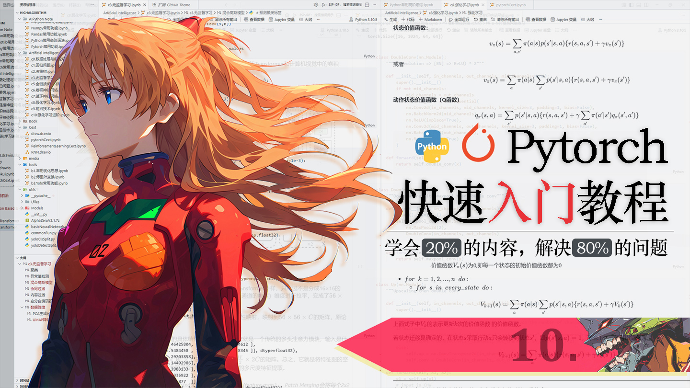
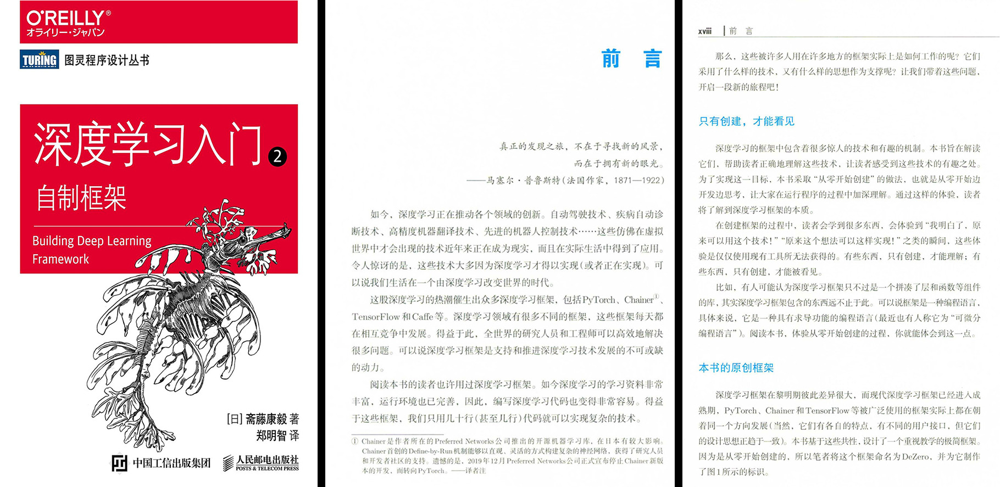
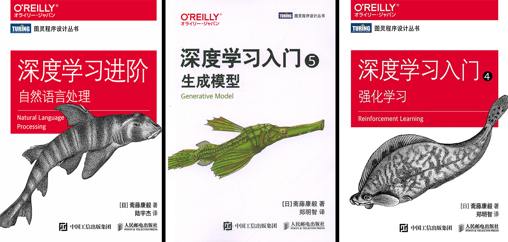

# 明日香 - Pytorch 快速入门保姆级教程(十) 完结

`2026.04 | ming`

------

<div align="center">
  
</div>


## 十九. 其它

### 19.1 FP16半精度训练

到这里，相信大家已经能熟练搭建模型、处理数据、定义优化器了，但是在实际训练中，肯定都遇到过一个 “头疼” 的问题：要么就是显卡显存不够，要不就是显卡算力不足，算的太慢了。尤其是训练 3D 图像、视频这类大数据量，或是搭建深层的复杂模型时，哪怕 batch size 只设为 1，显卡内存都可能告急；这时候就可以使用半精度来进行训练，不论是显存的占用，还是算力的消耗，都会大大减少。

先从 PyTorch 默认的浮点数存储方式说起。我们在第一章就讲解过PyTorch的数据格式，它默认用的是`torch.float32`，这种格式占 32 位内存，小数点后能保留更多位数，数据精度非常高。但是对于**绝大多数深度学习任务，其实根本用不上这么高的精度**。而 FP16（半精度浮点型）只占**16 位内存**，存储位数直接减半。这带来两个核心好处：

1. **显存占用减半**：同样的 batch size 下，显存使用量直接减少 50%，相当于你用一块 8G 显存的显卡，能达到 16G 显存的效果；
2. **计算速度翻倍**：GPU 对 16 位数据的计算效率远高于 32 位，算力直接拉满，训练周期大幅缩短。

我自己在学到这一章的时候，我就想，这还不简单，直接把模型所有的参数格式直接改成`torch.float16`，训练数据集的格式也全部改成`torch.float16`不就行了。

```python
model = MyModel()
model.to(torch.float16)  # 转换模型参数为torch.float16
```

但是这个想法是错误的！实战中千万不能这么用！

`model.to(torch.float16)`只会把**模型参数**转成 float16，但前向传播的计算逻辑，PyTorch 默认还是用 float32 执行。这就会出现一个尴尬的情况：模型参数是 float16，输入数据和计算逻辑是 float32，两种类型混在一起，PyTorch 直接抛出**类型不匹配错误**，训练根本跑不起来。

另外，FP16 的数值范围很小（大概在 ±65504 之间），而模型训练的梯度值往往非常小（接近 0）。用纯 FP16 训练时，小数值的梯度会被 FP16 的精度 “截断”，直接变成 0—— 这就是**梯度下溢**。梯度一旦变成 0，优化器就无法更新模型参数，训练直接停滞，这是致命问题。

再者，FP16 的精度有限，一些敏感操作（比如 Softmax、Log、交叉熵计算）在纯 FP16 环境下很容易出现数值溢出（结果变成无穷大或无穷小），导致模型数值不稳定，根本无法收敛。所以，纯 FP16 训练是个 “伪命题”，咱们真正要用的，是**混合精度训练**—— 这才是兼顾效率、稳定性的最优解。

混合精度训练的核心逻辑很简单：**关键计算用 FP16 提速，敏感操作用 FP32 保稳定，再配合梯度缩放避免梯度下溢**。PyTorch 官方提供了`torch.cuda.amp`模块，专门帮我们搞定混合精度训练，不用自己手动处理各种细节，开箱即用。

在使用前，先认识两个核心工具：

- `autocast()`：自动混合精度上下文管理器，能自动识别哪些操作用 FP16、哪些用 FP32，不用我们手动判断；
- `GradScaler()`：梯度缩放器，专门解决梯度下溢问题，动态调整缩放因子，保护小梯度不消失。

```python
# 导入混合精度训练所需的核心工具
from torch.cuda.amp import autocast, GradScaler
device = torch.device('cuda')

# 初始化模型、优化器、损失函数
model.to(device)
optimizer = optim.Adam(model.parameters(), lr=1e-3)
criterion = nn.CrossEntropyLoss()

# 创建梯度缩放器
scaler = GradScaler()

for epoch in range(epochs):  # epochs是你设置的训练轮数
    for data, target in dataloader:
        # 1. 数据移到GPU（和常规训练一致，无需手动转float16）
        data, target = data.cuda(), target.cuda()
        
        # 2. 清空梯度（常规操作，避免梯度累积）
        optimizer.zero_grad()
        
        # 3. 自动混合精度核心：前向传播在autocast上下文内执行
        # 这里autocast会自动决定用FP16还是FP32计算
        with autocast():
            output = model(data)  # 模型前向传播
            loss = criterion(output, target)  # 计算损失（替换成你自己的损失函数）
        
        # 4. 缩放损失 + 反向传播（关键：避免梯度下溢）
        # 先放大损失值，再反向传播，让梯度足够大，不被FP16截断
        scaler.scale(loss).backward()
        
        # 5. 更新参数 + 调整缩放因子
        # scaler.step会自动缩放梯度，再传给优化器更新参数
        scaler.step(optimizer)
        # 每一步更新后，调整缩放因子（为下一次训练做准备）
        scaler.update()
```

**注意：**必须用 GPU 训练，`torch.amp`只支持 CUDA 设备，CPU 上无法使用，所以一定要记得把模型、数据都移到 GPU 上。

### 19.2 FP16半精度推理

半精度推理要比半精度训练要简单得多，因为**不需要反向传播，也不需要梯度缩放器（GradScaler）**。

核心只需要两点：

1. **`torch.no_grad()`**：关闭梯度计算，节省显存并加速。
2. **`autocast()`**：依然需要它来让模型在支持的层自动使用 FP16 计算。

```python
import torch
from torch.cuda.amp import autocast
device = torch.device('cuda')

# 1. 准备模型
model.to(device)
model.eval()  # 关键：设置为评估模式（关闭 Dropout, 固定 BatchNorm 统计量）

# 加载训练好的权重
checkpoint = torch.load('best_model.pth')
model.load_state_dict(checkpoint)

# 2. 准备数据 (输入通常保持 FP32，autocast 会在模型内部处理转换)
data = data.to(device)  # 假设 data 已经是 FP32 的 Tensor

# 3. 开始推理
with torch.no_grad():          # 关键：不计算梯度
    with autocast():           # 关键：启用混合精度
        output = model(data)   # 注意：在使用output时要先检查一下output的类型
```

除了使用 `autocast`，还有一种更“彻底”的半精度推理方式，就是直接将模型权重和数据都转换为 FP16。这种方式在某些部署场景（如导出 ONNX 或 TensorRT 前）很常见。

```python
# 方法二：显式转换模型为 FP16
device = torch.device('cuda')
model.to(device)
model.eval()
model.half()  # 将整个模型权重强制转换为 float16

# 数据也需要对应转换为 half
data = data.to(device).half() 

with torch.no_grad():
    output = model(data)  # 此时不需要 autocast，因为模型已经是 FP16 了
```

**`autocast` vs `model.half()` 怎么选？**

- 推荐 `autocast` (方案 1)
  - **更安全**：训练时使用的是 AMP（混合精度），意味着模型中可能有些层（如 BatchNorm 或某些 Loss 层）必须用 FP32。`autocast` 会智能处理这些细节。
  - **兼容性**：不需要修改输入数据的预处理流程（输入可以保持标准的 FP32）。
- 使用 `model.half()` (方案 2)
  - **速度可能更快**：减少了运行时动态类型检查的开销。
  - **风险**：如果模型中有不支持 FP16 的算子，可能会报错或精度大幅下降。输入数据必须手动转为 `.half()`

### 19.3 进度条

在深度学习模型训练中，我们往往需要进行成百上千次迭代（epoch），尤其是数据集庞大、模型复杂的时候，单次训练耗时极长。如果没有直观的提示，我们只能盲目等待，既不知道训练走到了哪一步，也没法实时查看损失值、准确率等关键指标，甚至连训练有没有卡死都无法判断。

一个常用的方法就是命令行的进度条，如下图所示，相信你在很多场景下都见过这种进度条。


在PyTorch训练中，最常用、最轻便的进度条工具就是**tqdm**，它上手简单、功能齐全，完美适配深度学习训练场景，也是业内最主流的选择。

tqdm是Python的第三方库，全称是阿拉伯语“taqaddum”，意思是“进步”，专门用来生成美观、流畅的命令行进度条。它不需要复杂配置，导入之后几行代码就能实现效果，完全不用自己手动打印、刷新控制台，省心又好用。

在使用之前，我们需要先安装这个库：`pip install tqdm`

最基础的用法非常简单，把需要循环遍历的对象，用tqdm包装起来就行。不管是range循环、数据集迭代器，还是批量加载的dataloader，都能直接套用。

```python
from tqdm import tqdm
import time
import random

# 包装可迭代对象，生成进度条
pbar = tqdm(
    range(100),  # 迭代100次，模拟训练步数
    desc="processing:",  # 进度条前缀描述
    ncols=100,  # 进度条宽度
    unit="step",  # 进度单位
    leave=True  # 训练结束后保留进度条
)

# 开始循环
for i in pbar:
    # 模拟模型训练的耗时（反向传播、参数更新）
    time.sleep(0.01)
    # 实时更新描述文字
    pbar.set_description(f"Processing step %i" % i)
    # 右侧显示实时指标，比如损失、准确率
    pbar.set_postfix(loss=random.random(), gen=random.randint(1, 999))
```

在实际的PyTorch训练中，有时候我们没法直接把dataloader放进tqdm，或者需要自定义每一步的更新幅度，这时候就可以用**手动控制**的写法，自由度更高，也更贴合复杂训练流程。

手动模式用with语句开启，指定总步数，然后在循环里手动调用update方法：

```python
# 手动控制进度条
with tqdm(desc="processing:", ncols=100, total=100) as pbar:
    # 模拟大批次训练
    for i in range(10):
        # 模拟训练耗时
        time.sleep(0.05)
        # 手动更新进度，每次推进10步
        pbar.update(10)
```

`tqdm` 常用参数如下：

| 参数         | 参数说明                                                     | 使用示例                          |
| :----------- | :----------------------------------------------------------- | :-------------------------------- |
| `iterable`   | 需要包装的可迭代对象，比如range、列表、数据加载器，是进度条监听的循环主体 | `tqdm(range(100))`                |
| `desc`       | 进度条前方的描述文字，用来标注当前任务，比如训练、验证、测试 | `desc="Training epoch 1"`         |
| `total`      | 总迭代次数，也就是总步数，不知道具体数值可以省略；训练中一般设为数据集总批次数 | `total=len(dataloader)`           |
| `ncols`      | 进度条的整体宽度，控制控制台显示长度，避免换行或者过窄       | `ncols=100`                       |
| `unit`       | 进度单位，标注每一步代表什么，比如图片、步、批次，让进度更直观 | `unit="img"`、`unit="batch"`      |
| `unit_scale` | 自动换算大单位，比如步数过多时，自动转换成K、M，省去手动计算的麻烦 | `unit_scale=True`                 |
| `colour`     | 设置进度条颜色，让训练、验证进度条区分开，更醒目             | `colour='green'`、`colour='blue'` |
| `position`   | 多进度条同时显示时，指定当前进度条的位置，防止重叠错乱       | `position=0`                      |
| `leave`      | 控制训练结束后，是否保留进度条在控制台；True保留，False自动清除 | `leave=False`                     |


## 二十. 总结

至此，这份 PyTorch 快速入门保姆级教程，就正式告一段落啦 🎉！如果你是一步一个脚印、从头到尾跟着看到这里的朋友，一定要给自己点一个大大的赞👍——能沉下心来啃完入门内容、保持学习毅力的你，已经打败了绝大部分半途而废的学习者，只要这份坚持能一直延续，你一定能吃透人工智能的核心知识、扎根深度学习前沿，未来在AI领域闯出属于自己的一片天！

相信看到这里的你，已经系统掌握了 PyTorch 的核心用法和思想，也具备了将其运用到实际项目中的能力 ✨。我很清楚，这份教程并没有覆盖 PyTorch 的所有细节——毕竟框架的功能迭代很快，前沿特性也在不断更新，但现在的你，已经拥有了“自主学习”的核心能力，因为这篇教程里重点讲解的20%核心内容，已经能解决你日常80%的实操问题，而AI时代最宝贵的就是“借力学习”的思维：借助PyTorch官方文档、AI工具（如DeepSeek、千问），就能快速补全未涉及的知识点，轻松跟上框架更新的节奏。

这里必须提醒一句：光学不用可是学习深度学习的大忌哦 ❗️ “学而不思则罔”，对AI学习者来说，“学而不用则废”更贴切。接下来最重要的一步，就是动手实操——找几个贴合自己兴趣的深度学习小项目（比如图像分类、简单文本生成），用这篇教程里学的PyTorch知识，自己搭建模型、找公开数据集（Kaggle、天池上有很多适合新手的数据集），从零到一完成整个项目流程。哪怕过程中会遇到报错、模型不收敛、参数调不通的问题也没关系，这些都是成长的必经之路，多试几次、多查资料、多调试，你会发现：有些逻辑，只有亲手敲代码才能理清；有些原理，只有动手搭建才能吃透；有些能力，只有反复实践才能沉淀；有些东西，只有创建，才能理解；有些东西，只有创建，才能被看见 ✨。

不知道你在使用PyTorch的过程中，有没有过这样的好奇：它的自动反向传播到底是怎么实现的？🤔 我当年刚学PyTorch的时候，也被这个功能深深吸引，总觉得“一行代码就能完成梯度计算”太神奇了。如果你对框架的底层原理感兴趣，想亲手实现一个简易版的PyTorch、吃透自动微分的核心逻辑，那我非常推荐你去读《深度学习入门2：自制框架》这本书——这本书能帮你从底层拆解框架的实现逻辑，让你从“会用”变成“懂原理”，真正实现能力的进阶。



另外，如果你学完PyTorch，想继续深入深度学习的细分领域——比如自然语言处理（NLP）、生成模型（AI生图）、强化学习等，那我一定要给你推荐下面三本书，帮你少走弯路 📚：



细心的朋友应该会发现，这几本书的作者都是斋藤康毅——他也是我非常推崇和喜欢的一位作者。他的文字最大的特点，就是没有那些故弄玄虚的专业术语堆砌，不刻意营造“高深感”，也不绕弯子，而是真的站在学习者的角度，把复杂的原理拆解成通俗易懂的步骤，从基础到进阶层层递进，每个知识点都配了清晰的讲解和实操案例，他是真的想把知识讲明白，真的想让我们每个人都能学会。跟着他的书学，你会发现深度学习其实并没有那么难。

最后，也给大家送一个小福利 🎁：这份 PyTorch 教程系列的所有源文件、代码案例和图片素材，我都已经开源在了 [GitHub]( https://github.com/narrastory/Asuka-PyTorch-Tutorial) 上，大家有需要的话可以自行下载、学习，如果这份教程能帮到你一点点，能不能求一个star呀🥺，你们的支持，就是对我持续创作的最大鼓励。
