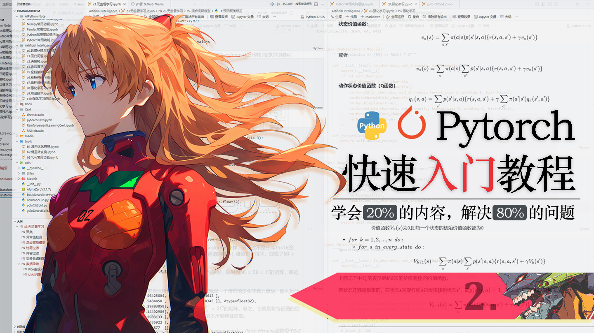

# 明日香 - Pytorch 快速入门保姆级教程(二)

`2026.02 | ming`

------

<div align="center">
  
</div>


## 四. GPU运算

在前面的章节中，我们学习了张量的各种操作，你可能觉得 PyTorch 的张量和 NumPy 的数组差别不大，都是对多维数组进行各种运算。但 PyTorch 有一个 NumPy 无法比拟的地方，那就是**GPU 加速**。通过显卡（GPU）进行张量运算，速度可以比 CPU 快几十倍甚至上百倍，尤其是处理大规模矩阵运算（如深度学习中的卷积、矩阵乘法）时，优势极为明显。

这一节，我们就来学习如何让 PyTorch 在 GPU 上跑起来，以及如何管理设备之间的数据迁移。

首先，我们要确认一下当前环境是否支持 GPU 运算（即 PyTorch 是否成功安装了 CUDA 版本，并且显卡驱动正常）。

```python
import torch

# 检测 CUDA 是否可用，如果输出 True，说明 GPU 可用
print(torch.cuda.is_available())

# 检测当前有多少块可用的 GPU
print(torch.cuda.device_count())
```

如果输出 `False`，说明你的 PyTorch 没有安装 CUDA 版本，或者显卡驱动有问题。这时可以回看第二章“PyTorch 安装”，按照教程重新安装 GPU 版本的 PyTorch。

为了方便管理张量所在的设备（CPU 或 GPU），PyTorch 提供了 `torch.device` 对象。你可以把它理解为一个“设备标签”，用来指示数据应该存放在哪里。

```python
# CPU 设备
device_cpu = torch.device('cpu')

# 第一个 GPU（如果你的电脑只有一块 GPU，可以简写为 'cuda'）
device_gpu_0 = torch.device('cuda:0')   # 索引 0 表示第一块 GPU

# 如果有第二块 GPU
device_gpu_1 = torch.device('cuda:1')   # 索引 1 表示第二块 GPU
```

创建张量时，可以通过 `device` 参数指定存放的设备。

```python
# 直接在 GPU（第一块）上创建张量
a_gpu = torch.tensor([[1, 2, 3], [4, 5, 6]], device=device_gpu_0)

# 在 CPU 上创建张量（默认不指定 device 就是 CPU）
b_cpu = torch.tensor([[1, 2, 3], [4, 5, 6]])
```

如果两个张量位于不同的设备（一个在 CPU，一个在 GPU），直接进行运算会报错。这是因为 GPU 无法直接访问 CPU 内存中的数据，反之亦然。

```python
# 尝试将 GPU 张量和 CPU 张量相乘
c = a_gpu * b_cpu   # 报错！不同设备不能直接运算
```

正确的做法是先把数据转移到同一个设备上，再进行计算。使用 `.to()` 方法可以将张量移动到指定设备。这个方法会返回一个新的张量（位于目标设备），原张量不变。

```python
# 将 CPU 上的张量转移到 GPU 上
b_gpu = b_cpu.to(device_gpu_0)

# 现在两个张量都在同一块 GPU 上，可以顺利运算
c_gpu = a_gpu * b_gpu

# 运算结果也存储在 GPU 显存中
print(c_gpu)
print(c_gpu.device)   # 查看所在设备
```

**注意：**数据在 CPU 和 GPU 之间的传输会消耗额外的时间。如果你的程序需要反复在两者间移动数据，性能反而可能下降。因此，**尽量在初始化阶段就将数据放到 GPU 上，后续所有计算都在 GPU 上完成**，只在必要时（如输出结果、保存模型）才将数据移回 CPU。只要是存储在显存中的数据之间的数学运算或者操作，都是用显卡来完成的，速度非常快！

在长时间训练或调试过程中，显存中可能会积累一些不再使用的中间变量（如旧的张量、计算图缓存）。如果不及时释放，可能会导致显存不足。

PyTorch 提供了以下几种方式来管理显存：

- **手动删除变量**：使用 `del` 关键字删除不再需要的张量，Python 的垃圾回收器会在合适的时候释放内存。
- **清空缓存**：调用 `torch.cuda.empty_cache()` 可以清空 PyTorch 的缓存，释放显存。

```python
# 删除变量
del a_gpu, b_gpu, c_gpu

# 清空缓存，释放显存
torch.cuda.empty_cache()
```

另外，如果你有多个 GPU，可以通过指定不同的 `device` 来分别管理数据。例如，将模型的不同部分放在不同 GPU 上，或者并行化训练模型。不过对于初学者，先掌握单个 GPU 的使用就足够应对大部分场景了。


## 五. 自动微分

### 5.1 数学概念

要说 PyTorch 中谁是最重要的组件，那非 **自动微分（Autograd）** 莫属了。毫不夸张地说，理解了自动微分，你就真正抓住了 PyTorch 的灵魂。自动微分使得张量的梯度计算变得异常简单高效，它是训练神经网络最基础、最核心的基石。

那么，什么是自动微分呢？用一句话直白地解释就是：**它能自动、高效地完成链式求导法则（也就是反向传播），从而计算出我们需要的梯度值**。

在深度学习中，我们通常需要计算损失函数对模型参数的导数（梯度），然后利用梯度下降法更新参数。如果没有自动微分，我们就得手动推导每个参数的梯度公式，并手动编程实现——对于稍微复杂一点的网络，这几乎是不可能完成的任务。而自动微分机制帮我们省去了这一切：只要定义好前向计算过程，PyTorch 会自动构建一个**计算图**，并随后自动执行反向传播，将梯度填充到每个需要求导的张量中。

也就是说，有了PyTorch，不论你编写的是多么复杂的神经网络架构，你都不用再考虑反向传播了，你只需要把前向传播描述清楚，那么PyTorch就会为你自动进行高效的反向传播，这就是它最大的优势所在！

为了更直观地理解自动微分背后的链式求导思想，我们先从一个简单的数学例子入手。设有如下前向计算关系：
$$
z = \frac{\text{cos}(x)}{1+y}
$$

$$
u = \text{ln}(2z + 1)
$$

$$
L = u \cdot x + y
$$

显然，$L$ 是关于 $x, y$ 的多元函数。现在，我们希望在 $x = \frac{\pi}{3}, \, y = 1$处求出 $L$ 关于 $x$ 的偏导数 $\frac{\partial L}{\partial x}$。根据链式法则，推导过程如下：
$$
\frac{\partial L}{\partial x} = \frac{\partial u}{\partial x}  \cdot x + u
$$

$$
\frac{\partial u}{\partial x} = \frac{2}{2z + 1} \cdot \frac{\partial z}{\partial x}
$$

$$
\frac{\partial z}{\partial x} = \frac{-\text{sin}(x)}{1+y}
$$

代入得：

$$
\frac{\partial L}{\partial x}\bigg|_{x=\frac{\pi}{3},y=1} = \frac{-\sin(x)}{1+y} \cdot \frac{2}{2z+1} \cdot x + u
$$

代入数值：

- $x = \frac{\pi}{3}$，$\sin(\pi/3) = \frac{\sqrt{3}}{2}$，$y = 1$，故 $z = \frac{\cos(\pi/3)}{2} = \frac{0.5}{2} = 0.25$。
- 则 $u = \ln(2\times0.25 + 1) = \ln(1.5)$。
- 最终：

$$
\frac{\partial L}{\partial x} = -\frac{\sqrt{3}/2}{2} \cdot \frac{2}{2\times0.25+1} \cdot \frac{\pi}{3} + \ln(1.5) = -\frac{\sqrt{3}\pi}{12} \cdot \frac{2}{1.5} + \ln(1.5) = -\frac{\sqrt{3}\pi}{9} + \ln(1.5) \approx -0.1991
$$

如果你具备高等数学基础，上述推导应当很容易理解。可以看到，$x$ 经过一系列运算最终得到 $L$，求偏导时需要从输出逆向逐层应用链式求导法则。本例中的前向传播还算简单，因此可以轻松写出解析的导数公式。然而，当网络结构极其复杂时，解析求导公式可能变得异常困难甚至不可行，那么如何高效地进行反向传播呢？

### 5.2 自动微分的使用

这就不需要你操心了，还是那句话，无论前向传播多么复杂，PyTorch都能自动、准确地计算出偏导数。下面用代码验证上面的例子：

```python
x = torch.tensor([torch.pi/3], requires_grad=True)  # 启用梯度追踪
y = torch.tensor([1.0])                             # y 不需要求导，默认不启用梯度追踪

z = torch.cos(x) / (1 + y)
u = torch.log(2 * z + 1)
L = u * x + y

L.backward()     # 反向传播，自动计算梯度

print(x.grad)    # 输出 tensor([-0.1991])
```

代码中的关键点：

- 在创建张量时，通过设置 `requires_grad=True` 来告诉 PyTorch：“我想要追踪这个张量的所有操作，以便之后计算梯度”。这相当于给这个张量打上了“需要导数”的标签。没有启用梯度追踪的张量的`.grad`属性永远为`None`。
- 完成前向计算（即从输入到损失值 `L` 的计算）后，对最终的结果变量（这里就是 `L`）调用 `.backward()` 方法。此时，PyTorch 会自动沿着**计算图**反向传播，把计算出的梯度累积到各个张量的 `.grad` 属性中。
- 注意：当 `L` / 最终结果是标量（零维张量）时，`backward()` 无需传入参数；若 `L` 为向量或更高维张量，则需要传入一个与 `L` 形状相同的梯度权重张量（通常用于非标量求导），不过这种情况基本见不到。

你肯定很好奇什么是计算图，在深度学习中，**计算图** 是 PyTorch 等框架实现自动微分的核心数据结构。简单来说，它是一个**有向无环图**，用来记录张量之间所有的运算过程。图中每个节点代表一个张量或一个运算，边则代表数据流向。当你执行一个涉及张量的操作时，PyTorch 会默默地在背后构建或扩展这个图，以便后续反向传播时能够沿着图的路径逐层求导。你只需要知道有计算图这个概念就行了，并不需要你掌握计算图是如何构建和如何反向传播的，这件事PyTorch框架已经为你做好了。

另外还有一个需要特别留意的点：多次调用 `.backward()` 会导致梯度累加，即每次反向传播的梯度会加到已有的 `.grad` 值上。因此，在训练循环中，每次更新参数前**必须手动清零梯度**。通常我们使用优化器的 `optimizer.zero_grad()` 来一次性将所有参数的梯度置零，或者手动调用 `x.grad.zero_()` 逐个清零。

### 5.3 detach

在 PyTorch 中，当你为一个张量设置 `requires_grad=True` 后，它就会进入“被追踪”状态——此后所有基于该张量的操作都会被记录到计算图中，以便后续反向传播。这意味着，如果你仅仅是想**复制**这个张量的值去做一些实验性的运算（比如打印观察、进行临时计算），这些“无关”操作也会被强制拉入计算图，从而干扰正常的梯度传播，甚至导致内存占用增加或意料之外的梯度计算。

让我们用一个简单例子来说明这个问题：

```python
# 原始需要梯度的张量
x = torch.tensor([2.0], requires_grad=True)
y = x ** 2                     # y 是计算图中的中间节点
z = y * 3                      # z 也是计算图中的节点

# 假设我们只是想查看一下 y 的值，并基于它做一些与梯度无关的计算
y_copy = y                     # 这其实只是一个引用，并未脱离计算图
w = y_copy + 1                 # 这个操作也被记录到计算图中！

# 现在我们想对 z 求导
z.backward()                   # 反向传播会经过 y_copy 和 w 吗？
print(x.grad)                  # 输出什么？这取决于 w 是否影响了路径
```

上面这段代码中，`y_copy` 并没有“复制”出一个不带计算历史的张量，它仍然与 `y` 共享同一个计算图节点。因此，`w = y_copy + 1` 的操作也被加到了计算图中，相当于给计算图增加了一条分支。当调用 `z.backward()` 时，梯度会沿着 `z` → `y` → `x` 的路径传播，但 `w` 这条分支因为没有被用于计算最终损失，所以不会影响梯度——但它的存在仍然占用了计算图资源。更糟糕的是，如果后续不小心对 `w` 也调用了 `backward`，就会引发错误或产生混乱的梯度累加。

为了避免这种“污染”，我们需要一种方式能够获得一个**数据相同但脱离计算图**的张量副本。PyTorch 提供了 `.detach()` 方法来实现这一点。`.detach()` 返回一个与原始张量**共享底层数据存储**，但**完全剥离了计算历史**的新张量。返回的张量与原始张量指向同一块内存，因此对其中任何一个的内容修改（例如通过索引赋值）都会立即反映在另一个上。这是高效且节省内存的设计。在 detached 张量上执行的任何后续操作，**都不会**被记录到原始计算图中，也**不会**影响原始张量的梯度计算。

下面的代码展示了 `detach()` 的正确用法：

```python
# 原始计算图
a = torch.tensor([1.0], requires_grad=True)
b = torch.tensor([2.0], requires_grad=True)
c = a * b  # c 带有计算历史

# 使用 detach() 创建剥离计算图的张量 d
d = c.detach()  # d 与 c 共享数据 [2.0], 但已经被剥离了计算历史

# 在 d 上进行操作 (不会影响 a, b 的梯度计算)
e = d * 3  # e.requires_grad=False

# 尝试对 e 求导会失败 (因为没有计算图)
# e.backward() 

# 验证数据共享
print(f"c before: {c}")  # tensor([2.])
d[0] = 10.0
print(f"c after modifying d: {c}")  # tensor([10.]) 共享数据，c 也变了

# 原始计算图仍然完整且可微
f = c ** 2  # f 依赖于 c, c 依赖于 a, b
f.backward()
print(
    f"df/da: {a.grad}"
)  # d(f)/da = 2 * c * dc/da = 2 * 10 * 2 = 40.0 (注意c已被修改为10)
print(
    f"df/db: {b.grad}"
)  # d(f)/db = 2 * c * dc/db = 2 * 10 * 1 = 20.0 (注意c已被修改为10)
# 注意，原本的c应该是2，w答案应该是8和4，但由于c被修改了，梯度计算反映了修改后的值。
```

**注意**：虽然 `detach()` 返回的张量与原始张量共享数据，但修改它的内容会直接影响原始张量的值，进而影响后续的计算和梯度——如上例中我们将 `c` 的值从 2 改成了 10，导致 `f` 的计算和梯度都基于新值。因此，除非你确实需要修改原始数据，否则不要轻易修改 detached 张量的内容。通常我们使用 `detach()` 只是为了**读取**中间结果或进行不干扰梯度的运算。

### 5.4 no_grad

如果你有非常多的张量需要进行实验性的计算，而不希望它们污染计算图，那么一个个地调用 `detach()` 未免太麻烦。这时候就可以使用 `with torch.no_grad():` 上下文管理器。当代码进入这个上下文块时，PyTorch 的自动微分引擎会被**完全禁用**——所有在块内执行的张量操作都不会被记录到计算图中，也不会构建任何反向传播所需的信息。

```python
# 准备一个需要梯度的张量
x = torch.tensor([2.0], requires_grad=True)

# 1. 在 no_grad() 外部：操作会被追踪
y = x ** 2
print("y.requires_grad:", y.requires_grad)  # True

# 2. 进入 no_grad() 上下文
with torch.no_grad():
    # 对已有张量 x 进行操作：不会被追踪
    z = x ** 3
    print("z.requires_grad:", z.requires_grad)  # False

# 3. 退出上下文后，恢复正常追踪
t = x * 2
print("t.requires_grad:", t.requires_grad)      # True
```

`with torch.no_grad():`是禁用梯度计算的首选方式，既能大幅减少内存消耗、加快计算速度，又能避免因意外操作污染计算图而引发的错误。

那么什么时候需要用到这个呢？在验证集或测试集上评估模型性能时，我们通常不需要计算梯度，这时候将前向传播代码放入 `with torch.no_grad():` 块中，可以显著降低内存占用并提升运行速度。或者当你只需要模型的输出结果（例如提取特征、计算某些指标）而完全不在意梯度时，使用 `no_grad()` 可以让代码更干净、更高效。

### 5.5 grad_fn

> 这个小节的内容在平时写代码时可能不常用，但对于理解 PyTorch 的自动求导机制非常重要，建议了解即可。

**每个非叶子节点张量（即由计算产生的张量）都有一个 `.grad_fn` 属性，它指向创建该张量的“操作函数”**，相当于一张记录着“这个张量是怎么算出来的”小票。

可以把 `.grad_fn` 想象成一张**“出生证明”**：

- 当你直接创建一个张量（比如 `x = torch.tensor([2.0])`），它是“天生的”，没有出生证明，所以它的 `.grad_fn` 是 `None`。
- 当你对这个张量做运算（比如 `z = x * y`），得到的 `z` 是“后天产生的”，此时它的 `.grad_fn` 就会记录下它是由“乘法操作”生出来的（对应 PyTorch 里的 `MulBackward` 对象）。
- 同样，`out = z.mean()` 也是通过“求均值操作”产生的，它的 `.grad_fn` 就是 `MeanBackward` 对象。

这些“出生证明”在反向传播时会被 PyTorch 自动调用来计算梯度：当你调用 `out.backward()`，autograd 引擎就会顺着 `.grad_fn` 构成的链条，从 `out` 一路回溯到最开始的叶子节点，沿途调用每个 `Function` 对象内置的 `backward()` 方法，完成梯度计算。

**重要细节**

- **叶子节点**：用户直接创建的张量（例如 `x = torch.tensor(...)`）或者从数据加载器得到的张量，它们的 `.grad_fn` 为 `None`，因为它们是计算的起点，不是运算结果。
- **非叶子节点**：由叶子节点通过运算产生的中间张量，它们的 `.grad_fn` 非 `None`，记录了生成它们的运算。
- 只有将张量的 `requires_grad` 属性设为 `True`，PyTorch 才会跟踪它的历史运算，才会产生非叶子节点的 `.grad_fn`。

```python
# 创建两个叶子节点，并开启梯度跟踪
x = torch.tensor([2.0], requires_grad=True)
y = torch.tensor([3.0], requires_grad=True)

# 进行运算，得到非叶子节点
z = x * y          # 乘法运算
out = z.mean()     # 均值运算

print(f"x is leaf: {x.is_leaf}, grad_fn: {x.grad_fn}")   # True, None
print(f"y is leaf: {y.is_leaf}, grad_fn: {y.grad_fn}")   # True, None
print(f"z is leaf: {z.is_leaf}, grad_fn: {z.grad_fn}")   # False, <MulBackward0 object at ...>
print(f"out is leaf: {out.is_leaf}, grad_fn: {out.grad_fn}") # False, <MeanBackward0 object at ...>

# 反向传播时，autograd 会利用 grad_fn 自动计算梯度
out.backward()
print(x.grad)  # 梯度已经保存在叶子节点的 .grad 属性中
```

### 5.6 autograd.grad

> 这个小节的内容同样不常用，但掌握它可以让你在需要直接获取梯度值（而不更新参数）时多一种选择，建议了解即可。

**`torch.autograd.grad()` 是一个函数，用于直接计算并返回**指定的输出张量（`outputs`）对指定的输入张量（`inputs`）的梯度，**不需要调用 `.backward()`，也不会修改任何张量的 `.grad` 属性**。

你可以把 `torch.autograd.grad()` 想象成一个**“梯度计算器”**：你告诉它“我想知道这个输出（比如损失）相对于这些输入（比如某些特征或中间变量）的梯度”，它就会当场给你算出来，然后交给你，**不会在你原来的张量上留下任何痕迹**（不会像 `.backward()` 那样把梯度累加到叶子节点的 `.grad` 中）。这就像你去复印一份文件，只拿走复印件，原件上不留任何标记。

**参数详解**

`torch.autograd.grad(outputs, inputs, grad_outputs=None, ...)`

- **`outputs`**：需要计算梯度的输出张量（可以是一个张量，也可以是多个张量的序列，例如 `[loss1, loss2]`）。
- **`inputs`**：需要计算其梯度的输入张量（同样可以是单个或多个张量），函数的返回值就是这些输入对应的梯度。
- `grad_outputs`: 可选。与 `outputs` 形状匹配的向量。通常用于链式法则中上游的梯度。如果 `outputs` 是标量（如损失），可以省略或设为 `None`（等价于 `torch.tensor(1.0)`）。如果 `outputs` 是向量/张量，**必须提供**与 `outputs` 形状相同的 `grad_outputs`。

```python
x = torch.tensor([2.0], requires_grad=True)
y = torch.tensor([3.0], requires_grad=True)
z = x * y            # z = 6
out = z.mean()       # out = 6（标量）

# 使用 torch.autograd.grad() 直接计算 out 对 x 和 y 的梯度
grads = torch.autograd.grad(outputs=out, inputs=[x, y])
print("Using torch.autograd.grad() for scalar output:")
print(f"d(out)/dx: {grads[0].item()}")   # 预期：y = 3
print(f"d(out)/dy: {grads[1].item()}")   # 预期：x = 2
```

```python
x = torch.tensor([1.0, 2.0], requires_grad=True)      # x = [1, 2]
A = torch.tensor([[2.0, 0.0], [0.0, 3.0]])            # 对角矩阵
y = A @ x                       # y = [2*x1, 3*x2] = [2, 6]  （向量）

# 假设我们想计算 y 对 x 的梯度，但上游传来的梯度（链式法则中的下一层梯度）是 [0.1, 0.2]
upstream_grad = torch.tensor([0.1, 0.2])

# 此时必须提供 grad_outputs
grad_x, = torch.autograd.grad(outputs=y, inputs=[x], grad_outputs=upstream_grad)
print("\nVector output with grad_outputs:")
print(f"dy/dx (with upstream grad [0.1, 0.2]): {grad_x}")  
# 结果：grad_x[0] = upstream_grad[0] * (∂y1/∂x1) + upstream_grad[1] * (∂y2/∂x1) = 0.1*2 + 0.2*0 = 0.2
#      grad_x[1] = upstream_grad[0] * (∂y1/∂x2) + upstream_grad[1] * (∂y2/∂x2) = 0.1*0 + 0.2*3 = 0.6
# 所以输出为 tensor([0.2000, 0.6000])
```


## 六. 自动微分练习

自动微分的章节读一遍可能只是“眼睛会了”，只有亲手敲一遍代码，跟着梯度流动的轨迹走一遍，才能深刻体会到 PyTorch 的自动求导到底做了什么。俗话说，“纸上得来终觉浅，绝知此事要躬行”.

一维线性回归是机器学习领域的“Hello World”，它的目标是用一条直线 $y=wx+b$来拟合给定的数据点。相信你在学习机器学习时已经用 Python + NumPy 手动实现过很多次一维线性回归了，现在让我们用 PyTorch 的自动求导功能来重新实现它，体会一下“自动求导”带来的便利。

假设我们有如下 7 个坐标点，绘制在坐标系中如图 6-1 所示：

```python
x = torch.tensor([1.0, 1.5, 1.8, 2.1, 2.2, 2.8, 3.3])
y = torch.tensor([1.6, 3.9, 3.7, 4.5, 3.6, 5.9, 6.6])
```

> 为了简化，我们暂时把数据看作向量（而不是矩阵），这样代码更直观。实际工程中常常使用列向量或小批量，但核心思想一致。

我们需要找到最佳的 $w$ 和 $b$，使得直线 $y=wx+b$ 尽可能靠近这些点。采用**均方误差（MSE）**作为损失函数，公式如下：
$$
J(w,b) = \frac{1}{m}\sum_{i=1}^{m}(\hat{y}^{(i)} -y^{(i)})^2 = \frac{1}{m}\sum_{i=1}^{m}(wx^{(i)}+b-y^{(i)})^2
$$
其中 $m = 7$ 。接下来初始化参数并定义损失函数：

```python
# 初始化参数，并开启梯度跟踪
w = torch.tensor(1.0, requires_grad=True)
b = torch.tensor(0.0, requires_grad=True)

# 损失函数
def mse_loss(w, b):
    # 计算所有样本的预测值
    y_pred = w * x + b
    # 计算均方误差
    loss = torch.mean((y_pred - y) ** 2)
    return loss
```

进行 15 轮梯度下降，每轮包含四个关键步骤：**前向传播**、**反向传播**、**参数更新**、**梯度清零**。这里我们详细拆解每一步的作用。

```python
lr = 0.02           # 学习率
loss_history = []   # 记录每轮的损失值，用于后续可视化

for epoch in range(15):
    # 1. 前向传播：计算当前参数下的损失
    loss = mse_loss(w, b)
    loss_history.append(loss.item())
    
    # 2. 反向传播：计算损失关于 w 和 b 的梯度
    loss.backward()
    # 此时 w.grad 和 b.grad 中已经存好了梯度值
    
    # 3. 参数更新：用梯度下降规则更新 w 和 b
    # 必须在 torch.no_grad() 上下文中操作，避免更新操作被记录进计算图
    with torch.no_grad():
        w -= lr * w.grad
        b -= lr * b.grad
    
    # 4. 梯度清零：清空 w.grad 和 b.grad，为下一轮计算做准备
    # 如果不清零，梯度会累加，导致更新方向错误
    w.grad.zero_()
    b.grad.zero_()
    
    # 可选：打印每轮的损失
    print(f"Epoch {epoch+1}, Loss: {loss.item():.4f}")

print(f"训练结束：w = {w.item():.3f}, b = {b.item():.3f}")
```

运行上述代码，你会得到类似如下的输出：

```python
Epoch 1, Loss: 5.4214
Epoch 2, Loss: 3.2946
Epoch 3, Loss: 2.0449
Epoch 4, Loss: 1.3105
Epoch 5, Loss: 0.8789
Epoch 6, Loss: 0.6253
Epoch 7, Loss: 0.4763
Epoch 8, Loss: 0.3886
Epoch 9, Loss: 0.3371
Epoch 10, Loss: 0.3068
Epoch 11, Loss: 0.2890
Epoch 12, Loss: 0.2785
Epoch 13, Loss: 0.2723
Epoch 14, Loss: 0.2686
Epoch 15, Loss: 0.2664
训练结束：w = 1.853, b = 0.351
```

可以看到，经过 15 轮迭代，损失从最初的较大值逐渐下降，参数 $w$ 和 $b$ 收敛到了能使直线拟合数据的值。

将最终得到的直线与原始数据点画在同一张图上，可以直观地看到拟合效果（如图 6-2 所示）


