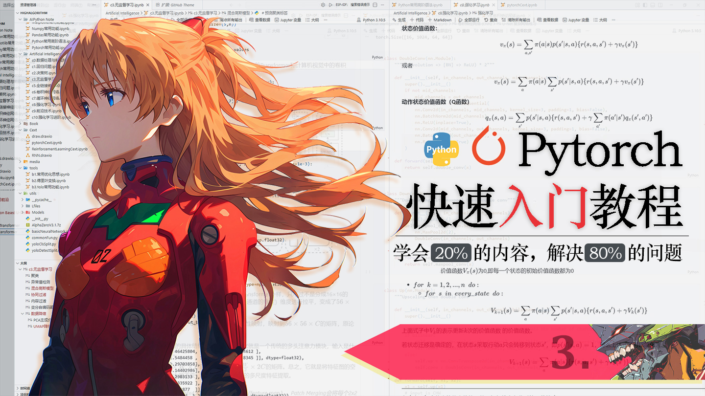

# 明日香 - Pytorch 快速入门保姆级教程(三)

`2026.03 | ming`

------

<div align="center">
  
</div>


## 七. 数据加载与处理

我们都知道，深度学习的应用无处不在——图片识别、语音转文字、视频生成、文本分类，而支撑这些应用的核心，就是海量的训练数据。不同任务的数据集千差万别，图片是像素矩阵、文本是字符序列、语音是波形数据，那PyTorch到底怎么读取这些五花八门的数据呢？

你可能会想，PyTorch是不是给每种数据都写好了现成的读取函数？其实不然——因为每个人的数据集结构、模型需求都不一样，没有万能的读取工具。但是它给了我们一个“万能框架”，只要学会这一套，不管什么类型的数据，都能轻松加载、处理，这套框架就是 **Dataset + DataLoader**。

可以把数据集想象成一个“仓库”，里面堆满了各种“货物”（样本数据），每个货物都贴了“标签”（数据标签）。

- Dataset 就相当于仓库的“整理员”：负责把仓库里的货物整理好，记录清楚有多少件货物（样本数量），并且能根据编号（索引）快速找到对应的货物和标签。
- DataLoader 就相当于仓库的“搬运工”：负责把整理好的货物，一批一批搬到车间（模型）里，还能根据需求打乱货物顺序、多个人一起搬运。

### 7.1 DataSet

`Dataset` 不是一个可以直接使用的工具，而是一个**抽象基类**（或者说“模板”）。因为每个任务的数据集格式千差万别（有的存在文件夹里，有的存在数据库里，有的是一堆路径列表），所以我们不能指望 PyTorch 提供一个万能的加载器。正确的做法是：**按照这个模板，自己定义一个专属的数据集整理员**——也就是自定义一个继承自 `Dataset` 的类。

Dataset 的本质，就是**存储样本及其对应的标签，提供“查询”功能**。比如你问它“仓库里有多少件货物”，它能快速回答；你说“给我第5件货物”，它能快速找到对应的货物和标签。

光说可能有点抽象，我们用代码来直观感受一下。

最简单的自定义 Dataset

```python
from torch.utils.data import Dataset   # 导入 PyTorch 自带的 Dataset 模板

# 自定义 Dataset 类，必须继承 Dataset
class MyDataset(Dataset):
    def __init__(self, data, labels):
        """
        初始化方法：把数据和标签保存起来
        data:   所有样本
        labels: 所有样本对应的标签（与 data 一一对应）
        """
        self.data = data
        self.labels = labels

    def __len__(self):
        """返回样本总数（管理员清点货物数量）"""
        return len(self.data)

    def __getitem__(self, idx):
        """
        根据索引 idx 返回一个样本及其标签（管理员按编号取货）
        idx: 样本索引（从 0 开始）
        """
        sample = self.data[idx]   # 获取样本
        label = self.labels[idx]  # 获取对应标签
        return sample, label
```

上面我们定义了一个最简单的数据集类。现在来试试用它封装我们的数据：

```python
# 假设我们有 5 个样本，每个样本是 4 维特征
mydata = torch.tensor([[4.3, 1.3, 1.3, 2.0],
                       [5.1, 3.3, 4.9, 2.1],
                       [5.0, 2.0, 3.5, 1.6],
                       [5.9, 3.0, 5.1, 1.8],
                       [6.3, 3.4, 5.6, 2.4]])

# 对应的标签（0 或 1）
mylabel = torch.tensor([0, 1, 0, 1, 1])

# 创建 MyDataset 实例
dataset = MyDataset(mydata, mylabel)

# 现在 dataset 就是一个标准的 PyTorch 数据集，可以通过索引访问
print(dataset[2])  
# 输出: (tensor([5.0000, 2.0000, 3.5000, 1.6000]), tensor(0))
```

输出是一个元组，第一个元素是样本，第二个元素是标签。这正是 PyTorch 期望的格式，后续的 `DataLoader` 会直接使用这个格式。

在自定义DataSet类的时候，我们必须要实现 `__len__` 和 `__getitem__`这两个方法，这是 PyTorch 的硬性规定：

1. **`__len__`**：返回数据集大小。PyTorch 的 `DataLoader` 在迭代时需要知道一共有多少个样本，才能决定如何分批、是否打乱等。
2. **`__getitem__`**：支持索引操作。并且return的格式永远是`样本，标签` ，`DataLoader` 会通过这个方法来获取每一个样本。

只要你有这两个方法，其它的随你怎么自定义都行。

看来上面的例子，你可能会觉得，多套一个Dataset的壳，有必要吗？明明直接读取`mylabel`和`mydata`不是更好更方便吗。你先不要着急，我们再来看一个例子，自定义图片分类数据集，相信你在看完下面这个例子就彻底了解了DataSet类存在的意义。

假设我们有一个猫狗分类的图片数据集，文件结构如下：

```
dataset/
├─ cat/  # 猫的图片，标签设为0
│  ├─ cat1.jpg
│  ├─ cat2.jpg
│  └─ ...
└─ dog/  # 狗的图片，标签设为1
   ├─ dog1.jpg
   ├─ dog2.jpg
   └─ ...
```

如果直接用列表存图片，会面临两个问题：

- **内存爆炸**：如果一次性把所有图片读进内存（比如 10 万张），电脑很可能内存不足。
- **预处理复杂**：图片需要统一大小、转换成张量、做数据增强等，这些操作最好在取样本时动态进行。

自定义 Dataset 完美解决了这些问题。下面我们实现一个针对这种文件夹结构的 Dataset ：

```python
import os
from torchvision.io import read_image
from torch.utils.data import Dataset

class CatDogDataset(Dataset):
    """猫狗分类数据集，假设图片存放在 dataset/cat/ 和 dataset/dog/ 下"""
    def __init__(self, root_dir, transform=None):
        """
        root_dir: 数据集根目录，例如 './dataset'
        transform: 预处理函数（第八章会详细讲解，先不用管）
        """
        self.root_dir = root_dir
        self.transform = transform
        self.samples = []  # 存放 (图片路径, 标签) 的列表

        # 遍历 cat 和 dog 两个子文件夹，将每一张图片的具体地址存放进self.samples中
        for label, class_name in enumerate(['cat', 'dog']):
            class_dir = os.path.join(root_dir, class_name)
            for file_name in os.listdir(class_dir):
                if file_name.lower().endswith(('.jpg', '.jpeg', '.png')):
                    path = os.path.join(class_dir, file_name)
                    self.samples.append((path, label))

    def __len__(self):
        # 返回此数据集包含的样本总数
        return len(self.samples)

    def __getitem__(self, idx):
        path, label = self.samples[idx]      # 取出第idx个图片的路径和标签
        image = read_image(path) # 读取路径path的图片
        if self.transform:
            image = self.transform(image)    # 进行预处理（如缩放、转张量）
        return image, label
```

这样，我们只需要把数据集的根目录传入`CatDogDataset`类就完成了数据集的创建

```python
mydataset = CatDogDataset("./dataset")
```

并且，你可以注意到：

- **`__init__` 中只存路径**：在初始化的时候，我们并没有把图片读入内存，而是把每个样本的“图片路径”和“标签”存为一个元组，放在 `self.samples` 列表里。这样即使有几十万张图片，内存占用也极小。
- **`__getitem__` 中动态读取**：当外部代码（如 `DataLoader`）通过索引索取某个样本时，我们才真正去磁盘读取图片，并实时进行预处理。这叫做**惰性加载**，是处理大数据集的标配。
- 注意，此时我们的所有训练数据都是存储在CPU的内存中的，而非GPU的显存中。并且也不能在DataSet中就把数据读取到GPU显存中，这样的话训练速度会非常慢，通常是在训练循环中批量的将数据送往显存中的。

通过这个例子，相信你已经明白了 `Dataset` 的价值：**它把“数据在哪里”和“怎么取数据”封装起来，后面的章节你可以看到Dataset类能让上层代码（如 `DataLoader`）可以统一、高效地访问任意形式的数据集，同时避免了内存爆炸和预处理混乱的问题。**

### 7.2 DataLoader

上一节我们学会了用 `Dataset` 像查字典一样按索引取出单个样本。但在实际训练神经网络时，我们绝不会一个一个地喂数据——那样太慢了，就像用勺子一勺勺地给大象喂水。正确的做法是一次性喂一批数据（批处理），让模型并行处理.

`DataLoader` 就是负责完成这个“批量配送”任务的工具。它把我们定义好的 `Dataset` 当作“原料仓库”，然后按照我们的要求，将原料打包、打乱、加速搬运到模型里。

`DataLoader` 主要帮你做了三件事：

1. **自动分批（Batching）**
   每次从数据集中取出固定数量的样本，形成一个“批次”（batch）。这个数量由参数 `batch_size` 控制。比如设置 `batch_size=32`，`DataLoader` 就会每次返回 32 个样本（及其标签）。
2. **数据打乱（Shuffling）**
   在每个 epoch（遍历完一遍所有数据）开始前，`DataLoader` 会把数据集中的顺序随机打乱。这能避免模型学习到样本顺序带来的假规律，提升泛化能力。
3. **多进程加速（Multiprocessing）**
   数据读取往往是训练中的 I/O 瓶颈。`DataLoader` 可以开启多个子进程并行加载数据，让数据源源不断地送到 GPU 面前，避免模型“等数据吃饭”。

沿用上一节的 `MyDataset`，我们先创建一些模拟数据，然后把它交给 `DataLoader`。

```python
import torch
from torch.utils.data import Dataset, DataLoader

# 1. 定义自己的 Dataset（和上节一样）
class MyDataset(Dataset):
    def __init__(self, data, labels):
        self.data = data      # 特征矩阵
        self.labels = labels  # 标签向量

    def __len__(self):
        return len(self.data)

    def __getitem__(self, idx):
        return self.data[idx], self.labels[idx]

# 2. 生成模拟数据：200个样本，每个样本4个特征，标签二分类（0/1）
data = torch.randn(200, 4)          # 200x4 的随机特征
labels = torch.randint(0, 2, (200,)) # 200个随机标签

# 3. 实例化 Dataset
dataset = MyDataset(data, labels)
```

```python
# 4. 创建 DataLoader —— 重点来了！
dataloader = DataLoader(
    dataset,                # 传入 Dataset 实例
    batch_size=5,           # 每批取5个样本（根据显存调整）
    shuffle=True,           # 每个 epoch 打乱数据（训练集通常True）
    num_workers=4,          # 用4个子进程加载数据（根据CPU核心数调整）
    drop_last=True,         # 丢弃最后不足 batch_size 的批次
    pin_memory=True         # 加速 CPU→GPU 传输（如果你有GPU，建议True）
)
```

**参数说明**

- `batch_size`：越大，梯度越稳定，但显存占用也越大。常用值：16, 32, 64, 128。
- `shuffle`：训练集一般设为 `True`，测试集设为 `False`。
- `num_workers`：在 Linux/Mac 上可以设为 CPU 核心数（如 4, 8），但在 Windows 上需要小心（见后面的“注意事项”）。
- `drop_last`：如果数据集大小不能被 `batch_size` 整除，最后一个批次样本数会少一些。设置 `drop_last=True` 就会丢弃这最后一批，让所有批次大小一致（有些模型要求固定输入维度）。
- `pin_memory`：如果使用 GPU，设为 `True` 可以将数据放在锁页内存中，使 CPU→GPU 传输更快。

`DataLoader` 本质是一个**可迭代对象**，我们可以直接用 `for` 循环遍历它，每次得到一个批次的数据和标签：

```python
for batch_data, batch_labels in dataloader:
    print("数据形状:", batch_data.shape)   
    print("标签形状:", batch_labels.shape) 
    print("数据内容:\n", batch_data)
    print("标签内容:", batch_labels)
    # 这里就可以把 batch_data, batch_labels 送入模型进行前向、反向传播了
    break  # 只查看第一个批次
```

```python
# 输出示例（每次运行可能不同，因为 shuffle=True）：
数据形状: torch.Size([5, 4])
标签形状: torch.Size([5])
数据内容:
 tensor([[ 0.9124,  0.4168,  0.7011,  0.1032],
        [ 0.9567, -0.0275,  0.2400,  0.2573],
        [ 0.7671,  0.6073,  0.8117,  0.4210],
        [ 0.6642,  0.9855, -0.6126,  0.3464],
        [ 0.9293,  0.0757,  0.1477,  0.5342]])
标签内容: tensor([0, 0, 0, 1, 1])
```

可以看到，`DataLoader` 自动帮我们把散装的样本打包成了整齐的批次，并且顺序是随机的。

⚠️注意：如果你在 **Windows** 系统上运行上面的代码，并且 `num_workers > 0`，很可能会遇到这样的报错：

```
RuntimeError: DataLoader worker (pid(s) ...) exited unexpectedly
```

这是因为 Windows 没有 `fork()` 系统调用，它启动多进程的方式与 Linux/Mac 不同。要解决这个问题，有两种常见做法：

1. **直接设 num_workers=0**
   把 `num_workers` 设为 0，让数据加载在主进程中进行。虽然速度慢一点，但绝对不会报错，适合快速验证代码。

2. **规范做法：将 DataLoader 相关代码放入 `if __name__ == '__main__':` 保护块**
   Windows 要求多进程代码必须放在该保护块内，否则会无限递归创建子进程。修改后的代码结构如下：

   ```python
   if __name__ == '__main__':
       dataset = MyDataset(data, labels)
       dataloader = DataLoader(dataset, batch_size=128, shuffle=True, num_workers=4, ...)
       for batch_data, batch_labels in dataloader:
           # 训练代码
           ...
   ```

   这样既能享受多进程加速，又不会在 Windows 下报错。这是推荐的正式写法。

### 7.3 划分数据集

在深度学习训练中，我们经常需要把数据集分成训练集和测试集。PyTorch 提供了一个非常方便的工具 `random_split`，可以帮我们一键划分，不用自己手写切片逻辑。

`torch.utils.data.random_split` 的作用是：**随机地将一个 Dataset 分割成若干个子集**。它只需要两个参数：

- `dataset`：要划分的数据集对象。
- `lengths`：一个列表，指定每个子集的样本数量（或比例）。

它会返回一个元组，里面是多个 `Dataset` 对象，可以直接喂给 `DataLoader`。

下面我们沿用上一节的 `dataset`（包含 200 个样本），按 **8:2** 的比例划分成训练集和验证集

```python
from torch.utils.data import random_split

# 假设我们已经创建好了 dataset（包含200个样本）
# 计算训练集和验证集的大小
train_size = int(0.8 * len(dataset))   # 80%样本用于训练
val_size = len(dataset) - train_size   # 剩下的样本用于验证

# 随机划分数据集
train_set, val_set = random_split(dataset, [train_size, val_size])

print(f"训练集样本数: {len(train_set)}")	# 160
print(f"验证集样本数: {len(val_set)}")	# 40
```

注意：

- `random_split` 不会复制数据，它只是记录原始数据集的索引。所以无论怎么划分，都不会额外占用内存。
- 划分是**随机**的，每次运行结果可能不同。如果希望结果可重复，可以在划分前设置随机种子：`torch.manual_seed(42)`。

划分好之后，我们就可以分别为训练集和验证集创建 `DataLoader` 了。

```python
from torch.utils.data import DataLoader

# 训练集 DataLoader：需要打乱数据，让每个 epoch 顺序不同
train_loader = DataLoader(train_set, batch_size=64, shuffle=True, num_workers=0)

# 验证集 DataLoader：不需要打乱，按顺序评估即可
val_loader = DataLoader(val_set, batch_size=64, shuffle=False, num_workers=0)
```


## 八. 常用图像处理

在上一章的内容里，我们简单接触了图像读取函数 **read_image** 和基础的图像变换工具**Transform**，只是浅尝辄止地用了一下。而在深度学习的视觉任务中（比如图像分类、目标检测），图像处理是绕不开的核心环节。现实中的数据往往不是“拿来就能用”的——图片有大有小，颜色有深有浅，甚至同一张图翻转一下就能变成一张“新图”。为了让模型学得更好、更鲁棒，我们通常会在训练前对图像做一系列**预处理**和**数据增强**。

打个比方：你给模型看一张猫的照片，如果只给它看同一个角度、同一光线的猫，模型可能会把“那个角度”当成猫的特征，换一个角度就不认识了。但如果你在训练时，把猫的照片随机旋转、裁剪、调色，模型就会逐渐明白：猫就是猫，不管它是躺着还是站着，不管是白天拍的还是晚上拍的，它都是猫。这就是**数据增强**的作用——用有限的图片，通过变换创造出无限多样的训练样本，让模型学到更本质的特征，从而提升泛化能力。

本章我们就来系统学习 PyTorch 中图像处理的常用工具：**`torchvision.io`**（读取图像）和 **`torchvision.transforms.v2`**（图像变换）。掌握它们，你就能轻松地对图像进行各种“PS”操作，为模型准备高质量的训练数据。

### 8.1 图像读取

处理图像的第一步，当然是**把图片读进来**。`torchvision.io` 提供了 `read_image` 函数，可以直接将图片文件读取为 PyTorch 的 Tensor 格式，非常方便。

```python
from torchvision.io import read_image

# 读取一张图片（自动转为 Tensor，形状为 [C, H, W]）
image_tensor = read_image("../media/icon48.png")
print("原始图像形状:", image_tensor.shape)	# 输出示例：torch.Size([4, 48, 48])
```

这里返回的 Tensor 形状是 `[C, H, W]`，即通道数 × 高度 × 宽度。如果你的图片是 **PNG 格式**，通常会有 4 个通道：R（红）、G（绿）、B（蓝）和 A（透明度）。而常见的 **JPG 图片**只有 RGB 三个通道，没有透明度通道。

必要时也可以切片取出前三个通道（例如 `image_tensor[:3]`）来丢掉 Alpha 通道，因为很多模型只接受三通道输入。

> 💡 **小提示**：`read_image` 返回的 Tensor 数值范围是 [0, 255] 的整数（数据类型为`torch.uint8`）。如果你需要浮点数（例如用于归一化），后续可以用变换将它转为 `float32`。

### 8.2 图像变换

图像变换方法非常多，要使用这些变换，首先要导入：

```python
from torchvision.transforms import v2
```

> `v2` 是 torchvision 0.15+ 引入的新一代变换 API，它与旧版兼容，但功能更强大，支持 tensor 图像直接操作，且能更好地与 GPU 配合。

为了方便查阅，我把最常用的变换整理成一个**速查表**（你可以在写代码时随时参考）。

| 变换类型            | 代码示例                                                     | 说明                                                         |
| :------------------ | :----------------------------------------------------------- | :----------------------------------------------------------- |
| **调整大小**        | `v2.Resize(256, antialias=True)`                             | 将图像的短边缩放到 256 像素，长边按比例缩放；`antialias=True` 可防止缩放时出现锯齿。 |
| **中心裁剪**        | `v2.CenterCrop(224)`                                         | 从图像中心裁剪出 224×224 的正方形区域。                      |
| **随机裁剪**        | `v2.RandomCrop(128)`                                         | 在图像上随机位置裁剪 128×128 区域，是常用的数据增强手段。    |
| **水平翻转**        | `v2.RandomHorizontalFlip(p=0.5)`                             | 以 50% 的概率水平翻转图像（左右镜像）。                      |
| **垂直翻转**        | `v2.RandomVerticalFlip(p=0.2)`                               | 以 20% 的概率垂直翻转图像（上下颠倒）。                      |
| **颜色抖动✨**       | `v2.ColorJitter(brightness=0.2, contrast=0.3, saturation=0.4, hue=0.1)` | 随机调整亮度（±20%）、对比度（±30%）、饱和度（±40%）、色相（±0.1）。 |
| **随机旋转**        | `v2.RandomRotation(30)`                                      | 在 [-30°, 30°] 范围内随机旋转图像。                          |
| **随机灰度化**      | `v2.RandomGrayscale(p=0.1)`                                  | 以 10% 的概率将图像转为灰度图（常用于减少对颜色的依赖）。    |
| **标准化**          | `v2.Normalize(mean=[0.485, 0.456, 0.406], std=[0.229, 0.224, 0.225])` | 对图像每个通道减去均值再除以标准差，使数据分布接近标准正态。**这些数字是 ImageNet 数据集的统计值，使用预训练模型时不可随意改动！** |
| **类型转换+归一化** | `v2.ToDtype(torch.float32, scale=True)`                      | 将图像转为 `float32` 类型，并将像素值从 [0, 255] 缩放到 [0, 1]。 |
| **高斯模糊**        | `v2.GaussianBlur(kernel_size=3, sigma=(0.1, 2.0))`           | 对图像进行高斯模糊，sigma 可以在给定范围内随机选择（增强模型对模糊的鲁棒性）。 |
| **转为单通道灰度**  | `v2.Grayscale(num_output_channels=1)`                        | 将 RGB 三通道图像转为单通道灰度图。                          |

**关于“概率”的说明**：上表中带有 `p` 参数的变换（如翻转、灰度化），表示每次应用时只有 `p` 的概率真正执行该变换，否则原样返回。

那么如何使用这些变换呢？非常简单，你想用什么变换，就将这些变换填到如下的数组中即可：

```python
# 1. 读取图片（4通道 PNG）
img = read_image("example1.png")  # shape: [4, H, W]
print("原始形状:", img.shape)

# 2. 丢弃 Alpha 通道，只保留 RGB（很多变换不支持4通道）
img_rgb = img[:3]  # shape: [3, H, W]

# 3. 定义变换流水线
transform = v2.Compose([
    ... # 在这里依次写下你想做的变换
])

# 4. 应用变换（可以多次应用，看到不同的随机效果）
transformed_img = transform(img_rgb)
```

`v2.Compose` 就是一个预处理流水线，它接受一个变换列表，然后按顺序依次应用。

下面来举几个例子，假设我们有一张 1080×1080 的正方形图片（`example1.png`），执行下面的变换：

```python
transform = v2.Compose(
    [
        v2.Resize(512, antialias=True),  # 短边缩放到 512
        v2.RandomCrop(300),  # 随机裁剪 300x300
        v2.RandomRotation(30),	# 随机旋转-30°~30°
    ]
)
```

**结果图片**（图 8-1）是一张旋转过且只包含原图局部区域的图片，每次运行结果可能不同。


**示例2：颜色抖动**

```python
transform2 = v2.Compose([
    v2.Resize(512, antialias=True),
    v2.ColorJitter(
        brightness=0.2,    # 亮度变化 ±20%
        contrast=0.3,      # 对比度变化 ±30%
        saturation=0.4,    # 饱和度变化 ±40%
        hue=0.1            # 色相变化 ±0.1（范围一般是 [-0.5, 0.5]）
    ),
])
```

✨ **为什么叫“抖动”？**
你可以理解为：每次应用这个变换时，都会在参数范围内随机选取一个值，就像给颜色加了一个随机“抖动”，让图片看起来像是换了滤镜。

**结果图片**（图 8-2）保持内容不变，但整体色调、亮度、对比度会发生随机的、柔和的变化。


在训练与视觉有关的深度学习模型时，我们通常需要将图像转换为模型期望的格式。标准流程如下：

```python
transform_standard = v2.Compose([
    # 数据增强部分（可选，仅训练时使用）
    # v2.RandomHorizontalFlip(p=0.5),
    # v2.RandomRotation(10),

    # 必备部分
    v2.ToDtype(torch.float32, scale=True),   # 转为 float32 并归一化到 [0,1]
    v2.Normalize(
        mean=[0.485, 0.456, 0.406],          # ImageNet 均值
        std=[0.229, 0.224, 0.225],           # ImageNet 标准差
    ),
])
```

**为什么最后两步是必须的？**

- `ToDtype(scale=True)` 将像素值从 [0,255] 缩放到 [0,1]，这是大多数神经网络输入层的期望范围。
- `Normalize` 将数据标准化为均值为 0、标准差为 1 的分布，可以加速模型收敛，且是预训练模型的硬性要求（因为预训练权重就是在这样的标准化数据上训练得到的）。

除了基础变换，`v2` 还提供了一些更有趣的增强方法，这里简单介绍两个，感兴趣的同学可以自行查阅文档。

**随机擦除**
随机选择一个矩形区域，用随机值或固定值填充，模拟物体被遮挡的情况，强迫模型关注其他区域。

```python
# 原图上出现一块黑色遮挡
v2.RandomErasing(p=0.5, scale=(0.02, 0.33), ratio=(0.3, 3.3), value=0)
```

**透视变换**
模拟从不同视角观察物体，产生“近大远小”的畸变效果。

```python
# 图像像被倾斜拉伸
v2.RandomPerspective(distortion_scale=0.5, p=0.5)
```

到这里你应该就理解了什么是图像变换transform，那么如何在模型训练的时候使用这些变换呢？其实你已经知道了，你可以回到`7.1`小节再看看`CatDogDataset`的代码，相信你就会恍然大悟。
