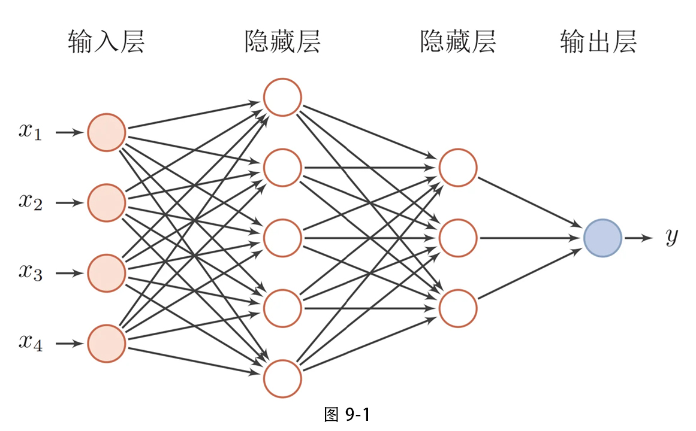
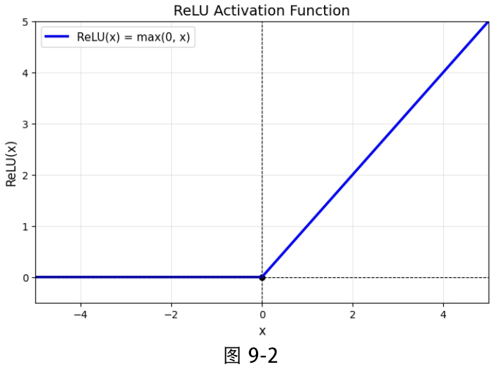
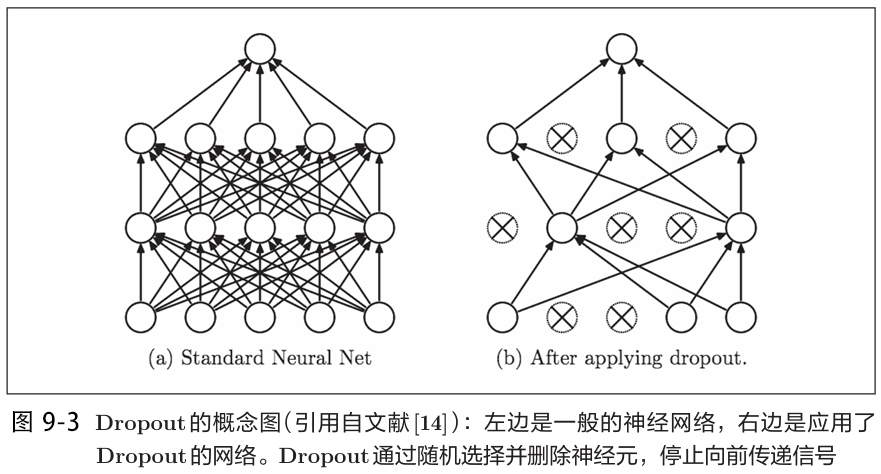
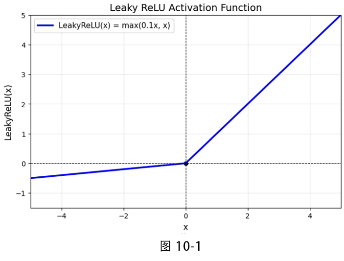
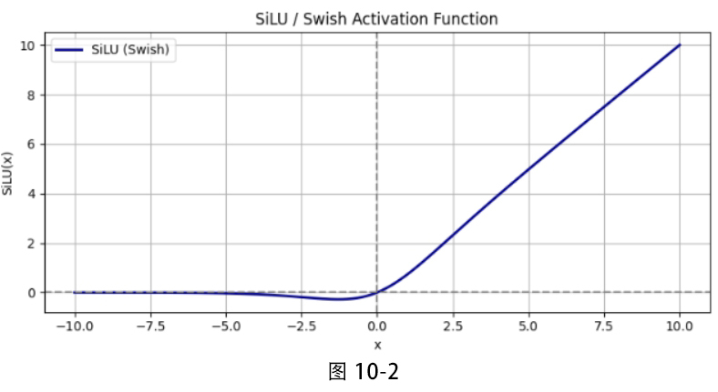
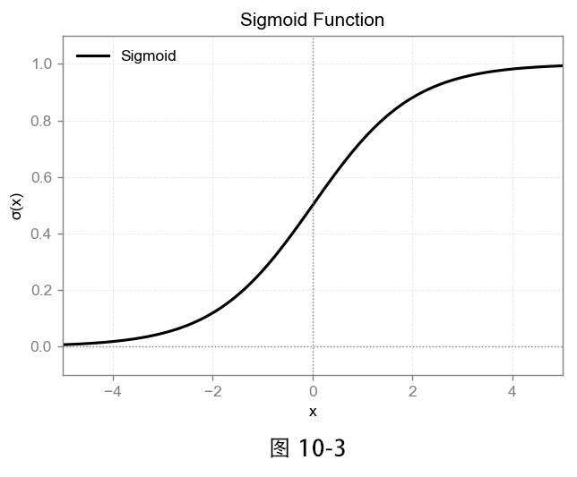
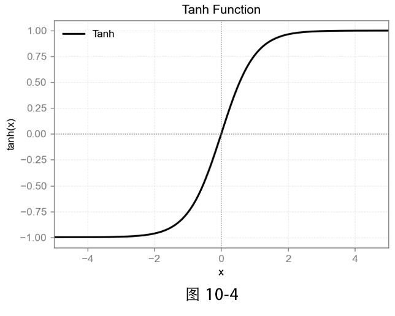

# 明日香 - Pytorch 快速入门保姆级教程(四)

`2026.03 | ming`

------

<div align="center">
  
</div>


## 九. 基本神经网络层

经过前面几章的学习，相信你已经掌握了 PyTorch 的核心数据结构（张量）、自动求导机制、数据加载与处理等基本功。现在，我们终于要进入深度学习模型的核心——**神经网络层**的学习了

本章将带你逐一认识深度学习中那些最基础、最常用的神经网络层。就像盖房子需要砖块和水泥一样，这些层就是构建深度学习模型的“砖块”。理解了每一块砖的用途，你就能灵活地搭建出各种复杂的模型。

所有网络层都存放在 `torch.nn` 模块中，因此后续代码都会默认导入：

```python
import torch
import torch.nn as nn
```

### 9.1 全链接层

全连接层，也叫线性层（Linear Layer），是神经网络中最基础的组件，也是每一个深度学习入门者遇到的第一个层。如图 9‑1 所示，在全连接网络中，每一层的每个神经元都与上一层的所有神经元相连，因此称为“全连接”。



在 PyTorch 中，`nn.Linear` 就是对这一层的封装，它对输入执行一个线性变换：
$$
\mathbf{y} = \mathbf{x}\mathbf{W}^{T} + \mathbf{b}
$$
其中，$\mathbf{x}$ 是输入向量，$\mathbf{W}$ 是权重矩阵，$\mathbf{b}$ 是偏置项。这个公式可以直观理解为：将输入的特征进行加权求和，再加上一个偏置，得到新的特征表示。

```python
# 定义一个全连接层：输入特征100，输出特征50
fc = nn.Linear(in_features=100, out_features=50)

# 构造一个随机的输入张量：batch_size=32，特征维度=100
x = torch.randn(32, 100)          # 形状 (32, 100)

# 前向计算
out = fc(x)                        # 形状 (32, 50)
print(out.shape)                   # torch.Size([32, 50])
```

**nn.Linear 核心参数**

| 参数           | 类型 | 说明                                                         |
| :------------- | :--- | :----------------------------------------------------------- |
| `in_features`  | int  | 输入特征的数量（即上一层神经元的个数）。输入数据的最后一维必须等于此值。 |
| `out_features` | int  | 输出特征的数量（即当前层神经元的个数）。决定了该层输出的维度。 |
| `bias`         | bool | 是否使用偏置项 $\mathbf{b}$，默认为 `True`。                 |

**输入与输出形状**

| 类型     | 形状                | 说明                                                         |
| :------- | :------------------ | :----------------------------------------------------------- |
| **输入** | `(*, in_features)`  | `*` 表示任意数量的前置维度（通常包括 batch 大小）。最后一维必须等于 `in_features`。 |
| **输出** | `(*, out_features)` | 输出形状与输入形状的前置维度保持一致，最后一维变为 `out_features`。 |

每个 `nn.Linear` 层内部包含两个可训练参数：`weight` 和 `bias`（如果启用）。可以通过 `.weight` 和 `.bias` 访问：

```python
print(fc.weight.shape)   # torch.Size([50, 100])  权重矩阵：输出特征×输入特征
print(fc.bias.shape)     # torch.Size([50])       偏置向量
```

- **权重矩阵**的形状为 `(out_features, in_features)`，其转置正好对应公式中的 $\mathbf{W}^T$。
- **偏置向量**的形状为 `(out_features,)`，每个输出神经元对应一个偏置值。

默认情况下，`nn.Linear` 的权重和偏置会被随机初始化（通常是均匀分布或正态分布）。关于如何自定义初始化，我们将在后续的“模型参数初始化”章节详细介绍。

现在，我们用 `nn.Linear` 来搭建如图 9‑1 所示的三层全连接网络（仅演示层与层之间的连接，暂不加入激活函数）。可以看到图中的输入特征数为 4，第一个隐藏层有 5 个神经元，第二个隐藏层有 3 个神经元，输出层为 1 个神经元。代码实现如下：

```python
# 定义每一层
hidden_layer1 = nn.Linear(in_features=4, out_features=5)
hidden_layer2 = nn.Linear(5, 3)          # 熟练后可省略参数名
output_layer  = nn.Linear(3, 1)

# 构造一批输入数据（batch_size=5）
batch_size = 5
input_data = torch.randn(batch_size, 4)  # 形状 (5, 4)

# 手动进行前向传播
out = hidden_layer1(input_data)          # 形状 (5, 5)
out = hidden_layer2(out)                 # 形状 (5, 3)
out = output_layer(out)                   # 形状 (5, 1)
print(out)

# 示例输出
# tensor([[-0.6771],
#         [-0.2559],
#         [-0.5684],
#         [-0.6970],
#         [-0.6154]])
```

### 9.2 ReLU层

仅有线性层的堆叠本质上仍然是线性变换，无法表达复杂的非线性关系。因此，我们需要在每层（或某些层）之后引入**激活函数**，为网络注入非线性能力。

**ReLU（Rectified Linear Unit，修正线性单元）** 是目前最常用的激活函数之一。它的数学定义非常简单：
$$
\text{ReLU}(x) = 
\begin{cases} 
x & \text{if } x > 0 \\
0 & \text{otherwise}
\end{cases}
$$
即：保留所有正输入，将负输入置为零。其函数图像如图 9‑2 所示。



ReLU 的优点：

- **计算高效**：仅需比较和取最大值，无需指数运算，适合大规模网络。
- **缓解梯度消失**：在正区间梯度恒为 1，有利于深层网络的梯度反向传播。
- **稀疏激活**：使得部分神经元输出为 0，增加网络的稀疏性，一定程度上起到正则化作用。

但也存在缺点：

- **神经元死亡（Dead ReLU）**：如果某个神经元在训练中始终处于负输入区域（例如由于参数初始化不当或学习率过大），其梯度永远为 0，导致该神经元永久性失活。

在 PyTorch 中，`nn.ReLU` 是一个封装好的层，可以直接放入网络中使用。

```python
relu = nn.ReLU()   # 实例化 ReLU 层

# 测试数据
input_tensor = torch.tensor([-1.5, 0.0, 2.3, -0.4])
output = relu(input_tensor)   # 前向计算

print(output)   # tensor([0.0000, 0.0000, 2.3000, 0.0000])
```

### 9.3 Sequential 容器

现在，我们学会了全连接层和 ReLU 激活函数，可以尝试搭建一个包含激活函数的图 9‑1 所示的网络。如果沿用之前逐层调用的方式，代码会变得冗长且容易出错：

```python
# 定义各层
hidden_layer1 = nn.Linear(4, 5)
relu1 = nn.ReLU()
hidden_layer2 = nn.Linear(5, 3)
relu2 = nn.ReLU()
output_layer  = nn.Linear(3, 1)

# 前向传播（需要手动串联）
out = hidden_layer1(input_data)
out = relu1(out)
out = hidden_layer2(out)
out = relu2(out)
out = output_layer(out)
```

随着网络加深，这种写法会变得非常繁琐，不过PyTorch 提供了 **`nn.Sequential`** 容器，它可以按顺序封装多个层，并自动完成前向传播，非常方便。

- `nn.Sequential` 是一个有序容器，可以包含任意数量的神经网络模块（层）。
- 当输入数据传入 `Sequential` 对象时，它会按照添加的顺序依次传递给每个子模块，并将每个模块的输出作为下一个模块的输入。
- 它大大简化了模型的定义和前向传播过程，非常适合构建层数固定的顺序网络。

**使用方式**

推荐在定义模型时直接传入层列表，代码结构清晰：

```python
model = nn.Sequential(
    nn.Linear(4, 5),   # 第一隐藏层
    nn.ReLU(),          # 激活函数
    nn.Linear(5, 3),    # 第二隐藏层
    nn.ReLU(),          # 激活函数
    nn.Linear(3, 1)     # 输出层
)

# 前向传播（一行搞定）
output = model(input_data)
print(output)
```

用`nn.Sequential`把各个层都封装起来，就会非常方便简洁，网络结构一目了然。但它也有局限性，它不适用于具有跳跃连接（如残差网络）或分支结构的模型，后续会介绍更加复杂的模型构建方法。

### 9.4 批归一化层

批量归一化（Batch Normalization，简称BN）由Sergey Ioffe和Christian Szegedy在2015年提出，它通过**对每一层的输出进行标准化**，强制将数据分布拉回到均值为0、方差为1的标准正态分布。这样做能够有效缓解训练过程中的内部协变量偏移问题，使网络训练更加稳定，收敛速度大大加快。如今，BN已成为几乎所有现代卷积神经网络和深度多层感知机的标配组件。

> 如果你在此之前从未听说过批归一化层和下一小节的Dropout层，请一定要好好看完“鱼书”（详见此系列的第一篇文章）

对于一个形状为 $(N, D)$ 的输入矩阵（$N$ 为批量大小，$D$ 为特征数量），BatchNorm层会对每一列（即每一个特征）独立地进行如下处理。假设某一列的取值为 $[x_1, x_2, \dots, x_N]^T$，首先计算该列的均值和方差：
$$
\mu = \frac{1}{n} \sum_{i=1}^{n}x_{i} 
$$

$$
\sigma^{2} = \frac{1}{n} \sum_{i=1}^{n}(x_{i} -\mu )^{2}
$$

然后对每个元素进行标准化：

$$
x_{i} \gets \frac{x_{i}-\mu }{\sqrt{\sigma^{2}+\varepsilon}}
$$

这里 $\varepsilon$ 是一个极小的常数（通常取 $10^{-5}$），用于防止分母为零。经过标准化后，该列的分布变为均值为0、方差为1。

然而，直接强制将数据限制在标准正态分布可能会降低网络的表达能力。因此，BN层引入了两个可学习的参数：缩放因子 $\gamma$ 和平移因子 $\beta$（均为长度为 $D$ 的向量）。最终的输出为：
$$
y_i = \gamma \cdot \hat{x_i} + \beta
$$
以上就是Batch Normalization层的前向传播。现在我们用PyTroch演示一下，假设我们有一个形状为 $(5, 3)$ 的输入数据（5个样本，每个样本3个特征），数值范围差异很大：

```python
import torch
import torch.nn as nn

input_data = torch.tensor(
    [[100, 0.3, 6.1],
     [121, 0.1, 1.8],
     [146, -0.4, 7.3],
     [239, 0.2, 5.5],
     [255, 0.1, 7.5]]
)

# 创建BatchNorm1d层，需要指定特征数量（即num_features=3）
bn = nn.BatchNorm1d(num_features=3)

# 前向传播
output = bn(input_data)
print(output)
```

输出结果可能如下（每次运行结果可能因初始化不同而略有差异）：

```python
tensor([[-1.1462,  0.9930,  0.2234],
        [-0.8128,  0.1655, -1.8652],
        [-0.4159, -1.9033,  0.8063],
        [ 1.0605,  0.5793, -0.0680],
        [ 1.3145,  0.1655,  0.9035]])
```

可以看到，原本量级悬殊的三列数据经过 BN 层后，每一列都被标准化到了相近的数值范围，这有利于后续层的学习。

在全连接网络中，BN 层通常放置在**线性层之后、激活函数之前**，形成 `Linear → BN → ReLU` 的标准结构。这种安排能够先对线性输出进行标准化，再输入激活函数，有助于避免梯度消失或爆炸。下面是一个简单的多层感知机示例：

```python
model = nn.Sequential(
    nn.Linear(4, 5),      # 输入特征4，输出特征5
    nn.BatchNorm1d(5),    # 对5个特征进行批归一化
    nn.ReLU(),            # 激活函数
    nn.Linear(5, 3),      # 第二隐藏层
    nn.BatchNorm1d(3),    # 再次批归一化
    nn.ReLU(),            # 激活函数
    nn.Linear(3, 1)       # 输出层（回归任务）
)
```

### 9.5 Dropout层

Dropout是由Hinton等人在2012年提出的一种简单而有效的正则化技术，**旨在防止神经网络过拟合**。

它的核心思想非常直观：**在训练过程中，随机“丢弃”一部分神经元（即暂时将其输出置为0），使得网络不能过度依赖某些特定的神经元，从而学习到更加鲁棒的特征**。如图9-3所示：



假设一个隐藏层有 $n$ 个神经元，每个神经元以概率 $p$ 被保留，以概率 $1-p$ 被丢弃（输出置零）。这样，每次前向传播时，网络的结构都会发生变化，相当于训练了多个不同的子网络。但在测试时，我们希望利用所有神经元，因此需要调整输出的尺度，以保持训练和测试时输出的期望一致。

Dropout 通常放在激活函数之后，例如 `Linear → ReLU → Dropout`。下面是一个包含 Dropout 的多层感知机示例：

```python
model = nn.Sequential(
    nn.Linear(4, 5),      
    nn.BatchNorm1d(5),    
    nn.ReLU(),
    nn.Dropout(0.3),   # 丢弃这一层中30%的神经元
    nn.Linear(5, 3),      
    nn.BatchNorm1d(3),   
    nn.ReLU(),
    nn.Dropout(0.5),   # 丢弃这一层中50%的神经元
    nn.Linear(3, 1)      
)
```

什么时候需要用这一层呢？很简单，当你觉得你的网络太深太大很有可能造成或者已经造成过拟合的时候，就用Dropout准没错。


## 十. 常用激活函数层

### 10.1 LeakReLU层

我们在 9.2 节介绍了 ReLU 激活函数，它凭借简单高效的优势成为主流选择。但 ReLU 有一个明显的缺点：**神经元死亡**——当输入为负时，梯度为 0，一旦某个神经元陷入负区间且无法恢复，它将永久失去学习能力。为了解决这个问题，研究者提出了 **LeakyReLU** 激活函数，它在负半轴上保留了一个很小的斜率，让负输入仍然能产生微小的梯度，从而保持神经元的活性。

LeakyReLU 的数学表达式为：
$$
\text{LeakyReLU}(x) = 
\begin{cases} 
x & \text{if } x > 0 \\
\alpha x & \text{otherwise}
\end{cases}
\quad \text{其中 } \alpha \text{ 是一个小的正数（如 } 0.01\text{）}
$$
其中 $\alpha$ 是一个小的正数，通常取 0.01。当 $\alpha = 0$ 时，LeakyReLU 退化为标准 ReLU。图 10-1 展示了不同 $\alpha$ 取值下的函数图像。



在 PyTorch 中，`nn.LeakyReLU` 实现了 LeakyReLU 激活函数，示例代码如下：

```python
# 创建一个 LeakyReLU 层，设置负斜率为 0.05（可手动调整）
leaky_relu = nn.LeakyReLU(negative_slope=0.05)

# 输入张量包含正负值
input_tensor = torch.tensor([-1.0, 0.0, 3.0, -0.5])
output = leaky_relu(input_tensor)

print(output)  # tensor([-0.0500,  0.0000,  3.0000, -0.0250])
```

**LeakyReLU优势**

- **保留负信息**：负区间梯度非零，使神经元即使在负输入时仍能更新参数，避免了 ReLU 的“死亡”问题。
- **缓解梯度消失**：在深层网络中，负区间的微小梯度有助于信息反向传播。

**适用场景**

- **深层网络**：如 ResNet、Transformer 等深层架构，LeakyReLU 能更好地维持梯度流动。
- **生成对抗网络（GANs）**：判别器需要稳定的梯度，LeakyReLU 常被用于 GAN 的卷积层后，防止判别器过早饱和。
- **数据分布不均衡或训练数据有限的任务**：保留负信息有助于模型从有限的样本中学习更丰富的特征。

**注意事项**：$\alpha$ 的取值通常设置在 0.01~0.2 之间，过大可能导致网络过于线性，降低表达能力；过小则接近 ReLU，无法充分发挥优势。

### 10.2 SiLU 层

SiLU（Sigmoid Linear Unit，也称为 Swish）是一种近年来备受关注的激活函数，由 Google 研究人员提出。它在深层网络中往往能取得优于 ReLU 的效果，尤其是在非常深的模型（如 Transformer、EfficientNet）中表现出色。

SiLU 的数学表达式为：
$$
\mathrm{SiLU}(x) =  \frac{x}{1+e^{-x}}
$$
SiLU 的函数图像如图 10-2 所示：



从图像可以看出，SiLU 具有以下特点：

- **平滑性**：整个函数处处可导，梯度变化连续，有利于优化。
- **非单调性**：函数在负半轴先减小后增大（在 $x \approx -1.28$ 处取得最小值），这种“自门控”机制让网络能够更灵活地调整特征响应。
- **有下界无上界**：当 $x \to -\infty$ 时，SiLU 趋近于 0；当 $x \to +\infty$ 时，SiLU 近似于 $x$（因为 $\sigma(x) \to 1$），这使得它在正区间保持线性，避免了梯度消失。

代码示例：

```python
# 创建 SiLU 层
silu = nn.SiLU()

# 输入张量
input_tensor = torch.tensor([-3.0, -1.0, 0.0, 2.0, 5.0])
output = silu(input_tensor)

print(output)  # tensor([-0.1423, -0.2689,  0.0000,  1.7616,  4.9665])
```

### 10.3 Sigmoid 层

Sigmoid 既可以用来当做激活函数，也可以作为二分类的输出层（现在不会这样用了，有更加优秀的替代品）

Sigmoid 函数的数学表达式为：
$$
\mathrm{Sigmoid}(x) =  \frac{1}{1+e^{-x}}
$$
这个函数的核心作用是将任意实数输入压缩到 **(0, 1)** 的开区间内。其函数图像如图 10-3 所示，是一条平滑的 S 型曲线。



从图像可以观察到 Sigmoid 的典型特征：

- **S 型曲线**：当 $x$ 趋近于负无穷时，$\sigma(x)$ 趋近于 0；当 $x$ 趋近于正无穷时，$\sigma(x)$ 趋近于 1 。
- **中心对称性**：函数关于点 $(0, 0.5)$ 中心对称，即 $\sigma(-x) = 1 - \sigma(x)$ 。
- **平滑性**：整个函数连续可导，导数也具有良好性质 。

**代码示例：**

```python
# 创建 Sigmoid 层
sigmoid = nn.Sigmoid()

# 输入张量（可以是任意形状）
input_tensor = torch.tensor([-2.0, -1.0, 0.0, 1.0, 2.0])
output = sigmoid(input_tensor)

print(output)  
# tensor([0.1192, 0.2689, 0.5000, 0.7311, 0.8808])
```

**Sigmoid 当做激活函数的一些缺陷：**

1. **梯度消失（Gradient Vanishing）**：这是 Sigmoid 最致命的缺点。当输入 $|x| > 5$ 时，导数 $\sigma'(x)$ 趋近于 0 。在深层网络中，梯度经过多层 Sigmoid 反向传播后会指数级衰减，导致浅层参数几乎无法更新。实验表明，10 层网络使用 Sigmoid 时，末端梯度可能仅为输入层的 $10^{-6}$ 量级 。
2. **输出非零中心化（Non-zero-centered）**：Sigmoid 的输出恒为正（均值为 0.5）。这导致下一层神经元的输入全为正，使得权重更新时梯度方向可能呈现“Zigzag”现象——即所有维度的梯度符号相同，需要多次折线式更新才能达到最优路径，降低了收敛速度 。
3. **计算复杂度较高**：涉及指数运算 $e^{-x}$，相比 ReLU 的简单阈值判断，计算开销更大 。在嵌入式设备或大规模部署中，这一差异可能成为瓶颈。

### 10.4 Tanh 层

在 10.3 节中，我们学习了 Sigmoid 函数，它能够将输入压缩到 (0, 1) 区间，非常适合表示概率。但 Sigmoid 有一个明显的缺陷——输出不是零中心化的（始终为正），这可能导致梯度更新时出现“之字形”路径，降低收敛速度。为了解决这个问题，研究者们更青睐 **Tanh**（双曲正切）函数，它在保留 Sigmoid 平滑特性的同时，将输出范围扩展到了 **(-1, 1)**，实现了零中心化。

Tanh 函数的数学表达式为：
$$
\mathrm{tanh}(x) = \frac{e^{x}-e^{-x}}{e^{x}+e^{-x}}
$$
从定义可以看出，Tanh 可以通过 Sigmoid 函数表示：$\tanh(x) = 2 \cdot \text{Sigmoid}(2x) - 1$，相当于将 Sigmoid 进行缩放和平移后得到的结果。其函数图像如图 10-4 所示，是一条中心对称的 S 型曲线。



从图像可以观察到 Tanh 的典型特征：

- **输出范围**：值域为 **(-1, 1)**，当 $x \to -\infty$ 时趋近于 -1，当 $x \to +\infty$ 时趋近于 1。
- **零中心化**：函数关于原点 $(0, 0)$ 中心对称，即 $\tanh(-x) = -\tanh(x)$，输出均值为 0。
- **平滑性**：整个函数连续可导，且比 Sigmoid 的梯度更陡峭（最大梯度为 1）。

**代码示例：**

```python
# 创建 Tanh 层
tanh = nn.Tanh()

# 输入张量（包含正负值）
input_tensor = torch.tensor([-2.0, -1.0, 0.0, 1.0, 2.0])
output = tanh(input_tensor)

print(output)
# tensor([-0.9640, -0.7616,  0.0000,  0.7616,  0.9640])
```

**Tanh 当做激活函数的一些缺陷：**

1. **梯度消失依然存在**：虽然 Tanh 的梯度比 Sigmoid 更强，但当输入绝对值较大时（$|x| > 3$），函数进入饱和区，梯度趋近于 0。在深层网络中，多层的梯度连乘仍然会导致梯度消失问题。
2. **计算复杂度较高**：与 Sigmoid 类似，Tanh 涉及指数运算 $e^{x}$ 和 $e^{-x}$，相比 ReLU 的简单阈值判断，计算开销更大。
3. **不适用于深层网络隐藏层**：在深度卷积神经网络中，Tanh 已被 ReLU 及其变体取代，因为 ReLU 在正区间梯度恒为 1，能更有效地避免梯度消失。

