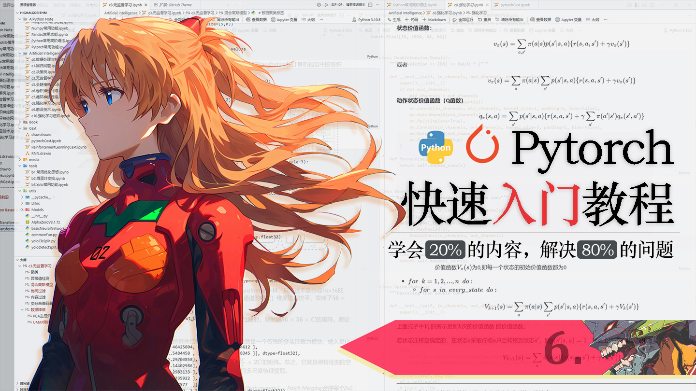

# 明日香 - Pytorch 快速入门保姆级教程(六)

`2026.03 | ming`

------

<div align="center">
  
</div>


## 十三. 常用卷积层

> 这一章需要你有卷积的相关概念才能顺利的读下去哦，如果你还不了解什么是卷积，以及卷积的具体数学操作，请一定要学完卷积的理论部分再来阅读此章节，还是推荐“鱼书”，里面的卷积讲解的非常清楚。
>

### 13.1 图像卷积

在图像相关的深度学习任务中，PyTorch 最常用、最核心的卷积 API 非 **`nn.Conv2d`** 莫属。无论是图像分类、目标检测还是语义分割，它都是搭建 CNN 网络的基础组件。下面我们先来看完整的 API 签名：

```python
import torch.nn as nn

conv_layer = nn.Conv2d(
    in_channels,      # 输入通道数
    out_channels,     # 输出通道数（卷积核的个数）
    kernel_size,      # 卷积核尺寸
    stride = 1,       # 滑动步长
    padding = 0,      # 边缘填充
    dilation = 1,     # 空洞卷积控制参数
    groups = 1,       # 分组卷积控制参数
    bias = True,      # 是否使用偏置
    padding_mode = 'zeros'  # 填充模式
)
```

乍一看参数不少，但其实只要你学过卷积神经网络的基础概念，大部分参数的含义你都应该很熟悉。只有 `dilation` 和 `groups` 可能不太常见，这正是本节要详细讲解的高级卷积技巧。

**① 基本参数解释**

1. **in_channels 和 out_channels**：

   - **`in_channels`**：输入数据的通道数。
     对于一张彩色图片，通常是3（RGB三通道）；灰度图就是1；如果这一层接在某个卷积层后面，那么`in_channels`就等于上一层输出的通道数。

   - **`out_channels`**：输出特征图的数量，也就是本层使用的**卷积核的个数**。每个卷积核会扫描输入数据，生成一张特征图，所以输出通道数就等于卷积核个数。这个值也决定了本层能学习到多少种不同的特征。比如`out_channels=64`，表示这一层会用64个卷积核，提取64种不同的特征模式。

2. **kernel_size**：
   - 卷积核的大小，可以是一个整数（比如`3`表示3×3的方形卷积核）。一般常用的是1、3、5、7。为什么3×3最流行？因为两个3×3卷积堆叠可以获得和5×5卷积一样的感受野，但参数量更少，非线性更强。

3. **stride**：
   - 卷积核在图像上滑动的步长。默认是1，也就是每次移动一个像素。如果`stride=2`，卷积核每次跳两格，输出特征图的高度和宽度会大约减半。所以步长为2常被用来代替池化层，实现下采样。

4. **padding**：
   - 在输入图像的四周填充一圈像素，默认是0，也就是不填充。填充的主要目的是控制输出特征图的空间尺寸，或者防止边缘信息被过早丢弃。最常用的策略是`padding = kernel_size // 2`，这样卷积前后尺寸保持不变（当`stride=1`时）。比如`kernel_size=3`，`padding=1`，输出尺寸就和输入一样。

5. **bias**：
   - 是否给卷积结果加上一个可学习的偏置项，默认是`True`。通常我们都会保留它，但在某些特殊情况下（比如卷积后面紧跟BatchNorm层）可能会设置`bias=False`，因为BatchNorm会减去均值，偏置被抵消，白白增加计算量。

**② 输入输出形状公式**：

假设输入形状为`(batch_size, in_channels, H, W)`，经过`nn.Conv2d`后，输出形状为`(batch_size, out_channels, H_out, W_out)`。其中H_out、W_out是输出特征图的宽高，可通过步长、填充、卷积核尺寸计算。

下面我们用一个简单的例子来演示 `nn.Conv2d` 的基本用法。假设我们有一张 $5 \times 5$ 的单通道图像，使用 2 个 $3 \times 3$ 的卷积核，步长为 1，无填充，看看输出形状的变化。

```python
# 单通道5x5图像
image = torch.tensor([[4,1,6,3,1],
                      [2,5,2,1,1],
                      [3,1,1,3,1],
                      [7,3,9,2,1],
                      [8,3,4,2,8]],dtype=torch.float32)

conv_layer = nn.Conv2d(
    in_channels = 1,  
    out_channels = 2,  
    kernel_size = 3, 
    stride=1,  
    padding=0,  
)

out = conv_layer(image.view(1,1,5,5))   # 注意要将其变为标准的输入形状
print(out.shape)	# torch.Size([1, 2, 3, 3])
```

**③ 空洞卷积**

普通卷积核的元素是紧密排列的，覆盖一个连续的区域。而**空洞卷积**（也叫扩张卷积）在卷积核的元素之间插入“空洞”（即间隔），使得同样大小的卷积核能覆盖更大的区域，从而**在不增加参数量的情况下扩大感受野**。

`dilation` 参数控制空洞的大小。默认 `dilation=1` 就是普通卷积，元素之间没有间隔。当 `dilation=2` 时，卷积核中每个元素之间会间隔 1 个像素，整个卷积核覆盖的区域就变大了。下图可以直观地理解（○ 表示卷积核权重位置，· 表示空洞）：

```
普通卷积核 3×3 (dilation=1):
○ ○ ○
○ ○ ○
○ ○ ○

空洞卷积核 3×3 (dilation=2):
○ · ○ · ○
· · · · ·
○ · ○ · ○
· · · · ·
○ · ○ · ○
```

同样是3×3的卷积核，在`dilation=2`时，它实际覆盖的范围变成了5×5（但只有9个位置有权重，其余位置都是0）。感受野变大了，但参数量没变。

为什么要用空洞卷积？

1. **扩大感受野**：在图像分割、目标检测等任务中，我们希望每个像素能看到更大的上下文信息。使用空洞卷积可以高效地增大感受野，而不需要堆叠很多层或使用大的卷积核。
2. **保持分辨率**：如果用池化或步长卷积来扩大感受野，会降低特征图的分辨率，丢失空间细节。空洞卷积可以在不降低分辨率的情况下扩大感受野，特别适合需要精细输出的任务（如语义分割）。
3. **减少参数**：要达到同样大的感受野，使用空洞卷积比直接用大卷积核（比如5×5、7×7）参数更少。

**注意事项**：如果多个空洞卷积叠加，可能会产生“网格伪影”（gridding artifacts），即某些像素从未被覆盖到。现代网络（如 DeepLab 系列）会采用**混合空洞卷积（HDC）** 来避免这个问题，这里我们暂时了解即可。

**④ 分组卷积**

分组卷积最早出现在 AlexNet 中，当时是为了用两个 GPU 并行训练。并且还能减少参数量和计算量。它的核心思想是：**将输入通道和输出通道分成若干组，每个组内独立进行卷积**。

假设输入通道数为`in_channels`，输出通道数为`out_channels`，`groups`设为`g`。那么：

- 输入通道被分成`g`组，每组有 `in_channels // g` 个通道。
- 输出通道也被分成`g`组，每组有 `out_channels // g` 个通道。
- 每个输出组只与对应的输入组进行卷积，组与组之间没有交互。
- 最后将`g`组的结果拼接起来，得到最终的输出。
- `groups=1`（默认值）就是普通的全连接卷积（所有输入通道和所有输出通道都相连）。

在分组卷积中，每个卷积核只与部分输入通道相连，参数量约为普通卷积的 $1/g$。并且分组卷积可以将不同组分配到不同 GPU 上训练，实现并行加速。而且组间信息隔离在一定程度上约束了模型，有时能提高泛化能力。

当然了，分组卷积的缺点也是很明显的，组间信息流被阻隔，可能降低模型的表示能力。如果组数设置过大，每组能学到的特征可能有限。通常需要在分组卷积后添加逐点卷积（$ 1×1$ 卷积）来混合不同组的信息，以弥补这一缺陷。

**⑤ 填充模式**

`padding_mode` 参数指定在填充时，新添加的像素值如何确定。除了默认的零填充（`'zeros'`），PyTorch 还提供了三种其他模式：

- **`'reflect'`（反射填充）**：以边界为对称轴进行镜像反射。例如对序列 `[1,2,3]` 做反射填充（长度为 2），得到 `[3,2,1,2,3,2,1]`。这种模式常用于自然图像，可以保持边界的连续性，减少伪影。
- **`'replicate'`（复制填充）**：直接用边界像素的值向外复制。例如 `[1,2,3]` 复制填充后变成 `[1,1,2,3,3,3]`。这种模式在图像修复等任务中有时会用到。
- **`'circular'`（循环填充）**：类似周期函数，将图像看作周期性重复。例如 `[1,2,3]` 循环填充后变成 `[3,1,2,3,1,2]`。这种模式在需要严格周期边界时使用，比如某些信号处理任务。

虽然填充方式这么多，不过在大多数视觉任务中，默认的零填充已经足够。

### 13.2 最大池化层

在卷积神经网络中，池化层（Pooling Layer）是一个非常基础且常用的操作。它的主要作用是**对特征图进行下采样**，也就是缩小特征图的尺寸，同时保留最重要的信息。

其中最常用的一种就是**最大池化（Max Pooling）**。它就像在图像上放一个滑动窗口，每次取窗口内所有像素的最大值作为输出，然后窗口滑动到下一个位置，重复这个过程。你可以把它想象成一个“扫描仪”，在每个小区域里只保留最亮（最显著）的那个像素。

在 PyTorch 中，最大池化层通过 `nn.MaxPool2d` 实现

```python
pool_layer = nn.MaxPool2d(
    kernel_size,        # 池化窗口尺寸（必需）
    stride = None,      # 滑动步长（默认等于 kernel_size）
    padding = 0,        # 边缘填充像素数
    dilation = 1,       # 窗口元素之间的间距
    return_indices = False,  # 是否返回最大值的位置索引
    ceil_mode = False   # 输出尺寸计算模式：True 用向上取整，False 用向下取整
)
```

这些参数看起来和卷积层有些相似，但含义略有不同。我们逐一解释：

- **`kernel_size`**：池化窗口的大小。可以是一个整数（如 2 表示 2×22×2 窗口），也可以是一个 `(h, w)` 元组。窗口会在输入特征图上滑动，每个窗口内取最大值。
- **`stride`**：窗口滑动的步长。默认值等于 `kernel_size`，即窗口不重叠。如果设置为 1，则窗口会逐个像素滑动（通常会导致输出尺寸变化很小，**较少使用**）。
- **`padding`**：在输入特征图的四周填充像素，默认填充 0。填充后，原本边缘的像素也能被窗口覆盖。注意：填充的像素值通常视为 0，但最大值池化时，0 可能被选为最大值，这会影响结果。**所以除非必要，一般不使用填充**。
- **`dilation`**：控制窗口内元素之间的间距。默认 `dilation=1` 表示窗口元素紧密排列；`dilation=2` 时，窗口元素之间会间隔一个像素，相当于窗口变大了，但实际参与计算的像素仍是原来的数量。**这个参数不常用**。
- **`return_indices`**：如果设为 `True`，前向传播时会同时返回池化结果和每个窗口内最大值所在的位置索引。这个索引通常用于后续的**反池化**操作（如 `nn.MaxUnpool2d`），例如在一些图像分割或自编码器网络中需要还原原始位置。**这个参数不常使用**。
- **`ceil_mode`**：这个参数决定了输出尺寸的计算方式。当输入尺寸不能被 `kernel_size` 整除时，最后一个窗口可能会超出边界。如果 `ceil_mode=False`（默认），超出边界的窗口会被丢弃，采用向下取整计算输出尺寸；如果 `ceil_mode=True`，则会保留超出边界的窗口（但只计算在输入范围内的部分），采用向上取整。后面我们会通过例子来演示两者的区别。

我们先看一个最简单的例子：使用 2×2 的窗口，步长也为 2（默认），对一张 8×8 的特征图进行池化。

```python
# 创建一个最大池化层：窗口大小2，步长默认为2
pool = nn.MaxPool2d(kernel_size=2)

# 随机生成输入：4张图片，每张3通道，8x8大小
input = torch.randn(4, 3, 8, 8)
output = pool(input)
print(output.shape)  # torch.Size([4, 3, 4, 4])
```

可以看到，输出尺寸从 8×8 变成了 4×4，正好减半。因为窗口大小和步长都是 2，没有重叠，每个 2×2 区域被一个最大值替代。

当输入尺寸不是窗口大小的整数倍时，`ceil_mode` 会影响输出尺寸。我们来对比一下

```python
# 输入：1张1通道的7x7特征图
input = torch.randn(1, 1, 7, 7)

# 默认 ceil_mode=False（向下取整）
pool_floor = nn.MaxPool2d(kernel_size=2, stride=2, ceil_mode=False)
out_floor = pool_floor(input)
print(out_floor.shape)  # torch.Size([1, 1, 3, 3])

# ceil_mode=True（向上取整）
pool_ceil = nn.MaxPool2d(kernel_size=2, stride=2, ceil_mode=True)
out_ceil = pool_ceil(input)
print(out_ceil.shape)   # torch.Size([1, 1, 4, 4])
```

在实际应用中，我们通常希望特征图尺寸规整地减半，因此大多使用 `kernel_size=2, stride=2, ceil_mode=False`，这样输入输出尺寸就是 2 的倍数关系。如果使用 `ceil_mode=True`，尺寸可能会不规则，影响后续层的拼接。

与卷积层不同，池化层没有可学习的参数，它只是一个固定的下采样操作。因此它计算效率非常高，且不会引入额外的参数量。

我们可以用步长为 2 的卷积来代替池化层，实现下采样。但卷积层带有可学习参数，计算量稍大；池化层则更快且无参数。两种方式各有优劣，现代网络中两种都有使用。池化层更适合简单快速的下采样，而步长卷积则可以学习到更复杂的下采样方式。

### 13.3 平均池化层

平均池化，和最大池化一样，都是非常常用的池化层，它不是取最大值，而是取窗口内所有像素的平均值，相当于对局部区域做了一个平滑处理。你可以把平均池化想象成用一块毛玻璃去看图像：每个局部区域的信息被均匀地模糊在一起，整体的轮廓还在，但细节被磨平了，减少模型对细节的过度依赖。

PyTorch 中的平均池化层通过 `nn.AvgPool2d` 实现，它的参数与 `MaxPool2d` 非常相似，但多了一个特有的参数 `count_include_pad`。

```python
pool_layer = nn.AvgPool2d(
    kernel_size,          # 池化窗口尺寸（必需）
    stride = None,        # 滑动步长（默认等于 kernel_size）
    padding = 0,          # 边缘填充像素数
    ceil_mode = False,    # 输出尺寸计算模式
    count_include_pad = True  # 是否将填充像素计入平均值的分母
)
```

- **`kernel_size`**、**`stride`**、**`padding`**、**`ceil_mode`** 的含义与 `MaxPool2d` 完全相同，这里不再赘述。
- **`count_include_pad`**：这个参数只存在于平均池化中，它决定了在计算平均值时，填充的像素（由 `padding` 添加的 0）是否被计入分母。**这个参数也不常用，因为一般也不会在这里使用padding参数。**

我们先创建一个简单的 4×4 输入，然后使用 2×2 窗口、步长为 1 的平均池化，观察输出结果。

```python
import torch
import torch.nn as nn

# 创建输入张量 (batch=1, channel=1, height=4, width=4)
x = torch.tensor([
    [1, 2, 3, 4],
    [5, 6, 7, 8],
    [9, 10, 11, 12],
    [13, 14, 15, 16]
], dtype=torch.float32).unsqueeze(0).unsqueeze(0)  # 形状 (1,1,4,4)

# 创建平均池化层：窗口2x2，步长1
pool = nn.AvgPool2d(kernel_size=2, stride=1)

# 应用池化
output = pool(x)
print(output)

# 输出结果
tensor([[[[ 3.5000,  4.5000,  5.5000],
          [ 7.5000,  8.5000,  9.5000],
          [11.5000, 12.5000, 13.5000]]]])
```

如果我们将步长设为 2，则窗口不重叠，输出尺寸减半

```python
pool2 = nn.AvgPool2d(kernel_size=2, stride=2)
output2 = pool2(x)
print(output2)

# 输出结果
tensor([[[[ 3.5000,  5.5000],
          [11.5000, 13.5000]]]])
```

### 13.4 自适应池化层

在前两节中，我们学习了最大池化和平均池化。它们都需要我们手动指定池化窗口大小（`kernel_size`）和步长（`stride`），输出尺寸会根据输入尺寸和这些参数计算得到。这在网络设计时可能会带来一些麻烦：如果输入图像的尺寸不是固定的，或者我们在迁移学习时想灵活改变网络结构，就得重新计算参数。

有没有一种池化层，可以**不管输入尺寸多大，都输出一个固定大小的特征图**呢？答案是肯定的——这就是**自适应池化层（Adaptive Pooling）**。它能根据你的要求（期望的输出尺寸）自动调整池化窗口的大小和步长，让你永远得到想要的尺寸。

考虑一个典型的卷积神经网络，比如用于图像分类的 ResNet。在网络的最后，通常会有一个**全局平均池化层**，它将整个特征图（比如 7×7 或 10×10）直接压缩成 1×1，然后接全连接层进行分类。但如果输入图像的大小变了，特征图的尺寸也会变，传统的池化层就无法自动输出固定大小的特征图了。而自适应池化层可以做到：无论输入是什么形状，只要指定输出尺寸为 1×1，它都能通过调整池化窗口来实现。

更一般地，自适应池化层允许我们指定**任意输出尺寸**，它会自动计算所需的池化参数，使得输出恰好是指定大小。

PyTorch 提供了两种自适应池化层：`nn.AdaptiveAvgPool2d`（自适应平均池化）和 `nn.AdaptiveMaxPool2d`（自适应最大池化）。它们的参数非常简单：

```python
# 自适应平均池化
adaptive_avg_pool = nn.AdaptiveAvgPool2d(output_size)

# 自适应最大池化
adaptive_max_pool = nn.AdaptiveMaxPool2d(output_size)
```

- **`output_size`**：期望的输出尺寸。可以是一个整数（如 `7`），表示输出为正方形 7×7；也可以是一个元组 `(H, W)`，分别指定高度和宽度。
- **注意**：这里的输出尺寸指的是特征图的空间维度（高度和宽度），通道数保持不变。

下面通过几个例子来演示自适应池化的用法。

```python
# 创建一个输入：batch=2, channels=3, height=7, width=9
input = torch.randn(2, 3, 7, 9)

# 例1：输出尺寸为 5x3（矩形）
pool1 = nn.AdaptiveAvgPool2d((5, 3))
output1 = pool1(input)
print(output1.shape)  # torch.Size([2, 3, 5, 3])

# 例2：输出尺寸为 2x2（正方形，指定整数 2 等价于 (2,2)）
pool2 = nn.AdaptiveAvgPool2d(2)
output2 = pool2(input)
print(output2.shape)  # torch.Size([2, 3, 2, 2])

# 例3：全局平均池化（输出 1x1）
pool3 = nn.AdaptiveAvgPool2d(1)
output3 = pool3(input)
print(output3.shape)  # torch.Size([2, 3, 1, 1])

# 也可以使用自适应最大池化
pool4 = nn.AdaptiveMaxPool2d((5, 3))
output4 = pool4(input)
print(output4.shape)  # torch.Size([2, 3, 5, 3])
```

### 13.5 上采样层

我们知道，卷积和池化操作通常会逐步减小特征图的空间尺寸（高度和宽度），这有助于提取更高层的语义特征并减少计算量。然而，很多任务需要将小尺寸的特征图恢复到较大的分辨率，有没有一种方法，能让图片的尺寸越来越大呢？比如在超分辨率重建中，我们需要将低分辨率图像放大到高分辨率。这种增大特征图尺寸的操作就称为**上采样（Upsampling）**。

PyTorch 提供了 `nn.Upsample` 模块，它通过插值算法来实现上采样，简单易用。你可以把它想象成放大一张图片：原本只有几个像素，现在要把它变成更大的图片，中间缺失的像素就需要根据周围像素的值“猜”出来，这个“猜”的过程就是插值。

上采样层的用处还是很多的，比如当网络层的某个环节需要特定尺寸的输入时，而你的特征图小于这个尺寸，此时就可以用上采样来调整。

`nn.Upsample` 的核心是插值算法，它决定了如何计算新像素点的值。PyTorch 支持以下几种模式：

- **`nearest`**：最近邻插值。新像素的值直接取原图中距离它最近的像素的值。这种方法计算最快，但放大后图像会出现明显的锯齿和马赛克，适合对质量要求不高、追求速度的任务。
- **`bilinear`**：双线性插值。在 2D 空间中，用周围四个像素的加权平均值来计算新像素的值，权值由距离决定。结果比最近邻平滑，是图像放大最常用的方法。
- **`bicubic`**：双三次插值。用周围 16 个像素的加权平均值，结果更平滑，但计算量更大。
- **`trilinear`**：三线性插值，用于 3D 数据（如体积图像），是双线性插值在三维空间的推广。
- **`linear`**：线性插值，用于 1D 数据或 3D 数据中的某一维度。

> 你可以这样理解：最近邻就像用拼图块直接放大，每个块颜色一样；双线性则像用毛玻璃看，像素之间过渡自然；双三次则像用高质量的柔焦镜头，细节保留更好。

```python
upsample_layer = nn.Upsample(
    size = None,           # 目标输出尺寸 (int 或 tuple)
    scale_factor = None,   # 缩放倍数 (int 或 tuple)
    mode = 'nearest',      # 插值模式
    align_corners = None   # 是否对齐角点（影响 bilinear/bicubic 结果）
)
```

- **`size`**：直接指定输出特征图的高度和宽度。可以是一个整数（如 4，表示输出 4×4），也可以是一个元组 `(H_out, W_out)`。
- **`scale_factor`**：指定缩放倍数。可以是一个浮点数（如 2.0，表示放大 2 倍），也可以是一个元组 `(h_scale, w_scale)` 分别指定高度和宽度的缩放倍数。注意：`size` 和 `scale_factor` 只能设置其中一个，不能同时使用。
- **`mode`**：插值模式，可选 `'nearest'`、`'bilinear'`、`'bicubic'`、`'trilinear'`、`'linear'`。默认 `'nearest'`。
- **`align_corners`**：仅当使用 `'bilinear'` 或 `'bicubic'` 模式时需要设置。如果为 `True`，输入和输出张量的角点像素会对齐，从而保持角点值不变；如果为 `False`，则角点不对齐，一般图像放大任务推荐设为 `True`，使结果更自然。

下面我们创建一个 2×2 的简单输入，用最近邻插值将其放大到 4×4。

```python
import torch
import torch.nn as nn

# 输入：1张1通道的2x2图像
input_tensor = torch.tensor([[[[1., 2.],
                               [3., 4.]]]])

# 最近邻插值，放大2倍
upsample_nn = nn.Upsample(scale_factor=2, mode='nearest')
output_nn = upsample_nn(input_tensor)
print("最近邻插值输出：\n", output_nn)

# 输出：
# 最近邻插值输出：
# tensor([[[[1., 1., 2., 2.],
#           [1., 1., 2., 2.],
#           [3., 3., 4., 4.],
#           [3., 3., 4., 4.]]]])
```

你也可以自己尝试其他的插值算法来看看结果。

`nn.Upsample` 只是一个简单的插值上采样，它没有可学习的参数，只是根据固定规则填充像素。虽然简单高效，但在一些需要更精细恢复细节的任务中，效果可能不够好。此时，可以考虑使用转置卷积，像素重组，它们包含可训练参数，能根据数据自适应地生成更精细的上采样结果。

### 13.6 转置卷积层

在上一节中，我们学习了 `nn.Upsample`，它通过插值来放大特征图，简单高效但没有可学习参数。而**转置卷积**（Transposed Convolution，也叫反卷积）则是一种**可学习的上采样方式**——它通过卷积运算来放大特征图，参数可以在训练中优化，从而更好地恢复细节。

转置卷积在生成对抗网络（GAN）、语义分割（如 FCN、U-Net）、超分辨率重建等任务中扮演着关键角色。虽然名字听起来有些陌生，但它的原理并不复杂，下面我们就来一步步拆解。

我们从最简单的例子开始：输入是一个 2×2 的单通道矩阵 $X$，卷积核 $W$ 也是 2×2，步长 `stride=1`，无填充。转置卷积的计算分为两步：

1. **每个输入元素与整个卷积核相乘**，得到 4 个 2×2 的小矩阵。
2. **将这 4 个小矩阵按步长叠加到输出矩阵中**，重叠的位置元素相加。

设
$$
X = \begin{bmatrix}
 x_{11}&x_{12} \\
  x_{21}&x_{22}
\end{bmatrix}, \space
W = \begin{bmatrix}
  w_{11}& w_{12}\\
  w_{21}&w_{22}
\end{bmatrix}
$$
第一步，每个 $x_{ij}$ 与 $W$ 相乘：
$$
x_{11} \cdot W =  \begin{bmatrix}
  x_{11}w_{11}&x_{11}w_{12} \\
  x_{11}w_{21}&x_{11}w_{22}
\end{bmatrix}，\space 
x_{21} \cdot W = \begin{bmatrix}
  x_{21}w_{11}&x_{21}w_{12} \\
  x_{21}w_{21}&x_{21}w_{22}
\end{bmatrix}
$$

$$
x_{12} \cdot W =  \begin{bmatrix}
  x_{12}w_{11}&x_{12}w_{12} \\
  x_{12}w_{21}&x_{12}w_{22}
\end{bmatrix}，\space 
x_{22} \cdot W = \begin{bmatrix}
  x_{22}w_{11}&x_{22}w_{12} \\
  x_{22}w_{21}&x_{22}w_{22}
\end{bmatrix}
$$

第二步，将这些小矩阵放在一个更大的输出矩阵中，放置的位置由输入元素的位置和步长决定。步长 `stride=1` 意味着每个小矩阵的左上角依次放在输出矩阵的 (1,1)、(1,2)、(2,1)、(2,2) 位置（从 1 开始索引），重叠区域相加。最终得到一个 3×3 的输出矩阵：
$$
\begin{bmatrix}
  x_{11}w_{11} & x_{11}w_{12} + x_{12}w_{11} & x_{12}w_{12} \\
  x_{11}w_{21} + x_{21}w_{11} & x_{11}w_{22} + x_{12}w_{21} + x_{21}w_{12} + x_{22}w_{11} & x_{12}w_{22} + x_{22}w_{12} \\
  x_{21}w_{21} & x_{21}w_{22} + x_{22}w_{21} & x_{22}w_{22}
\end{bmatrix}
$$

可以看到，输出尺寸变大了（从 2×2 到 3×3）。这就是转置卷积最直观的计算方式。

PyTorch 提供了 `nn.ConvTranspose2d` 来实现转置卷积，其参数与普通卷积非常相似：

```python
conv_trans = nn.ConvTranspose2d(
    in_channels,      # 输入通道数
    out_channels,     # 输出通道数
    kernel_size,      # 卷积核大小
    stride=1,         # 步长（控制放大倍数）
    padding=0,        # 对输入的外围填充（注意含义与普通卷积不同）
    output_padding=0, # 额外添加在输出边缘的填充，用于调整输出尺寸
)
```

重点参数说明：

- **`stride`**：步长。在转置卷积中，步长决定了输出放大的倍数。例如 `stride=2` 会使输出尺寸大约扩大 2 倍。
- **`padding`**：**注意**：这里的 `padding` 是在输入周围填充 0，但它的效果是**减少输出尺寸**，与普通卷积相反。直觉上，对输入填充相当于让卷积核从更边缘开始，从而输出变小。**通常我们设为 0**。不过你也可以这样理解，padding参数意义就是是裁剪输出特征图周围n圈。
- **`output_padding`**：用于解决因步长和输入尺寸带来的输出尺寸模糊问题，可以在输出的一侧额外补几行/列，使输出尺寸恰好为期望值。**这个参数不常用。**

我们用一个具体的例子来演示。输入为 3×3 的单通道矩阵，使用一个 3×3 卷积核，步长 2，无填充。为了便于观察，我们手动将卷积核权重全部设为 1。

```python
# 输入：1张1通道的3x3图像
input = torch.tensor([[[[1., 2., 3.],
                        [4., 5., 6.],
                        [7., 8., 9.]]]])

# 创建转置卷积层
conv_trans = nn.ConvTranspose2d(
    in_channels=1,
    out_channels=1,
    kernel_size=3,
    stride=1,
    padding=0,
    bias=False
)

# 将卷积核权重全部设为1（方便理解）
conv_trans.weight.data = torch.ones_like(conv_trans.weight.data)

# 前向传播
output = conv_trans(input)
print("输出形状:", output.shape)
print(output)
```

输出如下：(你可以自己试着更改stride参数，看看结果有什么变化)

```python
torch.Size([1, 1, 5, 5])
tensor([[[[ 1.,  3.,  6.,  5.,  3.],
          [ 5., 12., 21., 16.,  9.],
          [12., 27., 45., 33., 18.],
          [11., 24., 39., 28., 15.],
          [ 7., 15., 24., 17.,  9.]]]])
```

### 13.7 展平层

在卷积神经网络（CNN）中，卷积层和池化层处理的是具有空间结构的特征图，它们的输出通常是三维的 `(C, H, W)` 或四维的 `(N, C, H, W)` 张量。然而，当我们把特征图送入全连接层进行分类或回归时，全连接层期望的输入是一个一维向量。这就需要一种操作，将多维的特征图“拉直”成一维——这个操作就是**展平（Flatten）**。

PyTorch 提供了 `nn.Flatten` 模块，专门用于这一转换。它非常简单、高效。

```python
flatten_layer = nn.Flatten(
    start_dim = 1,   # 开始展平的维度（默认从1开始，即保留batch维度）
    end_dim = -1     # 结束展平的维度（默认-1表示最后一维）
)
```

- **`start_dim`**：指定从哪个维度开始展平。默认是 `1`，这意味着保留第 0 维（batch 维度）不变，从第 1 维开始到 `end_dim` 之间的所有维度都会被合并成一维。
- **`end_dim`**：指定展平的结束维度。默认是 `-1`，即最后一个维度。

例如，输入形状为 `(N, C, H, W)`：

- 默认 `start_dim=1, end_dim=-1`，输出形状为 `(N, C * H * W)`。
- 如果设置 `start_dim=2`，则只展平高度和宽度维度，输出形状为 `(N, C, H * W)`。
- 如果设置 `end_dim=2`，则展平从 `start_dim` 到第 2 维（包括），输出形状取决于具体维度。

我们先创建一个简单的四维张量，代表一批特征图，然后应用 `nn.Flatten` 观察形状变化。

```python
# 输入：batch=2, channels=3, height=4, width=5
x = torch.randn(2, 3, 4, 5)
print("输入形状:", x.shape)  # torch.Size([2, 3, 4, 5])

# 默认展平：从第1维到最后一维
flatten = nn.Flatten()
out = flatten(x)
print("默认展平后:", out.shape)  # torch.Size([2, 3*4*5=60]) → torch.Size([2, 60])

# 只展平高度和宽度维度（保留通道）
flatten_hw = nn.Flatten(start_dim=2, end_dim=-1)
out_hw = flatten_hw(x)
print("只展平HW:", out_hw.shape)  # torch.Size([2, 3, 4*5=20]) → torch.Size([2, 3, 20])
```

你可能会问：为什么要用 `nn.Flatten`，直接用 `x.view(x.size(0), -1)` 不行吗？当然可以，两者是等价的。但 `nn.Flatten` 作为模块，可以直接放进 `nn.Sequential`，代码更整洁；并且Flatten能自动计算展平后的维度，无需手动计算乘积，尤其当输入尺寸可变时（比如特征图大小在模型内部变化），`view` 可能需要传入计算好的尺寸，而 `Flatten` 会自动处理。在模型构建的时候还是推荐使用`Flatten`。

### 13.8 2D批归一化层

在 9.4 节中，我们已经详细介绍了批归一化（Batch Normalization）的原理：它通过对每一层的输出进行标准化，使其均值为 0、方差为 1，并引入可学习的缩放和平移因子来恢复表达能力。这种操作能有效缓解内部协变量偏移，加速训练并提高稳定性。

对于卷积神经网络，批归一化同样不可或缺。不过卷积层的输出是四维张量 `(N, C, H, W)`，因此我们需要使用专门针对图像特征的 **2D 批归一化层**——`nn.BatchNorm2d`。

`BatchNorm2d` 与 1D 版本的核心逻辑完全一致，唯一的区别在于**统计量的计算方式**。

对于形状为 `(N, C, H, W)` 的输入，`BatchNorm2d` 会在每个通道上独立进行归一化。也就是说，它针对第 `c` 个通道，收集该通道在所有样本、所有高度和宽度位置上的数值（共 `N × H × W` 个值），然后计算这些值的均值和方差，再进行标准化。

你可以这样理解：每个通道对应一张特征图，`BatchNorm2d` 对这张特征图上的所有像素（跨 batch 和空间位置）进行整体标准化，使得该通道的像素值分布稳定。

下面创建一个简单的卷积层 + BN 的组合，并观察输出形状。

```python
# 模拟一个卷积层的输出：batch=4, channels=16, height=8, width=8
x = torch.randn(4, 16, 8, 8)

# 创建 BatchNorm2d 层，需指定通道数 16
bn = nn.BatchNorm2d(num_features=16)

# 前向传播
y = bn(x)
print(y.shape)  # torch.Size([4, 16, 8, 8]) 形状不变
```

输出形状与输入完全相同，只是每个通道内的数值被标准化了。
