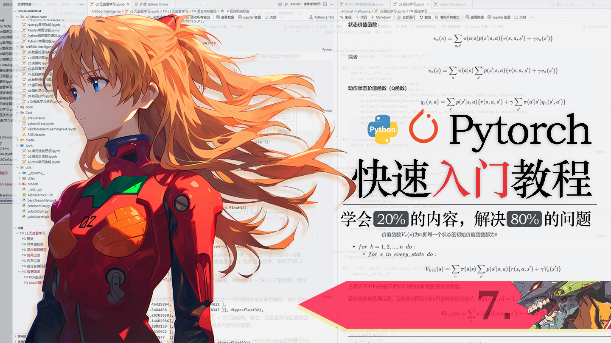
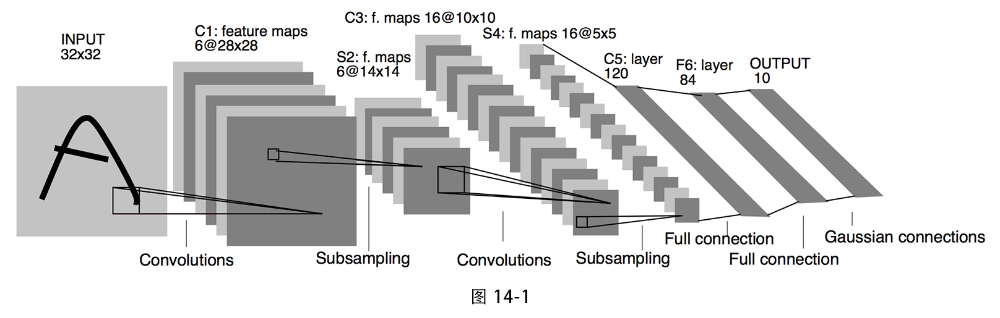
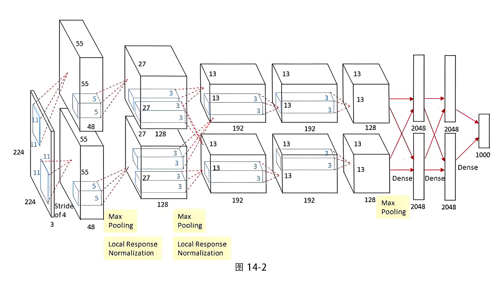
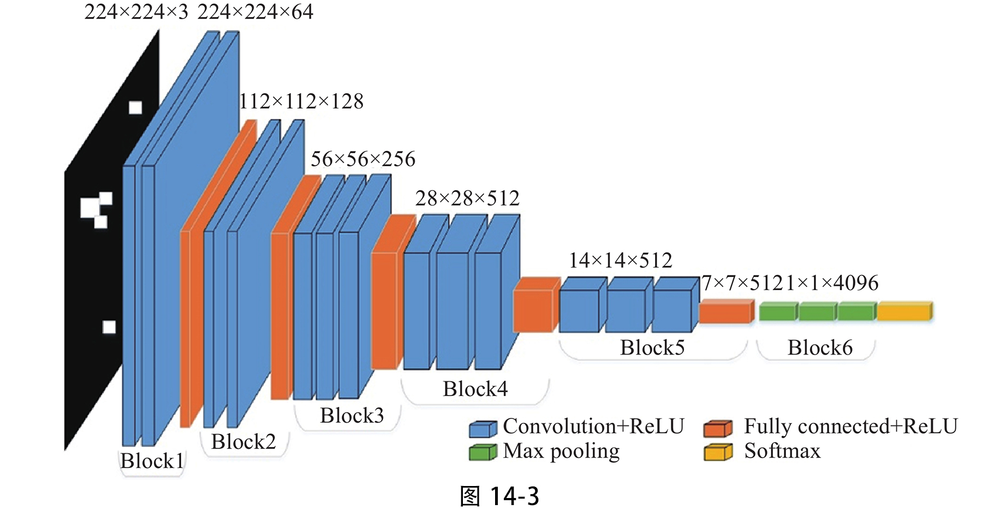
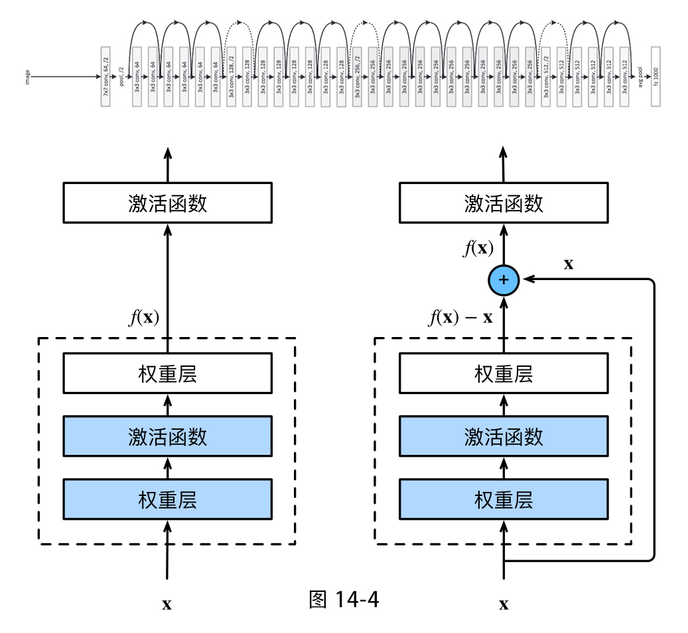
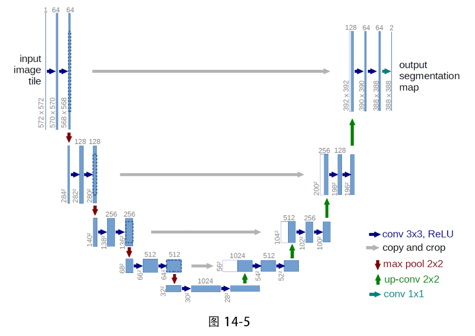

# 明日香 - Pytorch 快速入门保姆级教程(七)

`2026.03 | ming`

------

<div align="center">
  
</div>


## 十四. 经典卷积网络解析

> 这一章主要带大家练习如何使用PyTorch构建一个完整网络模型。
>
> 在深度学习领域，有一条不成文的学习捷径：**“读经典论文，复现经典代码”**。LeNet、AlexNet、VGG、ResNet等模型，不仅仅是教科书上的历史里程碑，更是现代复杂神经网络的基石。事实上，当前最前沿的大模型的模块设计思想，很多都能在这些经典网络中找到影子。
>
> 我们将通过PyTorch亲手复现这些改变了AI历史进程的经典架构。这不仅是熟练PyTorch API（如 `nn.Conv2d`、`nn.Linear`、`nn.Sequential` 等）的最佳实战机会，更是一次梳理深度学习发展脉络的过程。

### 14.1 LeNet-5

LeNet-5这个网络可以说是卷积神经网络的“Hello World”，这个卷积网络由Yann LeCun于1998年发布，专门设计用来识别手写支票上的数字，它奠定了现代 CNN 的基本结构：**卷积层提取特征、池化层降维、全连接层分类**

虽然以今天的标准看它很浅（只有7层），参数也只有6万左右，但它五脏俱全，对我们理解卷积的工作原理有着不可替代的意义。

LeNet-5 的输入是 **32×32 的灰度图像**（MNIST 手写数字原始是28×28，论文中将其放大到32×32以便边缘信息被更好提取）。整个网络包含 **7 层**（不含输入层），每层都有可训练参数。其结构如图 14‑1 所示。



下面用 PyTorch 搭建一个 LeNet-5。为了与现代实践接轨，我们做两点简化调整：

1. 使用 **ReLU** 代替原始的 tanh
2. 使用 **最大池化** 代替带可学习系数的平均池化
3. 要求输入尺寸为 32×32，若使用 28×28 的 MNIST 图像，需先进行填充

```python
import torch
import torch.nn as nn

class LeNet5(nn.Module):
    """
    LeNet-5 的 PyTorch 实现
    
    输入: (batch_size, 1, 32, 32)   # 灰度图，大小32x32
    输出: (batch_size, 10)          # 10个类别
    """
    def __init__(self, num_classes=10):
        super(LeNet5, self).__init__()
        
        # 特征提取部分：卷积 + 池化
        self.features = nn.Sequential(
            # C1: 卷积层
            # 输入1通道，输出6通道，卷积核5x5，步长1，无填充 → 输出28x28
            nn.Conv2d(in_channels=1, out_channels=6, kernel_size=5, stride=1, padding=0),
            nn.ReLU(), 
            
            # S2: 池化层 (下采样)
            # 2x2 窗口，步长2 → 输出14x14
            nn.MaxPool2d(kernel_size=2, stride=2),
            
            # C3: 第二个卷积层
            # 输入6通道，输出16通道，卷积核5x5 → 输出10x10

            nn.Conv2d(in_channels=6, out_channels=16, kernel_size=5, stride=1, padding=0),
            nn.ReLU(),
            
            # S4: 第二个池化层
            # 2x2 窗口，步长2 → 输出5x5
            nn.MaxPool2d(kernel_size=2, stride=2),
        )
        
        # 分类部分：全连接层
        self.classifier = nn.Sequential(
            nn.Flatten()
            nn.Linear(16 * 5 * 5, 120),
            nn.ReLU(),
            nn.Linear(120, 84),
            nn.ReLU(),
            nn.Linear(84, num_classes),
            # 注意：这里不加Softmax，因为CrossEntropyLoss自带Softmax
        )
    
    def forward(self, x):
        x = self.features(x)   # 特征提取
        x = self.classifier(x) # 分类
        return x
```

LeNet‑5 虽然规模小巧，却第一次向世界证明了**端到端的卷积神经网络能够解决实际问题**。从它开始，CNN 走出了实验室，进入了银行支票识别、邮局邮编识别等工业场景，并最终启发了后来一系列深度网络的诞生。

### 14.2 AlexNet

如果说 LeNet-5 是卷积神经网络的“Hello World”，那么 **AlexNet** 就是那个让全世界注意到深度学习的“重磅炸弹”。2012 年，ImageNet 大规模视觉识别挑战赛（ILSVRC）上，一个来自多伦多大学的团队——**Alex Krizhevsky、Ilya Sutskever 和 Geoffrey Hinton**——带着他们的 AlexNet 以 **15.3% 的 Top-5 错误率** 横扫对手，比第二名（26.2%）低了十几个百分点。这一成绩震惊了整个计算机视觉界，从此深度学习正式进入爆发期。AlexNet 证明了一个事实：只要网络足够深、数据足够多、计算足够强，深度学习可以碾压所有手工设计的特征。

在 AlexNet 之前，人们普遍认为神经网络层数太多会难以训练，容易过拟合，计算量也无法承受。AlexNet 之所以能成功，得益于几个关键创新：

1. **更深的网络**：AlexNet 有 8 层（5 个卷积层 + 3 个全连接层），参数量约 6000 万，远大于 LeNet-5 的 6 万。
2. **ReLU 激活函数**：用线性整流单元代替饱和的非线性函数（如 tanh），极大缓解了梯度消失问题，训练速度提升数倍。
3. **Dropout 正则化**：在全连接层随机丢弃部分神经元，有效防止过拟合。
4. **数据增强**：对训练图像进行随机裁剪、水平翻转、改变 RGB 通道强度等，让有限的数据产生更多变化。
5. **GPU 并行训练**：使用两块 GTX 580 GPU（3GB 显存）并行训练，将网络分布在两块显卡上，这是当时解决显存瓶颈的巧妙设计。
6. **局部响应归一化（LRN）**：对局部神经元的输出进行归一化，模拟生物神经元的侧抑制机制（不过后来的研究表明 LRN 效果有限，逐渐被 BatchNorm 取代）。

这些创新共同构成了现代深度卷积网络的基石。AlexNet具体结构如图14-2所示：



AlexNet 的输入是 **227×227×3** 的彩色图像。整个网络包含 8 个学习层：5 个卷积层和 3 个全连接层。下面给出 PyTorch 实现。

```python
import torch
import torch.nn as nn

class AlexNet(nn.Module):
    """
    输入: (batch_size, 3, 227, 227)
    输出: (batch_size, 1000)   # ImageNet 1000类
    """
    def __init__(self, num_classes=1000):
        super(AlexNet, self).__init__()
        
        # 特征提取部分：5个卷积层 + 池化
        self.features = nn.Sequential(
            # Conv1
            nn.Conv2d(3, 96, kernel_size=11, stride=4, padding=0),  # 输出: 55x55 
            nn.ReLU(),
            nn.MaxPool2d(kernel_size=3, stride=2),                   # 输出: 27x27
            
            # Conv2
            nn.Conv2d(96, 256, kernel_size=5, stride=1, padding=2), # 输出: 27x27
            nn.ReLU(),
            nn.MaxPool2d(kernel_size=3, stride=2),                   # 输出: 13x13
            
            # Conv3
            nn.Conv2d(256, 384, kernel_size=3, stride=1, padding=1), # 输出: 13x13
            nn.ReLU(),
            
            # Conv4
            nn.Conv2d(384, 384, kernel_size=3, stride=1, padding=1), # 输出: 13x13
            nn.ReLU(),
            
            # Conv5
            nn.Conv2d(384, 256, kernel_size=3, stride=1, padding=1), # 输出: 13x13
            nn.ReLU(),
            nn.MaxPool2d(kernel_size=3, stride=2),                   # 输出: 6x6
        )
        
        # 分类部分：3个全连接层
        self.classifier = nn.Sequential(
            nn.Flatten()
            nn.Dropout(p=0.5),                # Dropout 防止过拟合
            nn.Linear(256 * 6 * 6, 4096),     # 展平后输入 9216 -> 4096
            nn.ReLU(),
            
            nn.Dropout(p=0.5),
            nn.Linear(4096, 4096),
            nn.ReLU(),
            
            nn.Linear(4096, num_classes),      # 输出类别数
            # 注意：通常不加 Softmax，因为 CrossEntropyLoss 自带
        )
    
    def forward(self, x):
        x = self.features(x)
        x = self.classifier(x)
        return x
```

尽管 AlexNet 在当时取得了突破性成就，但从今天的视角看，它也存在一些明显的局限性：第一层卷积使用的 11×11 核参数量大，现代用堆叠 3×3 核替代。而且整个模型参数量过大，容易过拟合，6000 万参数主要集中在三个全连接层，导致模型容量过大，必须依赖 Dropout 和数据增强来抑制过拟合。后来的 VGGNet 虽然参数量更大，但通过堆叠小卷积核提高了参数效率。其次是网络深度有限，8 层结构在当时已算“深”，但以今天标准看很浅。梯度消失问题限制了进一步加深的可能，直到 ResNet 引入残差连接才彻底打破这一瓶颈。

### 14.3 VGGNet

还是那个视觉比赛，只不过这次是2014年，来自牛津大学 Visual Geometry Group（VGG）提出的 VGGNet 脱颖而出，在分类任务中取得亚军，定位任务中取得冠军。VGGNet 没有使用更大的卷积核，反而全部采用 3×3 的小卷积核，通过大幅增加网络深度来提升性能。它的出现证明了一个重要结论：**网络的深度对模型性能至关重要**，而通过堆叠小卷积核，可以在增加深度的同时控制参数量，并增强模型的非线性表达能力。

VGGNet 的核心贡献可以概括为以下几点：

- **全部使用 3×3 小卷积核**：在此之前，AlexNet 等网络往往使用较大的卷积核（如 11×11、5×5）来捕获大范围的空间特征。VGGNet 提出用多个连续的 3×3 卷积核堆叠来替代单个大卷积核。例如，两个 3×3 卷积核堆叠的感受野等同于一个 5×5 卷积核，三个 3×3 卷积核堆叠则等同于一个 7×7 卷积核。这样做有两个好处：
  1. 假设输入和输出的通道数均为 C，一个 7×7 卷积核的参数为 $7×7×C×C=49C^2$；而三个 3×3 卷积核的参数为 $3×(3×3×C×C)=27C^2$，参数量减少了约 45%。
  2. 每个卷积层后都跟随一个 ReLU 激活函数，三个 3×3 层就有三个非线性变换，而一个 7×7 层只有一个，这使得模型的决策函数更具判别力。
- **结构极其规整**：VGGNet 的设计非常简单一致——全部使用相同的 3×3 卷积（步长 1，填充 1）和 2×2 最大池化（步长 2）。这种规整的设计使得网络易于理解和实现，也方便后续的修改和扩展。
- **深度优势**：VGGNet 探索了网络深度对性能的影响，从 11 层到 19 层，实验表明越深的网络效果越好（直到过拟合极限）。

VGGNet 有多个变体，常用的是 VGG16 和 VGG19，数字代表网络中的**权重层数**（卷积层 + 全连接层）。以 VGG16 为例，它包含 13 个卷积层和 3 个全连接层，总共 16 个权重层。其结构如图14-3所示：



下面用PyTorch实现VGGNet16：

```python
import torch
import torch.nn as nn

class VGG16(nn.Module):
    def __init__(self, num_classes=1000):
        super(VGG16, self).__init__()
        
        # 1. 特征提取部分
        self.features = nn.Sequential(
            # Block 1: 3 -> 64
            nn.Conv2d(3, 64, kernel_size=3, padding=1), nn.ReLU(),
            nn.Conv2d(64, 64, kernel_size=3, padding=1), nn.ReLU(),
            nn.MaxPool2d(kernel_size=2, stride=2),
            
            # Block 2: 64 -> 128
            nn.Conv2d(64, 128, kernel_size=3, padding=1), nn.ReLU(),
            nn.Conv2d(128, 128, kernel_size=3, padding=1), nn.ReLU(),
            nn.MaxPool2d(kernel_size=2, stride=2),
            
            # Block 3: 128 -> 256
            nn.Conv2d(128, 256, kernel_size=3, padding=1), nn.ReLU(),
            nn.Conv2d(256, 256, kernel_size=3, padding=1), nn.ReLU(),
            nn.Conv2d(256, 256, kernel_size=3, padding=1), nn.ReLU(),
            nn.MaxPool2d(kernel_size=2, stride=2),
            
            # Block 4: 256 -> 512
            nn.Conv2d(256, 512, kernel_size=3, padding=1), nn.ReLU(),
            nn.Conv2d(512, 512, kernel_size=3, padding=1), nn.ReLU(),
            nn.Conv2d(512, 512, kernel_size=3, padding=1), nn.ReLU(),
            nn.MaxPool2d(kernel_size=2, stride=2),
            
            # Block 5: 512 -> 512
            nn.Conv2d(512, 512, kernel_size=3, padding=1), nn.ReLU(),
            nn.Conv2d(512, 512, kernel_size=3, padding=1), nn.ReLU(),
            nn.Conv2d(512, 512, kernel_size=3, padding=1), nn.ReLU(),
            nn.MaxPool2d(kernel_size=2, stride=2),
        )
        
        # 2. 分类器部分 (包含展平、全连接、Dropout)
        self.classifier = nn.Sequential(
            nn.Flatten(), # 自动展平
            nn.Linear(512 * 7 * 7, 4096), nn.ReLU(), nn.Dropout(0.5),
            nn.Linear(4096, 4096), nn.ReLU(), nn.Dropout(0.5),
            nn.Linear(4096, num_classes),
        )

    def forward(self, x):
        x = self.features(x)
        x = self.classifier(x)
        return x
```

### 14.4 ResNet

依然是那个ImageNet视觉竞赛，这次是在2015年，来自微软亚洲研究院的何恺明等人发明的**ResNet**（残差网络），以惊人的152层深度，将图像分类的错误率降低到了3.57%，超越了人类水平（约5%），一举夺得ILSVRC 2015冠军。

其实不难发现，很多对深度学习做出巨大贡献的模型架构思想都是在ImageNet竞赛赛场上出现的，这个竞赛究竟是何方神圣？简单来说，ImageNet是一个拥有超过1400万张标注图像的大规模数据集，而ILSVRC（ImageNet Large Scale Visual Recognition Challenge）则是基于它的年度比赛，被誉为计算机视觉领域的“奥运会”。每年，来自全球的顶尖团队都会在这里比拼算法的识别能力，也因此催生了AlexNet、VGG、GoogLeNet等一系列里程碑式的模型。

你可能想问：为什么之前的网络不敢堆到152层？按照常理，网络越深，表达能力应该越强，性能应该越好。但研究人员发现，当层数增加到一定程度时，训练效果反而变差——这不是过拟合，而是一个退化问题：深层网络的训练误差比浅层网络还要高。

退化问题的根源在于**梯度消失/爆炸**以及**优化困难**。随着网络加深，反向传播时梯度需要经过多个层连续相乘。如果权重初始化不当，梯度会指数级衰减（梯度消失）或增长（梯度爆炸），导致前面层的参数几乎无法更新，网络难以有效训练。而残差网络在反向传播时，由于跳跃连接的存在，梯度可以直接从后面的层流向前面的层，避免了连续相乘导致的梯度消失。

残差连接的结构如图14-4所示：



ResNet有很多版本，比如ResNet18、ResNet34、ResNet50、ResNet101、ResNet152等，它们只是每个阶段残差块的数量不同，结构完全一致。下面我们用PyTorch实现一个经典的ResNet18。ResNet18由1个初始卷积层和4个残差层（每个层包含若干个残差块）组成，最后通过全局平均池化和全连接层输出分类结果。

```python
import torch
import torch.nn as nn

# 基础残差块（BasicBlock）
class BasicBlock(nn.Module):
    def __init__(self, in_ch, out_ch, stride=1):
        super().__init__()
        # 主路径：两个3x3卷积，中间有BN和ReLU
        self.conv = nn.Sequential(
            nn.Conv2d(in_ch, out_ch, 3, stride=stride, padding=1, bias=False),
            nn.BatchNorm2d(out_ch),
            nn.ReLU(),
            nn.Conv2d(out_ch, out_ch, 3, stride=1, padding=1, bias=False),
            nn.BatchNorm2d(out_ch)
        )
        # 跳跃连接：如果输入输出维度不匹配（stride≠1或通道数变化），则用1x1卷积调整
        self.downsample = nn.Sequential(
            nn.Conv2d(in_ch, out_ch, 1, stride=stride, bias=False),
            nn.BatchNorm2d(out_ch)
        ) if stride != 1 or in_ch != out_ch else nn.Identity()
        self.relu = nn.ReLU()
    
    def forward(self, x):
        # 残差连接：主路径输出 + 跳跃连接输出，然后经过ReLU
        return self.relu(self.conv(x) + self.downsample(x))

# ResNet18主网络
class ResNet18(nn.Module):
    def __init__(self, num_classes=10):
        super().__init__()
        # 网络结构：一个初始的7x7卷积 + 4个残差层 + 全局平均池化 + 全连接
        self.net = nn.Sequential(
            # 初始层：7x7卷积，步长2， padding=3，输出尺寸减半
            nn.Conv2d(3, 64, 7, stride=2, padding=3, bias=False),
            nn.BatchNorm2d(64),
            nn.ReLU(),
            nn.MaxPool2d(3, stride=2, padding=1),  # 再减半
            # 四个残差层，每个层包含若干个BasicBlock
            self._layer(64, 64, 2, 1),    # 第1层：2个残差块，步长1，尺寸不变
            self._layer(64, 128, 2, 2),   # 第2层：2个残差块，步长2，尺寸减半
            self._layer(128, 256, 2, 2),  # 第3层：2个残差块，步长2，尺寸减半
            self._layer(256, 512, 2, 2),  # 第4层：2个残差块，步长2，尺寸减半
            nn.AdaptiveAvgPool2d((1, 1)), # 全局平均池化，输出1x1
            nn.Flatten(),                 # 展平
            nn.Linear(512, num_classes)   # 全连接分类
        )
    
    # 辅助函数：构建一个残差层
    def _layer(self, in_ch, out_ch, num_blocks, stride):
        # 第一个残差块可能需要下采样（因为stride可能不为1或通道变化）
        layers = [BasicBlock(in_ch, out_ch, stride)]
        # 后续残差块：输入输出通道一致，步长固定为1
        for _ in range(1, num_blocks):
            layers.append(BasicBlock(out_ch, out_ch, 1))
        return nn.Sequential(*layers)
    
    def forward(self, x):
        return self.net(x)
```

代码中，`nn.Identity()`是PyTorch中一个“什么都不做”的层：**输入是什么，输出就是什么**。它在跳跃连接不需要调整维度时充当占位符，使代码更加简洁统一。

通过这种残差结构，ResNet成功地训练出了超过100层的网络，并在ImageNet上取得了突破性成绩。现在，ResNet已经成为计算机视觉领域的基石，广泛应用于分类、检测、分割等任务中。

### 14.5 U-Net

U‑Net 是图像分割领域里程碑式的模型，尤其在医学影像分析等需要精细分割的任务中应用极广。它由 Olaf Ronneberger 等人在 2015 年提出，凭借优雅的对称结构和跳跃连接，在仅有少量训练样本时依然能取得优异的分割效果。

U‑Net 的结构如图 14‑5 所示，因整体形状酷似英文字母“U”而得名。从图中可以清晰地看到，模型分为左侧的**编码器**和右侧的**解码器**。编码器通过卷积和下采样逐步提取高层语义特征，同时空间分辨率不断降低；解码器则通过上采样逐步恢复细节信息，最终输出与输入同尺寸的分割图。而位于同一层左右两侧之间的**跳跃连接**，将编码器的特征直接拼接到解码器对应层，弥补了下采样过程中丢失的空间信息，这是 U‑Net 能够精确定位目标边界的关键。



组成 U‑Net 的基础模块主要有四类：

- **DoubleConv**：每个阶段的核心，连续两次“卷积 + 批归一化 + ReLU”操作，用于提取特征。
- **Down**：下采样模块，先进行最大池化（将特征图尺寸减半），再接一个 DoubleConv。
- **Up**：上采样模块，先通过转置卷积或双线性插值放大特征图，然后与对应编码层的输出拼接，最后经过 DoubleConv 融合特征。
- **OutConv**：输出层，用 1×1 卷积将通道数映射为类别数，得到最终的分割结果。

下面我们先用 PyTorch 逐一实现这些基础模块，再将它们组装成完整的 U‑Net。这种“搭积木”的方式不仅让代码清晰易读，还方便后续修改和复用。

```python
import torch
import torch.nn as nn
import torch.nn.functional as F
```

```python
class DoubleConv(nn.Module):
    """
    这是 U‑Net 中最基本的特征提取单元，由两个卷积块堆叠而成。
    每个卷积块包含： Conv2d + BatchNorm2d + ReLU。
    输入输出特征图的空间尺寸不变（通过 padding=1 保持），通道数可以变化。
    """
    def __init__(self, in_channels, out_channels, mid_channels=None):
        """
        in_channels (int): 输入特征图的通道数
        out_channels (int): 输出特征图的通道数
        mid_channels (int, optional): 中间层的通道数，默认等于 out_channels。

        """
        super().__init__()
        if not mid_channels:
            mid_channels = out_channels
        
        self.double_conv = nn.Sequential(
            nn.Conv2d(in_channels, mid_channels, kernel_size=3, padding=1, bias=False),
            nn.BatchNorm2d(mid_channels),
            nn.ReLU(),
            nn.Conv2d(mid_channels, out_channels, kernel_size=3, padding=1, bias=False),
            nn.BatchNorm2d(out_channels),
            nn.ReLU()
        )

    def forward(self, x):
        return self.double_conv(x)
```

```python
class Down(nn.Module):
    """
    下采样模块：最大池化后接 DoubleConv
    在编码器中使用，通过最大池化将特征图尺寸减半，同时使用 DoubleConv 提取更深层特征。
    """
    def __init__(self, in_channels, out_channels):
        super().__init__()
        self.maxpool_conv = nn.Sequential(
            nn.MaxPool2d(2),               
            DoubleConv(in_channels, out_channels)
        )

    def forward(self, x):
        return self.maxpool_conv(x)
```

```python
class Up(nn.Module):
    """
    上采样模块：转置卷积放大特征图，与编码器对应特征拼接，最后 DoubleConv
    在解码器中使用，采用转置卷积进行上采样（可学习参数），每次将通道数减半、尺寸加倍。
    上采样后需要与来自编码器的跳跃连接特征图拼接，然后进行 DoubleConv 融合特征。
    """
    def __init__(self, in_channels, out_channels):
        super().__init__()
        # 转置卷积：in_channels -> in_channels//2，尺寸加倍
        self.up = nn.ConvTranspose2d(in_channels, in_channels // 2, kernel_size=2, stride=2)
        # 拼接后的总通道数为 in_channels (因为编码器特征通道数也是 in_channels//2)，
        # 经过 DoubleConv 压缩到 out_channels
        self.conv = DoubleConv(in_channels, out_channels)

    def forward(self, x1, x2):
        """
        x1: 来自解码器的特征图（下层上采样后的结果，即当前上采样的输入）
        x2: 来自编码器的特征图（跳跃连接，来自对称层的输出）
        """
        x1 = self.up(x1)   # 执行转置卷积上采样
        # 处理可能的尺寸不一致（由于池化时的取整操作，x2 和 x1 的 H,W 可能差几个像素）
        diffY = x2.size()[2] - x1.size()[2]
        diffX = x2.size()[3] - x1.size()[3]
        # 对 x1 进行填充，使其尺寸与 x2 一致（左右上下对称填充）
        x1 = F.pad(x1, [diffX // 2, diffX - diffX // 2,
                        diffY // 2, diffY - diffY // 2])
        # 将编码器特征 x2 与上采样后的 x1 在通道维度上拼接
        x = torch.cat([x2, x1], dim=1)
        # 通过 DoubleConv 融合特征并调整通道数至 out_channels
        return self.conv(x)
```

```python
class OutConv(nn.Module):
    """
    输出卷积：1×1 卷积，将通道数映射为类别数
    分割任务中，最终需要为每个像素预测类别，因此用 1x1 卷积将特征图通道数变为 n_classes。
    """
    def __init__(self, in_channels, out_channels):
        super(OutConv, self).__init__()
        self.conv = nn.Conv2d(in_channels, out_channels, kernel_size=1)

    def forward(self, x):
        return self.conv(x)
```

有了这些基础模块，搭建完整的 U‑Net 就像拼图一样简单。我们只需按照结构顺序定义各个模块，并在 `forward` 函数中明确数据的流动路径。

```python
class UNet(nn.Module):
    """
    编码器-解码器结构，包含4次下采样和4次上采样，所有上采样均使用转置卷积。
    输入图像尺寸任意（但需保证经过下采样后能被2的4次方整除），输出与输入同尺寸的分割图。
    """
    def __init__(self, n_channels, n_classes):
        """
        n_channels (int): 输入图像的通道数（如 RGB 为3）
        n_classes (int):  分割类别数（包括背景）
        """
        super(UNet, self).__init__()
        self.n_channels = n_channels
        self.n_classes = n_classes

        # ----------------- 编码器（下采样路径）-----------------
        # 输入层：DoubleConv，将输入通道转换为64
        self.inc = DoubleConv(n_channels, 64)   # 输出: 64通道，尺寸不变

        # 第1次下采样：64 -> 128，尺寸减半
        self.down1 = Down(64, 128)              # 输出: 128通道，H/2, W/2

        # 第2次下采样：128 -> 256，尺寸再减半
        self.down2 = Down(128, 256)             # 输出: 256通道，H/4, W/4

        # 第3次下采样：256 -> 512，尺寸减半
        self.down3 = Down(256, 512)             # 输出: 512通道，H/8, W/8

        # 第4次下采样（最底层）：512 -> 1024，尺寸减半
        self.down4 = Down(512, 1024)            # 输出: 1024通道，H/16, W/16

        # ----------------- 解码器（上采样路径）-----------------
        # 第1次上采样：从最底层开始，输入1024，输出512
        self.up1 = Up(1024, 512)                # 与 down3 的输出 (512) 拼接
        # 第2次上采样：输入512，输出256
        self.up2 = Up(512, 256)                 # 与 down2 的输出 (256) 拼接
        # 第3次上采样：输入256，输出128
        self.up3 = Up(256, 128)                 # 与 down1 的输出 (128) 拼接
        # 第4次上采样：输入128，输出64
        self.up4 = Up(128, 64)                  # 与 inc 的输出 (64) 拼接

        # 输出卷积：将64通道映射为类别数 n_classes
        self.outc = OutConv(64, n_classes)

    def forward(self, x):
        """
        x: 输入图像张量，形状为 (batch, n_channels, H, W)
        Returns: 分割预测张量，形状为 (batch, n_classes, H, W)
        """
        # 编码器前向，保存每次下采样前的输出，用于跳跃连接
        x1 = self.inc(x)          # 第1层输出，64通道，尺寸 H, W
        x2 = self.down1(x1)       # 第2层输出，128通道，H/2, W/2
        x3 = self.down2(x2)       # 第3层输出，256通道，H/4, W/4
        x4 = self.down3(x3)       # 第4层输出，512通道，H/8, W/8
        x5 = self.down4(x4)       # 最底层输出，1024通道，H/16, W/16

        # 解码器前向，每次上采样时传入对应的编码器特征
        x = self.up1(x5, x4)      # 与 x4 (512通道) 跳跃连接
        x = self.up2(x, x3)       # 与 x3 (256通道) 跳跃连接
        x = self.up3(x, x2)       # 与 x2 (128通道) 跳跃连接
        x = self.up4(x, x1)       # 与 x1 (64通道) 跳跃连接
        logits = self.outc(x)     # 输出层，得到类别数通道的分割图，尺寸与 x1 相同（即原图尺寸）

        return logits
```

至此，一个完整可用的 U‑Net 模型便搭建完成了。你可以根据实际任务调整初始通道数、深度或上采样方式。代码中使用了 `nn.BatchNorm2d` 加速训练收敛，`bias=False` 是因为卷积后紧接 BN，偏置会被抵消。

如果你对某些函数（如 `F.pad` 的用法）还不熟悉，不用担心，你已经读到这里了，你已经有了较深的PyTorch基础了，像这些功能性函数完全可以去自学并且在短时间内掌握。


## 十五. 卷积的使用技巧

在前面的章节中，你已经学会了如何搭建一个基本的卷积神经网络。但当你开始自己设计网络时，可能会遇到很多问题：卷积核应该设多大？通道数设多少才合适？网络到底要建多深？本章将结合前人积累的宝贵经验，为你总结一套实用的卷积使用技巧。记住，**没有绝对“正确”的答案**，最好的参数往往取决于你的具体数据和任务。多尝试不同的配置，观察训练过程中的损失和准确率变化，使用验证集进行客观评估，这才是根本。而阅读经典的网络架构并借鉴它们的设计思路，是快速提升设计能力的最佳途径。

### 15.1 卷积核大小的选择

卷积核是卷积层的核心，它决定了每次提取特征的感受野大小。

- **3×3卷积——最主流的选择**
  在当今的卷积神经网络中，`3×3` 的小卷积核已经成为绝对的主流。为什么它这么受欢迎？
  - **参数少**：一个 `5×5` 卷积核有25个权重参数，而两个堆叠的 `3×3` 卷积核（中间有非线性激活）能达到相同的感受野，但参数只有 `2×3×3=18` 个，并且引入了更多的非线性变换，让网络表达能力更强。
  - **更深的网络**：三个 `3×3` 卷积核堆叠可以等效于一个 `7×7` 卷积核（27个参数 vs 49个参数），既节省了参数，又加深了网络，提升了模型容量。
    **小技巧**：在大多数情况下，优先使用 `3×3` 卷积，并配合 `padding=1` 保持输入输出尺寸一致。
- **1×1卷积——通道变换**
  `1×1` 卷积看起来似乎不提取空间信息（它只关注单个像素点），但它却是非常强大的工具：
  - **降维/升维**：灵活地改变通道数，例如将256个通道压缩到64个，减少后续计算量。
  - **跨通道信息融合**：让不同通道的信息在同一个位置进行线性组合。
  - **引入非线性**：在 `1×1` 卷积后接激活函数，可以在不改变空间尺寸的情况下增加非线性。
    **小技巧**：当你想减少计算量或增加网络深度时，多用 `1×1` 卷积，它经常出现在高效网络和残差模块中。
- **大卷积核（5×5、7×7）的应用场景**
  大卷积核现在用得较少，但并非一无是处。在网络的**第一层**，有时需要对输入图像（如224×224）进行快速下采样，这时一个 `7×7` 大核配合步长2能迅速降低分辨率，同时捕捉较大范围的初始特征（经典网络如AlexNet、VGG16的第一层就用到了大核）。除此之外，一般建议用多个小卷积核堆叠代替大核。

### 15.2 卷积层通道数的设计

通道数决定了卷积层提取的特征种类数量。你可以把每个通道想象成一种“特征探测器”，通道数越多，网络能探测到的特征模式就越丰富。

- **通道数随深度增加而增加**
  这是最常见的模式：浅层网络提取边缘、纹理等低级特征，需要的探测器较少；深层网络要组合这些低级特征形成部件、物体等高级语义，需要更多的探测器。
  典型增长模式：`64 → 128 → 256 → 512` 或 `32 → 64 → 128 → 256`。
- **确定起点通道数**
  对于小型数据集或简单任务，可以从较小的基数开始，比如16、32、64；对于稍复杂的数据集，可以从32或64开始。**千万不要一开始就设置512这样的大通道数**，否则模型庞大、训练慢且容易过拟合。
- **下采样时翻倍通道数**
  当特征图的空间尺寸减半时（通过步长2卷积或池化），通常会将通道数翻倍。这样做可以补偿空间信息损失，保持模型表达能力。例如：`[Conv 64] → 下采样 → [Conv 128] → 下采样 → [Conv 256]`。

### 15.3 网络深度

网络的深度（即卷积层的数量）直接影响模型的表达能力。

- **从浅到深，逐步增加**
  - 对于入门任务（如MNIST），2\~4个卷积层+1~2个全连接层就足够了（比如LeNet-5只有2个卷积层）。
  - 对于中等难度任务（如CIFAR-100），4~8个卷积层是常见范围。
  - 对于ImageNet这样的大型数据集，往往需要十几层到上百层（如ResNet有18、50、101层）。
    **强烈建议**：第一个模型先从3~4个卷积层开始，确保它能正常训练并达到基础准确率。如果模型**欠拟合**（训练集准确率也低），再逐步增加深度或宽度。
- **警惕过深带来的问题**
  过深的网络在小数据集上极易过拟合，且可能遭遇梯度消失/爆炸。此时需要配合正则化技术（如Dropout、BatchNorm）或引入残差连接（ResNet的核心思想）来帮助训练。

### 15.4 池化层的选择

平均池化和最大池化是两种最常用的池化方式，它们各有特点，适用于不同的场景。

| 特性         | 平均池化                     | 最大池化                           |
| :----------- | :--------------------------- | :--------------------------------- |
| **计算方式** | 取局部区域的平均值           | 取局部区域的最大值                 |
| **保留信息** | 保留区域的整体特征，平滑细节 | 保留最显著的特征（如边缘、纹理）   |
| **抗噪能力** | 强，对噪声不敏感             | 弱，噪声可能被放大                 |
| **适用场景** | 需要平滑特征、背景区域       | 需要突出边缘、关键点               |
| **梯度传播** | 梯度均匀分配给窗口内所有像素 | 梯度只传递给窗口内最大值所在的像素 |

**选择建议：**

- **图像分类**：在网络的深层，特征图已经包含了高级语义信息，此时使用平均池化可以更好地保留类别整体的响应，因此很多分类网络（如 ResNet）在最后使用全局平均池化（Global Average Pooling）来将特征图转换为特征向量。
- **目标检测/定位**：在网络的浅层，需要保留精确的空间位置信息，最大池化更能突出物体的边缘和关键点，因此常用最大池化。
- **现代网络设计**：许多网络会混合使用两种池化，或者用可学习的下采样层（如步长卷积）来替代它们。但池化层因其简单、无参、高效的特点，仍然是很多模型的标配。

**如何选择池化窗口大小？**

- **常用大小**：2×2 是最常见的，因为它能让特征图尺寸减半，同时计算简单。
- **输入尺寸**：如果输入图像很大，可以在前几层使用稍大的窗口（如 5×5）快速降低分辨率；但这样会丢失较多细节，需谨慎。
- **网络深度**：浅层特征图较大，使用较小窗口（2×2）逐步降维；深层特征图已经很小，甚至可以用全局平均池化（窗口等于整个特征图）直接得到一维向量。

**平均池化会丢失重要信息吗？**

平均池化的本质是平滑，它会抹掉局部区域的细节，只保留整体的平均响应。因此，对于需要精细纹理信息的任务（如纹理分类、风格迁移），过度使用平均池化可能导致信息丢失。但在深层网络中，特征图已经抽象为高级语义，细节反而可能是噪声，此时平均池化能起到稳定特征的作用。所以，使用平均池化时要根据任务需求权衡：浅层慎用，深层多用。

如果你想快速下采样，也可以使用带步长的卷积代替池化。现代网络越来越倾向于使用带步长卷积，因为卷积本身能学习下采样的方式。也可以用全局平均池化替代最后的全连接层，大幅减少参数。

