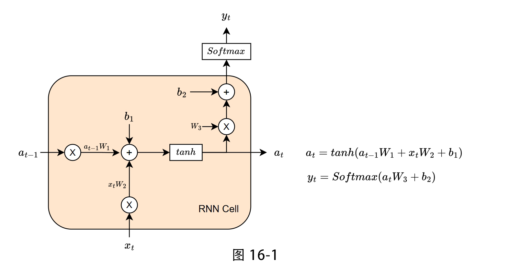
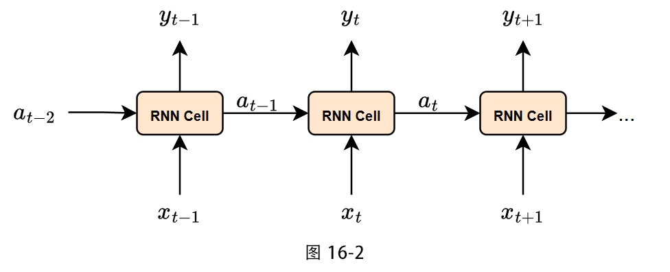
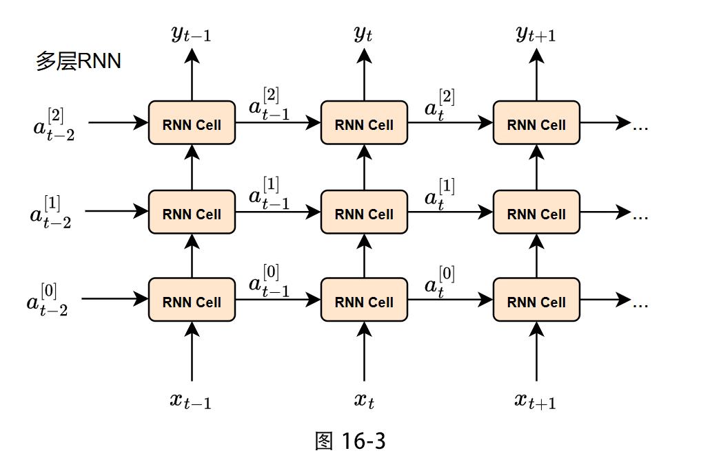
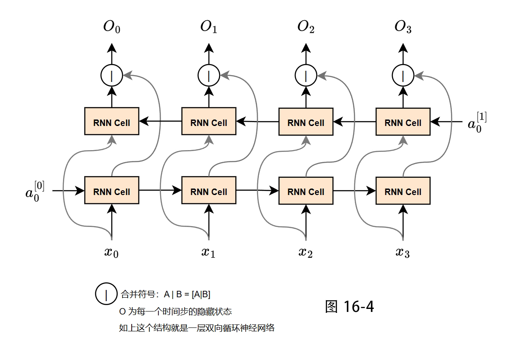
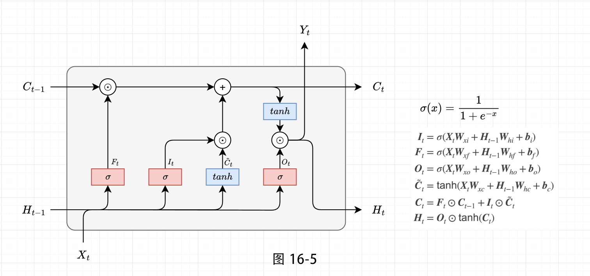
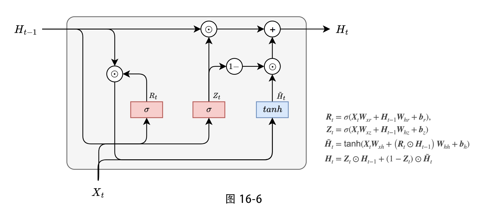

# 明日香 - Pytorch 快速入门保姆级教程(八)

`2026.03 | ming`

------

<div align="center">
  
</div>


## 十六. 循环神经网络层

> 这一章主要学习的是循环神经网络相关的 PyTorch 使用方法。如果你对 RNN 不感兴趣，完全可以跳过，不影响后面的阅读～不过要注意，读这一章之前，需要你先了解循环神经网络的基本原理哦。
>

### 16.1 RNN

RNN 在一个时间步内做的事情，可以用一个简单的公式来概括。PyTorch 中的 `nn.RNN` 遵循以下公式：
$$
h_t = \tanh(x_t W_{ih}^T + b_{ih} + h_{t-1} W_{hh}^T + b_{hh})
$$
一个 RNN 单元内部结构如图 16-1 所示，其中：

- $h_t$：当前时刻**更新后**的记忆。
- $h_{t-1}$：上一个时刻**保留下来**的记忆。
- $x_t$：当前时刻的**新输入**。
- $W_{ih}$ 和 $b_{ih}$：**输入权重**和**输入偏置**。它们的作用是告诉网络，当前的新输入 $x_t$ 有多重要，以及如何将其融入记忆中。
- $W_{hh}$ 和 $b_{hh}$：**隐藏权重**和**隐藏偏置**。它们的作用是告诉网络，上一时刻的记忆 $h_{t-1}$ 有多重要，以及如何将其保留下来。
- $\tanh$（双曲正切函数）：一个**激活函数**。你可以把它想象成一个“过滤器”或“压缩器”。它会将计算结果压缩在 -1 到 1 之间。这样做有两个好处：一是引入了非线性，让网络能学习更复杂的模式；二是防止记忆值变得无限大，让网络更稳定。



*注意：图 16-1 为了简单表示，使用的数学符号和  PyTorch 中稍有不同，所有的RNN图例使用 $a$ 来表示隐藏状态，官方使用 $h$ 来表示隐藏状态，其本质完全一致。*

如果把 RNN 按照时间的顺序展开，就会得到下面的样子（如图 16-2 所示）。图中的 RNN Cell 就是上图的 RNN 单元，它被反复调用，形成一条时间链。



上面展示的是单层 RNN 网络。如果将多个 RNN 单元纵向堆叠起来，就构成了多层 RNN 网络。图 16-3 展示了一个多层 RNN 按时间展开的形式：



**注意**：多层 RNN 中，向上一层传递的是隐藏状态 $a_t$，而不是每个 RNN 单元的输出 $y_t$。除了 RNN 之外，LSTM、GRU 等循环神经网络同样可以堆叠成多层结构。

为什么要设计多层的 RNN 网络呢？你可以把多层 RNN 想象成一个**多层的信息筛选网**：

- **第一层 RNN**：接收原始输入序列，并处理它，产生一系列隐藏状态 $a_t^{(1)}$。
- **第二层 RNN**：不再接收原始输入，而是把**第一层 RNN 的输出 $a_t^{(1)}$ 作为它的输入**，继续处理，产生更高层级的隐藏状态 $a_t^{(2)}$。
- 依此类推，每一层都在上一层提取出的特征基础上，进一步提取更抽象、更高级的模式。这种**层级化特征提取**能力，使得多层 RNN 在复杂序列任务中表现更好。

你可能会问：上面展示的 RNN 网络都是“从过去到未来”沿着时间正向传播，能不能“从尾巴到开头”进行反向传播呢？当然可以！这就是**双向循环神经网络**（Bidirectional RNN）。在双向 RNN 中，每个时间步都会同时考虑**过去**和**未来**的上下文信息：一个正向 RNN 从前向后处理序列，一个反向 RNN 从后向前处理序列，然后将两者的隐藏状态拼接起来作为最终输出。

**双向 RNN 的优势**在于，序列中的每个时间步都能“看到”完整的上下文，而不是仅仅依赖于之前的信息。这在许多任务中非常关键，例如：

- **情感分析**：判断一个句子的情感倾向时，句子末尾的否定词可能会反转前面部分的情感，双向结构能够捕捉这种跨长距离的依赖。
- **命名实体识别**：识别“Apple”是人名还是公司名，往往需要结合前后的词语才能准确判断。
- **机器翻译**：生成译文时，源语言句子中靠后的信息可能影响靠前的翻译结果。

不过，双向循环神经网络也有一些**局限性**，因此在某些场景下使用较少：

- **无法用于在线或实时任务**：因为它需要完整序列才能计算反向路径，所以不能像单向 RNN 那样逐个时间步处理输入。例如在语音识别中，实时转写要求边说话边输出，双向模型就难以满足。
- **参数量和计算量翻倍**：由于正向和反向各有一套参数，模型大小和训练时间都约为单向的两倍。
- **不适用于某些生成任务**：在语言模型（预测下一个词）这类任务中，未来信息本身不可用，强行使用双向会导致信息泄露。

双向循环神经网络的结构如图 16-4 所示：



以上就是 RNN 的基本介绍。当然，你可以把这里的 RNN 单元换成 LSTM 或 GRU 单元，它们都遵循类似的堆叠和双向扩展方式。

接下来我们来看看如何在PyTorch中使用RNN。PyTorch提供了两个相关模块：`nn.RNN` 和 `nn.RNNCell`。**我们主要讲解更常用的 `nn.RNN`，它会一次性将整个输入序列处理完，返回所有时间步的输出和最后一个隐藏状态，而不需要我们自己手动循环。** 如果你需要更精细地控制每个时间步的计算（比如在某些时间步之后做额外处理），则可以使用 `nn.RNNCell`，它只完成单个时间步的计算。

**`nn.RNN` 的初始化参数**

创建一个RNN层时，我们需要指定几个关键的参数：

- `input_size`: 输入数据的特征数。比如，在词向量中，每个词用一个100维的向量表示，那么 `input_size` 就是 100。
- `hidden_size`: 隐藏状态的特征数。也就是我们想用多少个数字来“记住”信息。这个值越大，网络的记忆能力和表达能力就越强，但计算量也越大。
- `num_layers`: RNN的层数。默认是1。你可以堆叠多个RNN层来构建更深的网络，以捕捉更复杂的模式。
- `batch_first`: 一个布尔值，决定输入和输出张量的维度顺序。**强烈建议设置为 `True`**，因为这样 `(batch, sequence, feature)` 的维度顺序更符合我们的直觉。
- `bidirectional`: 一个布尔值，决定是否使用双向循环RNN。如果设为 `True`，RNN会同时从序列的正向和反向两个方向读取数据。

理解了参数，我们来看看数据在RNN中是如何流动的。令 `batch_first=True`。

- **输入 (`input`)**: 形状为 `(N, L, H_in)`
  - `N`: 批大小（Batch Size），即同时处理几个独立的序列。
  - `L`: 序列长度（Sequence Length），即每个序列有多少个时间步。
  - `H_in`: 输入特征数（`input_size`）。
- **初始隐藏状态 (`h_0`)**: 形状为 `(D * num_layers, N, H_out)`，可选参数，不提供则默认为0。
  - `D`: 方向数。如果 `bidirectional=True`，则 `D=2`；否则 `D=1`。
  - `H_out`: 隐藏状态特征数（`hidden_size`）。
- **输出 (`output`)**: 形状为 `(N, L, D * H_out)`
  - 这个 `output` 包含了**每个时间步** `t` 的隐藏状态 `h_t`。
- **最终隐藏状态 (`h_n`)**: 形状为 `(D * num_layers, N, H_out)`
  - 这个 `h_n` 只包含了**最后一个时间步**的隐藏状态。对于多层RNN，它会包含每一层的最后一个时间步的状态。

下面我们通过具体的代码示例来加深理解。我们将分别展示**单层单向 RNN**、**多层单向 RNN** 以及**双向 RNN** 的使用，并验证输出形状与理论是否一致。（你可以自己尝试运行下面的部分代码，把输出矩阵打印出来看看自会明白）

```python
import torch
import torch.nn as nn

# ---------- 示例 1：单层单向 RNN ----------
# 参数：输入特征数=3，隐藏状态特征数=5，层数=1，batch_first=True，单向
rnn_1 = nn.RNN(input_size=3, hidden_size=5, num_layers=1, batch_first=True)

# 模拟数据：N=2（两个独立的序列），L=4（每个序列有4个项），H_in=3（每个项用3维向量表示）
input = torch.randn(2, 4, 3)

# 可选：手动创建初始隐藏状态。形状：(D*num_layers, N, H_out) = (1*1, 2, 5)
h0 = torch.randn(1, 2, 5)

# 前向传播
output, hn = rnn_1(input, h0)  # 如果不传h0，则使用默认的0

print(f"output 的形状: {output.shape}")  # torch.Size([2, 4, 5])
print(f"hn 的形状: {hn.shape}")          # torch.Size([1, 2, 5])
print(f"output 最后一个时间步与 hn 是否相等: {torch.allclose(output[:, -1, :], hn[0, :, :])}\n")


# ---------- 示例 2：多层单向 RNN ----------
# 参数：输入特征数=3，隐藏状态特征数=5，层数=3，batch_first=True，单向
rnn_2 = nn.RNN(input_size=3, hidden_size=5, num_layers=3, batch_first=True)

# 初始隐藏状态形状：(D*num_layers, N, H_out) = (1*3, 2, 5)
h0_2 = torch.randn(3, 2, 5)

output, hn = rnn_2(input, h0_2)

print(f"output 的形状: {output.shape}")  # 仍然是 torch.Size([2, 4, 5])，只输出最后一层的每个时间步
print(f"hn 的形状: {hn.shape}")          # 预期 torch.Size([3, 2, 5])，包含每一层最后一个时间步的状态
# 验证 output 最后一个时间步是否等于 hn 的最后一层
print(f"output 最后一个时间步与 hn 最后一层是否相等: {torch.allclose(output[:, -1, :], hn[-1, :, :])}\n")


# ---------- 示例 3：双向 RNN ----------
# 参数：输入特征数=3，隐藏状态特征数=5，层数=1，batch_first=True，双向
rnn_bi = nn.RNN(input_size=3, hidden_size=5, num_layers=1, batch_first=True, bidirectional=True)

# 初始隐藏状态形状：(D*num_layers, N, H_out) = (2*1, 2, 5)
h0_bi = torch.randn(2, 2, 5)

output, hn = rnn_bi(input, h0_bi)

print(f"output 的形状: {output.shape}")  # 预期 torch.Size([2, 4, 10])，因为双向会拼接两个方向的输出
print(f"hn 的形状: {hn.shape}")          # 预期 torch.Size([2, 2, 5])，hn[0] 是正向最后一层，hn[1] 是反向最后一层
print(f"output 的最后一个时间步（正向+反向）形状: {output[:, -1, :].shape}")  # (2,10)
print(f"正向最后一个隐藏状态形状: {hn[0, :, :].shape}")  # (2,5)
print(f"反向最后一个隐藏状态形状: {hn[1, :, :].shape}")  # (2,5)
```

细心的你可能已经发现，上面的 `nn.RNN` 模块只需要调用一次，就能自动完成整个序列的计算，非常方便。**这背后的原理是 `nn.RNN` 内部替你循环执行了每个时间步的计算。** 如果你想手动控制这个循环，比如在某个时间步后插入一个自定义操作，就可以使用更底层的 `nn.RNNCell`。

`nn.RNNCell` 是一个**单步**的RNN单元。它只完成一个时间步的计算：接收当前输入 $x_t$ 和上一时刻的隐藏状态 $a_{t-1}$，输出当前时刻的隐藏状态 $a_t$。你需要自己写一个 `for` 循环来遍历整个序列。虽然这样更灵活，但在大多数情况下，直接使用 `nn.RNN` 就已经足够高效和简洁了。如果你想学习RNNCell的使用方法，可以参考官方文档：https://docs.pytorch.org/docs/stable/generated/torch.nn.RNNCell.html

RNN优势在于其结构简单，计算效率高，特别是在处理**短序列**时表现非常出色。并且可以很方便地构建成双向（Bidirectional RNN），捕捉上下文信息。但是其缺陷同样大，理论上RNN可以记住很久以前的信息，但在实践中，由于“记忆”需要随着时间步不断被传递和压缩，越久远的信息就越容易被“冲淡”。因此，它很难处理需要依赖长距离信息的序列（比如一篇很长的文章）。另外在反向传播时，误差信号需要沿着时间步反向传播回去。当序列很长时，这个传播过程会非常漫长，导致梯度要么指数级地衰减到0（梯度消失），要么指数级地增长到无穷大（梯度爆炸）。梯度消失会让网络“忘记”早期输入的信息，梯度爆炸则会让训练过程变得极其不稳定。

正是由于这些局限性，后续才发展出了LSTM和GRU等更强大的变体。它们是RNN的“升级版”，通过引入“门控”机制，巧妙地解决了长期依赖和梯度问题。

### 16.2 LSTM

> 阅读这一节之前，建议先阅读 16.1 节，一些基础概念在 16.1 中已经介绍过，这里就不再重复说明。

LSTM 是一种特殊的 RNN，它通过引入 **门控机制**，让网络学会了“自主选择”：哪些旧信息应该被遗忘，哪些新信息值得被记住，哪些当前信息需要作为输出。这种设计使得 LSTM 在长序列上表现得更加稳定和强大。LSTM 由 Sepp Hochreiter 和 Jürgen Schmidhuber 在 1997 年提出，至今仍是序列建模领域的重要基石。其具体结构如图 16-5 所示：



LSTM 单元内部包含两条“记忆线”：

- **细胞状态（Cell State）$C_t$**：可以看作 **长期记忆**。它像一条传送带，贯穿整个时间链，信息在上面流动时只会有少量的线性交互，因此很容易保持不变。你可以把它想象成一本厚厚的笔记，重要的知识可以一直保留。
- **隐藏状态（Hidden State）$h_t$**：可以看作 **短期记忆**。它是当前时间步的输出，同时也作为下一时间步的输入之一。它就像你正在思考的“工作记忆”，会随时更新。

为了精准地维护这两条记忆线，LSTM 设计了三个 **门** 结构。每个门本质上是一个带有 Sigmoid 激活函数的全连接层，其输出是一个介于 0 到 1 之间的数值向量，用来控制信息可以“流过”的比例：

- 值 **接近 0** 表示“几乎全部遗忘/阻止”；
- 值 **接近 1** 表示“几乎全部保留/通过”。

$F_{t}$是**遗忘门**，它决定了：上一时刻的长期记忆 $C_{t-1}$ 中有多少信息需要保留到当前时刻。它的输入是上一时刻的隐藏状态 $h_{t-1}$ 和当前输入 $x_t$，通过 Sigmoid 函数得到一个遗忘向量 $F_t$。然后，将 $F_t$ 与上一时刻的细胞状态 $C_{t-1}$ 做逐元素相乘，这一步就像“划掉笔记中不再重要的内容”：$F_t$ 中为 0 的位置，对应的记忆会被清除；为 1 的位置，记忆则被完整保留。

$I_{t}$和$\tilde{C}_{t}$​的逐元素相乘为**输入门**，它决定了当前时刻的新信息中，有哪些值得被写入长期记忆。它由两部分组成：

- **输入门向量 $I_t$**：通过 Sigmoid 函数决定哪些位置的值需要更新。
- **候选细胞状态 $\tilde{C}_t$**：通过 $\tanh$ 函数（输出范围在 -1 到 1 之间）创建一个新的候选值向量，表示当前输入可能带来的新信息。

然后，将 $I_t$ 与 $\tilde{C}_t$ 逐元素相乘，得到“经过筛选的新信息”，这一步就像是“从新学到的知识中筛选出重要的部分，添加到笔记里”。

最后的结构$O_{t}$和$C_{t}$相乘就是**输出门**，它决定了当前时刻的长期记忆 $C_t$ 中，有多少信息需要作为当前时刻的隐藏状态 $h_t$（也就是短期记忆）输出。输出门首先根据 $h_{t-1}$ 和 $x_t$ 计算出一个输出向量 $O_t$，然后，将更新后的细胞状态 $C_t$ 通过 $\tanh$ 函数缩放到 $[-1, 1]$ 之间，再与 $O_t$ 逐元素相乘，得到当前时刻的隐藏状态 $h_t$。$h_t$ 既作为当前时刻的输出，也会被传递到下一个时间步参与计算。

在 PyTorch 中，`nn.LSTM` 的用法与 `nn.RNN` 非常相似，但输入输出中多了一个细胞状态（长期记忆）$c$。

**参数说明**

- `input_size`：输入数据的特征数。
- `hidden_size`：隐藏状态（短期记忆）的特征数。注意，这个值也是 LSTM 单元内部长期记忆 $C_t$ 的维度。
- `num_layers`：堆叠的 LSTM 层数，默认 1。
- `batch_first`：是否将 batch 放在第 0 维，强烈建议设为 `True`。
- `bidirectional`：是否双向，默认 `False`。
- `proj_size`：投影层大小，默认为 0（不启用）。不用管这个参数，基本用不到。

**输入输出形状**（令 `batch_first=True`）

- **输入**：`input` 形状为 `(N, L, H_in)`，其中 $N$ 是批量大小，$L$ 是序列长度，$H_{in}$ 是 `input_size`。
- **初始状态**：元组 `(h_0, c_0)`，每个形状为 `(D * num_layers, N, H_out)`。$D$ 是方向数（双向为 2，否则为 1），$H_{out}$ 是 `hidden_size`。如果不提供，默认为全零。
- **输出**：元组 `(output, (h_n, c_n))`
  - `output`：所有时间步的隐藏状态，形状 `(N, L, D * H_out)`。
  - `h_n`：最后一个时间步的隐藏状态（短期记忆），形状 `(D * num_layers, N, H_out)`。
  - `c_n`：最后一个时间步的细胞状态（长期记忆），形状 `(D * num_layers, N, H_out)`。

（你可以自己尝试运行下面的部分代码，把输出矩阵打印出来看看自会明白）

```python
import torch
import torch.nn as nn

# ---------- 示例 1：单层单向 LSTM ----------
lstm_1 = nn.LSTM(input_size=3, hidden_size=5, num_layers=1, batch_first=True)

# 模拟输入：N=2（2个序列），L=4（每个序列长度是4），H_in=3
x = torch.randn(2, 4, 3)

# 初始状态（可选）
h0 = torch.randn(1, 2, 5)   # (D*num_layers, N, H_out)
c0 = torch.randn(1, 2, 5)   # 同上

output, (hn, cn) = lstm_1(x, (h0, c0))  # 也可以不传初始状态，自动用0

print(f"output.shape: {output.shape}")   # (2, 4, 5)
print(f"hn.shape: {hn.shape}")           # (1, 2, 5)
print(f"cn.shape: {cn.shape}")           # (1, 2, 5)
print("output 最后一个时间步与 hn 是否相等：",
      torch.allclose(output[:, -1, :], hn[0, :, :]))  # True

# ---------- 示例 2：多层单向 LSTM ----------
lstm_2 = nn.LSTM(input_size=3, hidden_size=5, num_layers=3, batch_first=True)

# 初始状态形状： (D*num_layers, N, H_out) = (1*3, 2, 5)
h0_2 = torch.randn(3, 2, 5)
c0_2 = torch.randn(3, 2, 5)

output_2, (hn_2, cn_2) = lstm_2(x, (h0_2, c0_2))

print(f"output_2.shape: {output_2.shape}")   # (2, 4, 5)
print(f"hn_2.shape: {hn_2.shape}")           # (3, 2, 5)
print(f"cn_2.shape: {cn_2.shape}")           # (3, 2, 5)
print("output 最后一个时间步与 hn 最后一层是否相等：",
      torch.allclose(output_2[:, -1, :], hn_2[-1, :, :]))  # True

# ---------- 示例 3：双向 LSTM ----------
lstm_bi = nn.LSTM(input_size=3, hidden_size=5, num_layers=1,
                  batch_first=True, bidirectional=True)

# 初始状态形状： (D*num_layers, N, H_out) = (2*1, 2, 5)
h0_bi = torch.randn(2, 2, 5)
c0_bi = torch.randn(2, 2, 5)

output_bi, (hn_bi, cn_bi) = lstm_bi(x, (h0_bi, c0_bi))

print(f"output_bi.shape: {output_bi.shape}")   # (2, 4, 10) 因为双向拼接
print(f"hn_bi.shape: {hn_bi.shape}")           # (2, 2, 5)
print(f"cn_bi.shape: {cn_bi.shape}")           # (2, 2, 5)
```

**如果需要手动控制每个时间步**，可以使用 `nn.LSTMCell`，它只处理单个时间步。用法与 `nn.RNNCell` 类似，需要自己写循环遍历序列。

**LSTM优势**：

- 有效缓解梯度消失和梯度爆炸，能够处理较长的序列（通常可达 100 步左右）。
- 通过门控机制，能够自主选择保留或遗忘信息，表达能力更强。
- 在许多任务中（如机器翻译、语音识别、时间序列预测）表现出色。

**LSTM缺陷**：

- 参数量比普通 RNN 大得多（因为多了三个门），训练速度较慢。
- 对于非常长的序列（如几千步），仍然可能遇到记忆退化问题。

### 16.3 GRU

> 阅读这一节之前，建议先阅读 16.1 节，一些基础概念在 16.1 中已经介绍过，这里就不再重复说明。

虽然 LSTM 功能强大，但它的结构相对复杂，参数量较大，训练速度也偏慢。那么，有没有一种模型既能保留 LSTM 的长序列建模能力，又能更加轻量、高效呢？

2014 年，Cho 等人提出了 **GRU（Gated Recurrent Unit，门控循环单元）**。GRU 可以看作是 LSTM 的“精简版”，它将 LSTM 中的三个门合并为两个门，并去掉了独立的细胞状态（$C_t$），让隐藏状态 $h_t$ 同时扮演短期记忆和长期记忆的角色。这种设计使 GRU 的参数比 LSTM 减少约 **25%**，在大多数任务中，GRU 能够以更快的训练速度取得与 LSTM 相近的性能，因此成为平衡效率与效果的优选方案。GRU具体结构如图16-6所示：



简单来说，GRU 将 LSTM 的“遗忘”和“输入”门合并成一个 **更新门**，用来决定保留多少旧信息、加入多少新信息；同时保留了 **重置门**，用来决定忽略多少过去的记忆。这种结构让 GRU 既能捕捉长期依赖，又比 LSTM 更轻便。

关于GRU的具体设计思想就不在这里讨论了，想了解的可以自行AI查询。

`nn.GRU` 的用法与 `nn.RNN` 和 `nn.LSTM` 非常相似，唯一的区别是它不再需要细胞状态 $c$，只传递隐藏状态 $h$。

**初始化参数**

- `input_size`：输入特征数。
- `hidden_size`：隐藏状态特征数。
- `num_layers`：堆叠的 GRU 层数，默认 1。
- `batch_first`：是否将 batch 放在第 0 维，强烈建议设为 `True`。
- `bidirectional`：是否双向，默认 `False`。

**输入输出形状**（令 `batch_first=True`）

- **输入**：`input` 形状为 `(N, L, H_in)`，$N$ 是批量大小，$L$ 是序列长度，$H_{in}$ 是 `input_size`。
- **初始隐藏状态**：`h_0` 形状为 `(D * num_layers, N, H_out)`，$D$ 是方向数（双向为 2，否则为 1），$H_{out}$ 是 `hidden_size`。如果不提供，默认为全零。
- **输出**：元组 `(output, h_n)`
  - `output`：所有时间步的隐藏状态，形状 `(N, L, D * H_out)`。
  - `h_n`：最后一个时间步的隐藏状态，形状 `(D * num_layers, N, H_out)`。

```python
import torch
import torch.nn as nn

# ---------- 示例 1：单层单向 GRU ----------
gru_1 = nn.GRU(input_size=3, hidden_size=5, num_layers=1, batch_first=True)

# 模拟输入：N=2（2个序列），L=4（每个序列长为4），H_in=3
x = torch.randn(2, 4, 3)

# 初始隐藏状态（可选）
h0 = torch.randn(1, 2, 5)   # (D*num_layers, N, H_out)

output, hn = gru_1(x, h0)   # 也可以不传初始状态，自动用0

print(f"output.shape: {output.shape}")   # (2, 4, 5)
print(f"hn.shape: {hn.shape}")           # (1, 2, 5)
print("output 最后一个时间步与 hn 是否相等：",
      torch.allclose(output[:, -1, :], hn[0, :, :]))  # True

# ---------- 示例 2：多层单向 GRU ----------
gru_2 = nn.GRU(input_size=3, hidden_size=5, num_layers=3, batch_first=True)

h0_2 = torch.randn(3, 2, 5)   # (D*num_layers, N, H_out)
output_2, hn_2 = gru_2(x, h0_2)

print(f"output_2.shape: {output_2.shape}")   # (2, 4, 5)
print(f"hn_2.shape: {hn_2.shape}")           # (3, 2, 5)
print("output 最后一个时间步与 hn 最后一层是否相等：",
      torch.allclose(output_2[:, -1, :], hn_2[-1, :, :]))  # True

# ---------- 示例 3：双向 GRU ----------
gru_bi = nn.GRU(input_size=3, hidden_size=5, num_layers=1,
                batch_first=True, bidirectional=True)

h0_bi = torch.randn(2, 2, 5)   # (D*num_layers, N, H_out)  D=2
output_bi, hn_bi = gru_bi(x, h0_bi)

print(f"output_bi.shape: {output_bi.shape}")   # (2, 4, 10)
print(f"hn_bi.shape: {hn_bi.shape}")           # (2, 2, 5)
```

如果你需要精细控制每个时间步的计算，可以使用 `nn.GRUCell`，它只处理单个时间步，用法与 `nn.RNNCell` 类似，这里不再赘述。

**GRU优势**

- **参数更少**：比 LSTM 减少约 25% 的参数量，训练和推理更快。
- **结构更简洁**：易于理解和实现，在中小规模数据集上往往收敛更快。
- **性能优秀**：在大多数任务（如文本分类、情感分析、短时序列预测）中，GRU 能取得与 LSTM 相近甚至更好的效果。

**GRU缺陷**

- 对于**超长序列**（比如数百个时间步以上），LSTM 的独立细胞状态可能提供更稳定的记忆传递，因此 GRU 有时会略逊于 LSTM。
- 如果任务需要非常精细地控制记忆的遗忘、输入和输出，LSTM 的三门结构可能更具灵活性。

### 16.4 Transformer

严格来说，Transformer 并不属于循环神经网络（RNN）的范畴，但由于它同样被广泛用于序列建模任务（如文本、语音、时间序列等），并且在实际应用中几乎已经取代了传统 RNN 的地位，因此我们也在这里提一嘴，保持知识体系的完整性。

如果你目前对 Transformer 还一无所知，甚至觉得它的“自注意力”“多头机制”等概念听起来有些劝退，完全不用担心。我之前专门写过一篇非常详细的 Transformer 教程，从最朴素的动机出发，一步步推导出它的数学原理，保证能让你从原理层面完全理解透彻，并且还会教你使用 PyTorch 中的内置 Transformer 模型。

👉 教程链接：https://juejin.cn/post/7584013833993224226

### 16.5 一维卷积

在时序数据、文本、信号等**序列型数据**处理中，一维卷积是实用性极强的基础操作，也是衔接基础卷积和序列模型的核心知识点。很多初学者会有疑问：处理序列不是有LSTM、GRU这些专用模型吗？为什么还要用一维卷积？

其实很简单：如果序列长度过长，直接把完整序列送入LSTM，模型不仅训练速度慢，还容易出现梯度消失、长序列特征捕捉不到的问题。这时候一维卷积就能派上大用场，它相当于给序列做一次**高效预处理**：先通过卷积提取局部关键特征，把长序列压缩成短序列，再把精简后的特征送入LSTM，既能提升模型训练效率，又能优化最终效果，是工业界处理长序列任务的常用组合技巧。

二维卷积在高度和宽度上滑动，提取空间局部特征；而一维卷积只在 **时间轴（或序列长度轴）** 上滑动，提取序列的局部时序特征。

在 PyTorch 中，一维卷积的输入张量形状约定为：`(batch_size, in_channels, sequence_length)`

- **batch_size**：批次大小，即一次处理多少个独立的序列。
- **in_channels**：每个时间步的特征维度。
- **sequence_length**：序列的长度。

一维卷积的卷积核，只会在**sequence_length**维度上滑动，每滑动到一个局部窗口，就对窗口内所有输入通道的数值做加权求和，完成特征提取，最终生成新的输出特征。

输出张量的形状为：`(batch_size, out_channels, new_length)`

- **out_channels（输出通道数）**：就是卷积核的个数，想提取多少种局部特征，就设置多少个卷积核，由我们手动定义；
- **new_length（输出序列长度）**：由卷积核大小、步长、填充三个参数共同决定。

下面用代码演示一维卷积的定义和调用

```python
# 1. 构造模拟输入数据：严格遵循输入形状规则
# batch_size=2（2条序列），in_channels=3（每个时间步3个特征），sequence_length=10（序列长10）
input = torch.randn(2, 3, 10)  # 维度顺序：(批次, 输入通道, 序列长度) 

# 2. 定义一维卷积层
conv1d = nn.Conv1d(
    in_channels=3,   # 输入通道数，必须和输入数据的第二维完全一致
    out_channels=5,  # 输出通道数=卷积核数量，自定义设置，这里设置5个卷积核
    kernel_size=3,   # 卷积核大小：在时间轴上覆盖3个连续时间步
    stride=1,        # 步长：卷积核每次滑动1个位置，默认值为1
    padding=0,       # 填充：序列两端不填充0，默认值为0
)

# 3. 前向传播，得到输出
output = conv1d(input)
print(output.shape)  # 输出: torch.Size([2, 5, 8])

```

补充说明：`nn.Conv1d`的核心参数（卷积核大小、步长、填充、 dilation）和二维卷积`nn.Conv2d`完全通用，逻辑一模一样，学过二维卷积的同学可以直接迁移知识，不用重新记忆参数含义。

### 16.6 一维池化层

一维池化和二维池化的逻辑、作用完全一致，只是把滑动维度从二维空间换成了一维时间轴。

一维池化是典型的**下采样操作**，核心用途有三个：

1. 压缩序列长度，减少后续模型的计算量，加快训练和推理速度；
2. 保留序列局部区域的核心特征，过滤冗余噪声信息；
3. 防止模型过拟合，提升模型泛化能力。

关键特点：**池化层不改变通道数**，只压缩序列长度。

PyTorch 中提供了两种最基础的一维池化层：

- **`nn.MaxPool1d`**：在滑动窗口内取最大值，保留最显著的特征。
- **`nn.AvgPool1d`**：在滑动窗口内取平均值，平滑局部信息。

输入形状：`(batch_size, channels, sequence_length)`

输出形状：`(batch_size, channels, output_length)`

池化层不改变通道数（`channels` 保持不变），只压缩序列长度。

```python
# 创建一个输入：batch=2, 通道=3, 序列长度=10
x = torch.randn(2, 3, 10)

# 最大池化：窗口大小为3，步长为2
maxpool = nn.MaxPool1d(kernel_size=3, stride=2)
out_max = maxpool(x)
print("MaxPool1d 输出形状:", out_max.shape)  # torch.Size([2, 3, 4])

# 平均池化：窗口大小为3，步长为2
avgpool = nn.AvgPool1d(kernel_size=3, stride=2)
out_avg = avgpool(x)
print("AvgPool1d 输出形状:", out_avg.shape)  # torch.Size([2, 3, 4])
```

补充提示：`nn.MaxPool1d`和`nn.AvgPool1d`的参数（kernel_size、stride、padding）和二维池化层`nn.MaxPool2d`、`nn.AvgPool2d`完全通用，参数含义、设置逻辑一模一样，直接参考二维池化的参数经验设置即可，无需额外学习。

### 16.7 嵌入层

在自然语言处理（NLP）、推荐系统、分类任务等实战场景中，我们最常遇到一类特殊数据——**离散类别型数据**，比如文本中的单词、商品ID、用户标签、类别编号等。这类数据有个核心特点：**只有类别区分，没有数值大小意义**，比如单词“苹果”和“香蕉”没有谁大谁小的区别，只是不同类别，直接把这类数据的原始索引丢进神经网络，模型完全无法提取有效特征，训练效果会极差。

**嵌入层（Embedding Layer）** 就是专门用来解决这个问题的——它把离散的索引映射成稠密的向量，让神经网络能够“理解”这些类别之间的相似关系。在没接触嵌入层之前，很多人会想到用One-hot独热编码处理离散数据，我们用文本举例就能明白它的致命缺陷：

假设我们有一个包含10000个单词的词汇表，给每个单词分配唯一索引：“我”=13，“喜欢”=519，“吃”=3190，“苹果”=126。用One-hot编码的话，需要创建**长度等于词汇表大小**的向量，对应单词索引位置填1，其余全0。

这种方式看似简单，却有两个无法忽视的硬伤，完全不适合实战：

1. **极度冗余，内存开销爆炸**：词汇表越大，向量越稀疏，10000词的词汇表就需要10000维向量，大部分位置都是0，浪费大量显存和计算资源；
2. **无法表达语义关联**：One-hot向量两两正交，语义相近的词（比如“苹果”和“香蕉”）在向量空间里没有任何关联，模型学不到相似性，完全违背深度学习提取特征的核心逻辑。

PyTorch中的`nn.Embedding`，本质就是一个**可学习的查找表**，我们可以把它通俗理解成一本**深度学习专属词典**：

- 词典的“词条数量”：对应我们的离散类别总数（比如词汇表大小、商品总数）；
- 词典的“词条释义”：对应每个类别专属的稠密向量，向量维度我们手动指定；
- 学习逻辑：初始时所有向量都是随机初始化的，随着模型不断训练，嵌入向量会自动优化，最终实现**语义相近的类别，向量空间距离更近**，比如“苹果”和“香蕉”的向量会很接近，“苹果”和“电脑”的向量会距离很远。

`nn.Embedding`层本质就是一个简化版的无偏置的`nn.Linear`线性变换。但它的实现方式是“查找映射”，比直接用线性层处理离散数据效率高得多，更适合序列类离散数据的处理。

```python
# 定义嵌入层：核心参数只需要两个
# num_embeddings=10000：词典大小，共10000个离散索引（比如1000词词汇表）
# embedding_dim=100：每个索引对应100维稠密向量
embedding_layer = nn.Embedding(num_embeddings=10000, embedding_dim=100)

# 模拟文本序列索引：我喜欢吃苹果 → 对应索引[13, 519, 3190, 126]
indices = torch.tensor([13, 519, 3190, 126])
# 嵌入层映射：离散索引 → 稠密向量
embedded = embedding_layer(indices)
# 输出形状：序列长度4，向量维度100，这样就把每个词用了一个长度为100的稠密向量来表示
print("单序列嵌入输出形状:", embedded.shape)  # 输出: torch.Size([4, 100])
```

如果输入是二维的 `(batch_size, seq_len)`，输出就是三维的 `(batch_size, seq_len, embedding_dim)`。

```python
# 实战批次输入：一次性处理2个句子，每个句子5个单词
# 生成随机索引：范围0-999，形状(batch_size=2, seq_len=5)
batch_indices = torch.randint(low=0, high=10000, size=(2, 5))
print("批次输入索引形状:", batch_indices.shape)  # 输出: torch.Size([2, 5])

# 批次嵌入映射
batch_embedded = embedding_layer(batch_indices)
# 输出形状：批次2，序列长度5，向量维度100
print("批次嵌入输出形状:", batch_embedded.shape)  # 输出: torch.Size([2, 5, 100])
```

