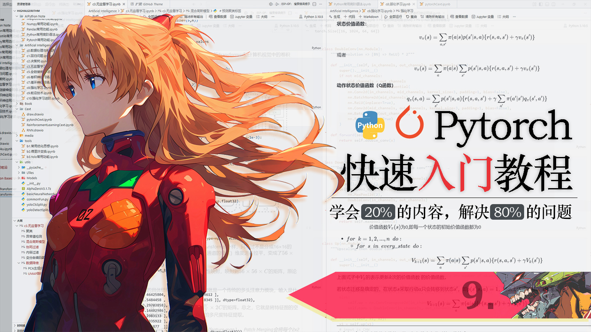

# 明日香 - Pytorch 快速入门保姆级教程(九)

`2026.03 | ming`

------

<div align="center">
  
</div>


## 十七. 优化器

神经网络的学习的目的是找到使损失函数的值尽可能小的参数。这是寻找最优参数的问题，解决这个问题的过程称为最优化（optimization）。遗憾的是，神经网络的最优化问题非常难。这是因为参数空间非常复杂，无法轻易找到最优解（无法使用那种通过解数学式一下子就求得最小值的方法）。而且，在深度神经网络中，参数的数量非常庞大，导致最优化问题更加复杂。

那什么是优化器？简单来说，**优化器就是深度学习模型训练的参数更新工具**。它的核心工作，就是基于损失函数计算出的参数梯度，按照预设的更新规则，一步步迭代调整模型的权重和偏置，引导参数朝着“损失持续降低”的方向移动，最终收敛到理想的最优参数组合。

刚接触深度学习时，我们最先接触、也是最基础的梯度下降算法，就是经典的**随机梯度下降（SGD）优化器**，它的参数更新公式是所有优化器的基础，具体形式如下：
$$
W \gets W - \eta \frac{\partial L}{\partial W}
$$

- **W**：代表神经网络的可训练参数，主要包括网络层的权重矩阵（Weight）和偏置向量（Bias），是整个模型需要学习的核心内容，直接决定模型的预测能力。
- **η**：读作Eta，代表**学习率（Learning Rate）**，是优化器的核心超参数，控制每一步参数更新的步长大小。
- **$\frac{\partial L}{\partial W}$**：代表损失函数L对参数W的偏导数，也就是参数梯度，它的符号决定了参数更新的方向，数值大小反映了当前参数对损失的影响程度。

如果你还不清楚什么是优化器，并且还不知道有哪些经典的优化器，还是建议先回顾经典入门书籍《深度学习入门：基于Python的理论与实现》（俗称鱼书）的第6.1章，后续内容默认大家已经掌握这部分基础理论，不再重复讲解底层知识。

本教程不会罗列所有优化器，只聚焦**工业界最常用、覆盖80%以上实战场景**的核心优化器，重点讲解它们的原理、Pytorch实现方式。大家完全不用担心优化器种类太多学不完，因为所有优化器的核心逻辑和使用范式都是相通的，只要掌握本节讲解的常用优化器，后续遇到任何新的优化器，都能快速上手。

### 17.1 完整训练与评估流程

在讲优化器之前，我们先来完整地看一遍模型训练与测试的全流程。这样一来，你就能清楚地看到优化器在整个训练过程中处于哪个位置、具体发挥了什么作用。

下面是一段典型的分类任务训练代码：

```python
device = torch.device('cuda:0') # 指定训练设备，有GPU则用cuda:0，无GPU可改为cpu
# 将模型参数加载入指定设备（GPU/CPU），model就是我们自定义的模型，详见本教程的12.3章
model.to(device)	
optimizer = xxx	# 定义并初始化优化器，后续章节会详细讲解各类优化器的用法
criterion = nn.CrossEntropyLoss()	# 创建损失函数，详见本教程第11章

def train(epoch):
    model.train()	# 将模型设置为训练模式
    train_loss = 0	# 初始化总训练损失
    # 遍历训练集加载器，分批读取数据和标签，DataLoader用法详见教程7.2章
    for data, label in train_loader:   
        # 将数据和标签迁移到指定设备（GPU/CPU），保证数据和模型在同一设备
        data, label = data.to(device), label.to(device)	
        optimizer.zero_grad()	# 将优化器中所有参数的梯度置零，防止梯度累积干扰训练
        # 模型前向传播，输入数据得到预测结果，model(xxx)会将xxx作为参数传入模型的forward方法并执行。
        output = model(data)	
        loss = criterion(output, label)		 # 计算预测值与真实值的损失
        loss.backward()			# 反向传播，计算所有参数的梯度值
        optimizer.step()		# 优化器更新模型参数，朝着减小损失的方向调整权重
        # 累加当前批次的总损失，乘以批次大小是为了后续计算全局平均损失
        train_loss += loss.item()*data.size(0)  		
    train_loss = train_loss/len(train_loader.dataset)   # 求一个epoch损失平均
	print('Epoch: {} \tTraining Loss: {:.6f}'.format(epoch, train_loss))
```

对应的，一个完整分类任务的验证评估过程如下所示

```python
def test():
    model.eval()  # 切换模型为评估模式
    valid_loss = 0  # 初始化验证损失
    correct = 0  # 初始化预测正确的样本数
    total = 0  # 初始化总样本数
    # 关闭梯度计算，节省显存、提升运算速度，验证阶段无需更新参数
    with torch.no_grad():
        # valid_loader 就是验证集的DataLoader加载器
        for data, label in valid_loader:
            data, label = data.to(device), label.to(device)
            output = model(data)
            # 下面就是通过模型得到的输出，计算这个模型的各种性能指标了，根据你的需要来写
            # 计算验证损失
            loss = criterion(output, label)
            valid_loss += loss.item() * data.size(0)
            # 统计预测正确的样本数
            _, pred = torch.max(output, dim=1)
            correct += torch.sum(pred == label).item()
            total += label.size(0)
    # 计算平均验证损失和准确率
    valid_loss = valid_loss / len(valid_loader.dataset)
    acc = correct / total
    # 打印验证结果
    print('Validation Loss: {:.6f} \tAccuracy: {:.4f}'.format(valid_loss, acc))
```

**注意**：`model.train()` 和 `model.eval()` 的作用是切换模型的行为模式

- **model.train()**：切换模型至**训练模式**，适用于训练阶段。此时模型会启用Dropout层（随机失活神经元防止过拟合）、BatchNorm层（使用批次内数据计算均值和方差），所有可训练参数处于可更新状态，保证训练过程的正则化效果。
- **model.eval()**：切换模型至**评估/推理模式**，适用于验证、测试和实际推理阶段。此时会关闭Dropout层（所有神经元正常工作）、BatchNorm层（使用训练阶段保存的全局均值和方差，不再更新）等，此时我们只需要通过 `with torch.no_grad():` 关闭梯度计算，节省显存和计算开销，然后前向传播得到预测结果，与真实标签比对即可，这样就是一个完整的推理/验证流程，保证模型输出稳定、提升运算速度，避免验证阶段干扰模型参数。

### 17.2 SGD

SGD全称是**随机梯度下降**（Stochastic Gradient Descent），它的核心逻辑非常简单：沿着损失函数下降的方向，一点点调整模型的参数，让损失值越来越小，最终让模型拟合数据。作为最基础的优化器，SGD不仅计算效率极高，占用资源少，更是所有进阶优化器的基准。

- **优点**：结构极简，计算速度快，内存占用小，兼容性极强，适用于绝大多数基础训练场景，是调试模型的首选基准优化器。
- **缺点**：单纯的标准SGD容易出现训练震荡，收敛速度偏慢，而且**必须手动调整学习率**，学习率设得太大容易跳过最优解，设得太小又会训练太慢。
- **改良技巧**：给SGD加上**动量（Momentum）**，就能有效减少震荡、加速收敛。

在PyTorch里，SGD优化器封装在`torch.optim.SGD`中，自带标准SGD和带动量的SGD两种模式。

| 参数           | 详细说明                                                     | 典型取值                       |
| :------------- | :----------------------------------------------------------- | :----------------------------- |
| `params`       | 需要优化的模型参数，**必选参数**，直接传入模型的所有参数即可，不用手动筛选。 | `model.parameters()`           |
| `lr`           | 学习率，也就是下山的步长，**必选参数**。这个参数是超参，需要手动设置，决定了参数更新的幅度。 | 0.01 - 0.1（基础场景首选0.01） |
| `momentum`     | 动量因子，给SGD加惯性，积累之前的梯度方向，抑制震荡，加速收敛。数值越大，惯性越强。 | 0.9（业界通用推荐值）          |
| `dampening`    | 动量抑制因子，用来削弱动量的惯性，一般保持默认值即可，不用改动。 | 0                              |
| `weight_decay` | 权重衰减系数，等价于L2正则化，用来防止模型过拟合，约束模型参数不要过大。 | 0.0001（即1e-4）               |
| `nesterov`     | 是否开启Nesterov动量，一种改良版动量，提前预判梯度方向，一般场景用不上，默认关闭即可。 | False                          |

```python
# 定义好模型(model)后，初始化SGD优化器
optimizer = torch.optim.SGD(model.parameters(), lr=0.01, momentum=0.9)
# 上面的model.parameters()就是模型中的所有可训练参数, 这里的意思就是将模型中的所有可训练参数交给SGD优化器，让其进行更新。
```

### 17.3 Adagrad

SGD用固定的学习率更新所有参数，看似简单粗暴，但在实际训练中藏着一个大问题：**所有参数共用一个学习率**。试想一下，模型里有的参数更新特别频繁，有的参数几乎不更新（比如稀疏数据里的冷门特征）。用同一个学习率，频繁更新的参数容易震荡不收敛，冷门参数又因为更新太少，迟迟学不到东西。

为了解决这个问题，研究者提出了**Adagrad**优化器，全称Adaptive Gradient（自适应梯度算法），它也是PyTorch自带的经典自适应学习率优化器，核心思路就是：**给每个参数量身定制学习率**，不再一刀切。

落到算法原理上，Adagrad会记录每个参数过往的梯度平方累加值，用这个累加值去缩放当前学习率。简单来说：

> 参数更新越频繁，梯度累加值越大，学习率就越小；参数更新越少，梯度累加值越小，学习率就越大。

而且Adagrad还有一个特点：**学习率会随着训练步数单调递减**。前期学习率大，参数更新快；后期学习率慢慢变小，训练趋于稳定，方便收敛。

**优点**

1. **自适应学习率**：无需手动精调学习率，算法自动分配，新手也能轻松用
2. **适配稀疏数据**：这是Adagrad最大的优势，对稀疏特征、低频特征友好，能有效捕捉冷门信息
3. 实现简单，计算量小，不会给训练增加太多负担

**缺点**

1. **后期学习率趋近于0，训练容易停滞**：因为梯度累加值只会变大不会减小，训练后期学习率会变得极小，参数几乎不再更新，导致模型提前收敛，达不到最优效果
2. 依赖初始学习率的选择，初始值设置不当也会影响训练效果

在PyTorch里，Adagrad封装在`torch.optim.Adagrad`中：

| 参数                        | 参数说明                                       | 典型取值                  |
| :-------------------------- | :--------------------------------------------- | :------------------------ |
| `params`                    | 需要优化的模型参数，**必选参数**               | `model.parameters()`      |
| `lr`                        | 初始学习率，**必选参数**，决定最开始的更新幅度 | 0.01（常用默认值）        |
| `lr_decay`                  | 学习率衰减系数，控制学习率下降速度             | 0（默认不开启衰减）       |
| `weight_decay`              | L2正则化系数，防止模型过拟合                   | 0（默认），常用1e-4、1e-5 |
| `initial_accumulator_value` | 梯度累加器初始值，避免分母为0，保证算法稳定    | 0.1（官方推荐值）         |

这里重点提一下学习率衰减公式，步数为 $t$ 时，学习率更新规则：
$$
\mathrm{lr}  \gets \frac{\mathrm{lr}}{1+(t-1) \cdot \mathrm{lr\_ decay} }
$$
如果把lr_decay设为0，公式里分母就等于1，相当于不开启额外衰减，只用算法自带的梯度累加衰减。

```python
optimizer = torch.optim.Adagrad(
    model.parameters(),  
    lr=0.01,           
    weight_decay=1e-4,  
    lr_decay = 0.5
)
```

### 17.4 Adam

单纯的SGD收敛速度慢、容易陷入局部最优，而Adagrad虽然解决了学习率自适应的问题，但随着训练步数增加，学习率会持续衰减，后期模型几乎无法继续更新，在复杂深度学习任务中局限性很明显。

本节要讲的**Adam优化器**，正是解决了前两类优化器痛点的“全能优化器”，也是目前**工业界、学术界深度学习任务的默认首选优化器**。作为深度学习从业者，不管是日常实验、项目落地还是论文复现，Adam都是我们使用率最高、容错率最强的优化工具。

Adam全称是**Adaptive Moment Estimation（自适应矩估计）**，从名字就能看出，它的核心是对梯度的矩进行自适应计算，本质上是**结合了动量法与RMSProp优化器的双重优势**，相当于把两大优化策略的优点融为一体，同时规避了各自的缺陷。

从技术层面来讲，Adam主要做了两件事：

1. 引入一阶矩估计：继承动量法的思想，累积历史梯度的移动平均值，让参数更新具备惯性，缓解梯度震荡，加快收敛速度；
2. 引入二阶矩估计：继承RMSProp的思想，累积历史梯度平方的移动平均值，实现学习率自适应，针对不同参数动态调整更新幅度，同时避免了Adagrad学习率持续衰减的问题。

也正是这种强强联合的设计，让Adam具备了极强的通用性，哪怕是深度学习新手，不用精调超参数，也能拿到不错的训练效果。简单来说：**当你不知道该选什么优化器的时候，直接用Adam大概率不会出错**。

在Pytorch框架中，Adam优化器封装在`torch.optim.Adam`模块下，使用逻辑和之前的SGD、Adagrad完全一致。

| 参数名称       | 参数含义                                                     | 典型取值/默认值                        |
| :------------- | :----------------------------------------------------------- | :------------------------------------- |
| `params`       | 需要优化的模型参数，必选参数，传入模型的可训练参数即可       | `model.parameters()`                   |
| `lr`           | 基础学习率，控制整体参数更新步幅，Adam对该参数敏感度较低     | 0.001（官方默认值，新手首选）          |
| `betas`        | 梯度一阶矩、二阶矩的滑动平均系数，对应β1、β2，分别控制动量与梯度平方累积力度 | (0.9, 0.999)（官方默认值）             |
| `eps`          | 数值稳定项，防止分母出现0，避免训练过程中梯度爆炸或计算报错  | 1e-8（默认值，无需修改）               |
| `weight_decay` | L2正则化系数，用于防止模型过拟合，无过拟合问题时可设为0      | 0.0（默认值），需正则化时设0.0001~0.01 |

```python
optimizer = torch.optim.Adam(
    model.parameters(),  # 模型可训练参数
    lr=0.001,            # 基础学习率
    weight_decay=0.001   # 加入L2正则化，缓解过拟合
)
```

### 17.5 RMSprop

Adagrad虽然实现了参数自适应调优，不用手动精细调节学习率，但它有一个致命短板：随着迭代次数增加，累积梯度平方会越来越大，导致学习率无限趋近于0，后期模型完全停止更新，收敛效果大打折扣。针对这个痛点，科研人员在Adagrad的基础上做了改进，推出了**RMSprop（均方根传播）**优化器。RMSprop改用**滑动平均**的方式，只保留近期梯度的平方信息，对过往的梯度信息做衰减处理，让累积值保持稳定，不会无限增大，从根源解决了学习率消失的问题。它保留了Adagrad的自适应优势，又完美解决了学习率单调下降的问题，成为了处理特殊数据、特殊网络结构的王牌优化器，也是深度学习里极为常用的自适应优化算法。

Adagrad会记录走过的所有路况，越往后步子越小，走到半路就彻底停下；

而RMSprop只会**记住近期的路况**，忘掉久远的爬坡痕迹，既能根据路况调整步幅，又不会越走越慢，始终保持稳定的前进速度，尤其擅长走崎岖不平、起伏多变的山路。

这种特性，让RMSprop特别擅长处理**非平稳目标**，最典型的就是循环神经网络RNN、LSTM处理的时序数据，比如文本、语音、时间序列，这也是它最出圈的适用场景。

在PyTorch里，RMSprop封装在`torch.optim.RMSprop`中，调用方式和其他优化器高度一致。

| 参数名称       | 参数含义                                          | 参数属性           | 典型取值                          |
| :------------- | :------------------------------------------------ | :----------------- | :-------------------------------- |
| `params`       | 需要优化的模型参数                                | 必选参数，无默认值 | `model.parameters()`              |
| `lr`           | 基础学习率，控制整体步幅大小                      | 可选参数           | 0.01（常用），也可设为0.001       |
| `alpha`        | 梯度平方的平滑常数/衰减系数，控制历史梯度遗忘速度 | 可选参数           | 0.99（默认值，通用首选）          |
| `eps`          | 数值稳定项，防止分母为0，避免计算报错             | 可选参数           | 1e-8（默认值，无需改动）          |
| `weight_decay` | L2正则化系数，防止模型过拟合                      | 可选参数           | 0（无正则），常用1e-4、1e-5       |
| `momentum`     | 动量因子，加入动量加速收敛，跳出局部最优          | 可选参数           | 0（无动量），常用0.9              |
| `centered`     | 是否对梯度做中心化处理，适用于特殊场景            | 可选参数           | False（默认值，普通任务无需开启） |

```python
optimizer = torch.optim.RMSprop(
    params=model.parameters(),  # 必选：模型参数
    lr=0.01,                    # 基础学习率
)
```

### 17.6 优化器的进阶用法

常用的优化器就讲这么多了，它们使用起来都非常简单，只要把模型的全部参数传进去就行了，但在实际工程落地、模型微调以及进阶训练中，我们往往会遇到更复杂的需求，常规的统一参数配置方式已经无法满足。

举几个最常见的实战问题：如果想要给模型不同层级设置**差异化学习率**，浅层网络用较大学习率，深层网络用较小学习率，该如何实现？在预训练模型微调时，想要冻结主干网络参数，只让少数顶层分类头或适配层参与更新，又该怎么操作？训练过程中一旦出现梯度过大，引发梯度爆炸导致训练崩溃，如何通过梯度裁剪把梯度约束在安全范围内？

本节就围绕这三个核心点，结合完整代码实例，讲解PyTorch优化器的高阶配置技巧。为了方便演示，我们先定义一个经典的HED边缘检测模型，后续所有操作都基于这个模型展开。

```python
class HED(nn.Module):
    def __init__(self):
        super(HED, self).__init__()
        # VGG-16 基础卷积层
        self.conv1 = nn.Sequential(
            nn.Conv2d(3, 64, 3, padding=1),nn.ReLU(),
            nn.Conv2d(64, 64, 3, padding=1),nn.ReLU(),
        )
        self.conv2 = nn.Sequential(
            nn.MaxPool2d(2, stride=2),
            nn.Conv2d(64, 128, 3, padding=1),nn.ReLU(),
            nn.Conv2d(128, 128, 3, padding=1),nn.ReLU(),
        )
        self.conv3 = nn.Sequential(
            nn.MaxPool2d(2, stride=2),
            nn.Conv2d(128, 256, 3, padding=1),nn.ReLU(),
            nn.Conv2d(256, 256, 3, padding=1),nn.ReLU(),
            nn.Conv2d(256, 256, 3, padding=1),nn.ReLU(),
        )
        self.conv4 = nn.Sequential(
            nn.MaxPool2d(2, stride=2),
            nn.Conv2d(256, 512, 3, padding=1),nn.ReLU(),
            nn.Conv2d(512, 512, 3, padding=1),nn.ReLU(),
            nn.Conv2d(512, 512, 3, padding=1),nn.ReLU(),
        )
        self.conv5 = nn.Sequential(
            nn.MaxPool2d(2, stride=2),
            nn.Conv2d(512, 512, 3, padding=1),nn.ReLU(),
            nn.Conv2d(512, 512, 3, padding=1),nn.ReLU(),
            nn.Conv2d(512, 512, 3, padding=1),nn.ReLU(),
        )

        # 侧输出层（5个）
        self.side1 = nn.Conv2d(64, 1, 1)
        self.side2 = nn.Conv2d(128, 1, 1)
        self.side3 = nn.Conv2d(256, 1, 1)
        self.side4 = nn.Conv2d(512, 1, 1)
        self.side5 = nn.Conv2d(512, 1, 1)

        # 上采样 + 融合层
        self.upscore2 = nn.ConvTranspose2d(1, 1, 4, stride=2, padding=1)
        self.upscore3 = nn.ConvTranspose2d(1, 1, 8, stride=4, padding=2)
        self.upscore4 = nn.ConvTranspose2d(1, 1, 16, stride=8, padding=4)
        self.upscore5 = nn.ConvTranspose2d(1, 1, 32, stride=16, padding=8)
        self.fuse = nn.Conv2d(5, 1, 1)

    def forward(self, x):
        # 前向传播
        hx1 = self.conv1(x)
        hx2 = self.conv2(hx1)
        hx3 = self.conv3(hx2)
        hx4 = self.conv4(hx3)
        hx5 = self.conv5(hx4)

        # 侧输出
        d1 = self.side1(hx1)
        d2 = self.upscore2(self.side2(hx2))
        d3 = self.upscore3(self.side3(hx3))
        d4 = self.upscore4(self.side4(hx4))
        d5 = self.upscore5(self.side5(hx5))

        # 融合输出
        fused = self.fuse(torch.cat([d1, d2, d3, d4, d5], dim=1))

        # Sigmoid 输出 0~1 概率图
        return (
            torch.sigmoid(d1),
            torch.sigmoid(d2),
            torch.sigmoid(d3),
            torch.sigmoid(d4),
            torch.sigmoid(d5),
            torch.sigmoid(fused),
        )
```

**不同层设置不同的学习率**

在模型训练中，统一学习率并非最优方案。对于预训练模型，浅层特征提取器已经学到通用特征，只需微调，适合用小学习率；而顶层自定义层是随机初始化的，需要快速收敛，适合用大学习率。即便没有预训练权重，给浅层、深层设置差异化学习率，也能让模型收敛更稳定，避免浅层参数震荡过大。

PyTorch优化器支持传入**参数组列表**，每个参数组可以独立配置学习率、权重衰减等超参数，实现分层学习率。核心思路是：按层级拆分模型参数，给不同参数组绑定专属lr，再传入优化器。

以下代码基于HED模型，实现分层学习率配置：将底层conv1-conv3设为小学习率，高层conv4-conv5设为中等学习率，侧输出层、上采样层和融合层设为大学习率，适配不同模块的训练需求。

```python
# 初始化模型
model = HED()

# 分组设置参数和学习率
params_group = [
    # 底层特征提取层，小学习率
    {'params': model.conv1.parameters(), 'lr': 1e-4},
    {'params': model.conv2.parameters(), 'lr': 1e-4},
    {'params': model.conv3.parameters(), 'lr': 1e-4},
    # 中层特征层，中等学习率
    {'params': model.conv4.parameters(), 'lr': 5e-4},
    {'params': model.conv5.parameters(), 'lr': 5e-4},
    # 顶层输出与融合层，大学习率
    {'params': model.side1.parameters(), 'lr': 1e-3},
    {'params': model.side2.parameters(), 'lr': 1e-3},
    {'params': model.side3.parameters(), 'lr': 1e-3},
    {'params': model.side4.parameters(), 'lr': 1e-3},
    {'params': model.side5.parameters(), 'lr': 1e-3},
    {'params': model.upscore2.parameters(), 'lr': 1e-3},
    {'params': model.upscore3.parameters(), 'lr': 1e-3},
    {'params': model.upscore4.parameters(), 'lr': 1e-3},
    {'params': model.upscore5.parameters(), 'lr': 1e-3},
    {'params': model.fuse.parameters(), 'lr': 1e-3},
]

# 初始化优化器，传入参数组，基础lr可不写，以分组lr为准
optimizer = torch.optim.Adam(params_group, weight_decay=1e-5)
```

这种方式灵活度极高，除了学习率，每个参数组还能单独配置权重衰减、动量等参数，完美适配精细化训练需求。

**参数冻结**

参数冻结是模型微调的核心技巧，尤其适用于预训练模型迁移学习。冻结参数后，对应层的权重不会参与反向传播更新，既能保留预训练学到的优质特征，又能减少计算量、加快训练速度，还能防止小数据集下过拟合。

PyTorch冻结参数的原理很简单：将参数的**requires_grad**设为False，关闭梯度计算，反向传播时不会计算这部分参数的梯度，优化器自然不会更新它们。通常我们会冻结主干特征提取网络，只训练顶层适配层。

以下代码演示冻结HED模型全部卷积主干，只训练输出、上采样和融合层：

```python
# 初始化模型
model = HED()

# 冻结主干卷积层，关闭梯度计算
model.conv1.requires_grad_(False)
model.conv2.requires_grad_(False)
model.conv3.requires_grad_(False)
model.conv4.requires_grad_(False)
model.conv5.requires_grad_(False)

# 只让顶层参与训练，开启梯度（默认开启，可省略）
model.side1.requires_grad_(True)
model.side2.requires_grad_(True)
model.side3.requires_grad_(True)
model.side4.requires_grad_(True)
model.side5.requires_grad_(True)
model.upscore2.requires_grad_(True)
model.upscore3.requires_grad_(True)
model.upscore4.requires_grad_(True)
model.upscore5.requires_grad_(True)
model.fuse.requires_grad_(True)

# 优化器只传入需要更新的参数，减少内存占用
optimizer = torch.optim.Adam(
    [param for param in model.parameters() if param.requires_grad],
    lr=1e-3
)
```

**梯度裁剪**

在训练深度网络、循环神经网络或者使用较大学习率时，很容易出现梯度爆炸问题。梯度爆炸会让参数更新步长过大，损失值飙升，直接导致训练崩溃。梯度裁剪就是解决这个问题的常用手段，它能强制把梯度值限制在一个预设范围内，防止梯度过大。

梯度裁剪的核心原理是：计算所有参数梯度的范数，若超出阈值，就按比例缩放梯度，使得梯度的L2范数（或无穷范数）不超过设定上限。PyTorch内置了便捷的梯度裁剪函数，无需手动计算，调用一行代码即可完成。

梯度裁剪的标准执行位置：**反向传播计算梯度后，优化器更新参数前**。常用裁剪方式有两种，一种是按L2范数裁剪（推荐），最常用；一种是按最大值裁剪，限制梯度绝对值。

```python
# 反向传播，计算梯度
optimizer.zero_grad()
loss.backward()

# 在这里进行梯度裁剪：这里使用的是L2范数裁剪，限制梯度L2范数最大值为1.0
torch.nn.utils.clip_grad_norm_(model.parameters(), max_norm=1.0, norm_type=2)

# 参数更新
optimizer.step()
```

`max_norm`常用取值:

- 常规 CV 模型、常规训练：**max_norm=1.0** 或 **2.0**（最通用，优先用这个）
- 训练 RNN/LSTM、深层网络、大学习率场景：**0.5~1.0**（更严格）
- 微调小模型、梯度稳定场景：**2.0~5.0**

`max_norm`设置技巧:

1. **默认先用 1.0**：适配绝大多数场景，不用反复调参
2. 观察损失值：损失突然飙升、出现 NaN，说明梯度爆炸，**调小 max_norm**（比如 0.5）
3. 训练太慢、收敛不动：说明梯度被过度压制，**调大 max_norm**（比如 2.0/3.0）
4. 不用设太大：超过 5.0 基本失去裁剪效果，等于没开

### 17.7 学习率调度器

在模型训练流程里，除了核心的优化器，还有一个至关重要的辅助工具——**学习率调度器**。它的核心作用是在训练过程中**动态调整学习率**，而非全程使用固定学习率，能有效加快模型收敛速度，防止模型在训练后期陷入局部最优解，还能避免因学习率过大导致的训练震荡、精度无法提升等问题，是提升模型最终性能的关键手段。

和优化器一样，学习率调度器也有多种成熟的实现策略，适配不同的训练场景和任务需求，其中最常用、最实用的三类分别是：**阶梯式衰减（StepLR）**、**余弦退火（CosineAnnealingLR）**，以及训练初期常用的**学习率预热（Warmup）**。

在工业级工程落地和顶会前沿研究中，**学习率调度策略的选型与调优，往往比优化器自身的参数微调更能决定模型的最终精度**。想要在CVPR、ICLR这类计算机视觉、机器学习顶会论文中，把基线模型（baseline）的准确率提升1%~2%，最直接、最高效的手段通常不是更换优化器，而是针对性设计一套适配任务的学习率调度方案，微调调度器参数带来的收益，远大于优化器调参。

但回归到入门实战和常规任务场景，大家不用过度纠结学习率调度器。对于简单数据集、基础模型训练，搭配Adam、SGD这类经典优化器，使用默认固定学习率，已经能满足绝大部分需求，完全没必要额外添加调度器。

本教程定位为快速入门、实用至上，因此不会讲解各类调度器。如果后续你投身科研、攻坚高精度模型，需要进一步钻研学习率调度策略，可以针对性查阅PyTorch官方文档、顶会论文和进阶实战教程，对学习率调度器进行深入学习。


## 十八. 模型参数与结构

### 18.1 模型参数的保存与加载

经过前17章的学习，相信大家已经掌握了从零构建并训练一个完整模型的方法。模型训练完成后，我们自然需要将其保存到本地，以便后续使用时可以直接加载，无需重新训练。

一个完整的 PyTorch 模型，本质上由两部分构成：

**模型结构**：即我们通过继承 `nn.Module` 编写的类，其中定义了网络的层次结构、每层的类型（如卷积层、全连接层）以及数据前向传播的流程。相关内容可参考本教程第 12.3 章。

**模型权重（参数）**：模型在训练过程中通过优化算法不断迭代更新得到的数值，是模型学习到的核心知识。

PyTorch 中常见的模型保存格式包括 `.pkl`、`.pt` 和 `.pth`。需要说明的是，**这三种后缀在日常使用中没有本质区别**，仅后缀名不同，读写方式与存储内容完全一致。大家任选一种即可，其中 `.pth` 格式在业内最为常用，辨识度也最高。

对应模型的两个组成部分，存储方式也分为两种：

- **方案一：保存整个模型（结构 + 权重）**
  这种方式非常不推荐，原因在于：保存的文件体积较大，兼容性差。若后续修改了模型类的代码，加载时会直接报错；不同 PyTorch 版本之间也容易出现不兼容的问题。
- **方案二：仅保存模型权重（推荐）**
  当前业界主流的做法是只保存模型权重。其优势十分明显：文件体积小，兼容性强。无论是更换运行环境还是调整模型结构细节，只要保证加载时的模型结构与训练时一致，都能稳定加载。此外，这种方式也非常便于迁移学习和断点续训。

**下面仅介绍如何保存模型权重：**

训练完成后，仅需一行代码即可将模型参数保存至本地文件。

```python
# 定义保存路径，后缀使用 .pth
save_path = "/home/user/model_weights.pth"
# 保存模型权重（仅保存参数），model 为训练好的模型实例
torch.save(model.state_dict(), save_path)
```

这样你就能在对应的地址下看到一个名为`model_weights.pth`的权重文件了。

模型权重有了，那如何加载这个模型权重并且使用它呢？加载权重分三步：**定义模型结构→加载权重→切换模式**。

特别注意：**必须首先创建与训练时完全一致的模型结构**，包括层数、层类型、输入输出维度等均不能改变，否则权重无法正确匹配，会引发错误。

```python
# 第一步：实例化模型结构（与训练时的类完全一致）
model = MyModel()

# 第二步：加载本地权重文件
model.load_state_dict(torch.load('/home/user/model_weights.pth'))

# 第三步：切换模型模式
model.eval()  # 推理模式：用于预测、测试，会关闭 dropout、batchnorm 等训练专用层
```

### 18.2 断点续训

在实际训练过程中，我们常会遇到以下情形：

- 模型训练耗时过长，因电脑关机或断电导致中断；
- 训练中途需要暂停以调整参数，希望之后能继续训练。

此时，仅保存模型权重已无法满足需求。我们需要 **保存更多关键信息**，从而实现断点续训，让训练能够从中断处无缝恢复，避免从头开始。

我们可以将模型权重、优化器状态、当前训练轮数、当前损失值，甚至学习率调度器的状态等，一并打包成一个字典，统一保存。

```python
# 假设训练至某一轮次，定义需要保存的所有信息
checkpoint = {
    # 当前训练轮数
    'epoch': current_epoch,
    # 模型权重
    'model_state_dict': model.state_dict(),
    # 优化器状态（包含学习率、动量等参数）
    'optimizer_state_dict': optimizer.state_dict(),
    # 当前损失值
    'loss': current_loss,
    # 可选：学习率调度器状态、数据集配置等
}

# 保存检查点文件
torch.save(checkpoint, 'checkpoint.pth')
```

加载检查点与加载权重类似，但需要从字典中分别提取各项信息，并逐一恢复到模型和优化器中。

```python
# 1. 实例化模型和优化器（与训练时完全一致）
model = MyModel()
optimizer = torch.optim.SGD(model.parameters(), lr=0.001)

# 2. 加载检查点文件
checkpoint = torch.load('checkpoint.pth')

# 3. 分别恢复各项参数
model.load_state_dict(checkpoint['model_state_dict'])
optimizer.load_state_dict(checkpoint['optimizer_state_dict'])

# 4. 恢复训练轮数和损失值
current_epoch = checkpoint['epoch']
current_loss = checkpoint['loss']

# 5. 切换为训练模式，继续训练
model.train()
...
```

通过这种方式，无论训练因何种原因中断，都能精准接续，极大节省训练时间，尤其适用于大模型或大规模数据集的训练场景。

### 18.3 模型结构分析

在深度学习工程实践中，无论是亲手搭建自定义模型，还是使用开源的预训练模型，模型结构分析都是一项核心基本功。大家通常会关注一系列关键问题：模型的网络层级是如何搭建的？每层的输入输出维度有何变化？模型总参数量有多少？模型保存后的文件占用多大存储空间？模型在训练、推理阶段会消耗多少显存与算力？想要理清这些问题，就离不开规范、细致的模型结构分析。

熟练掌握模型结构分析技巧，能为深度学习实操带来诸多便利：

- **理解模型设计**：清晰掌握模型的层级结构与数据流向，加深对网络设计思想的理解；
- **诊断模型问题**：快速发现维度不匹配、参数设置错误等问题，减少调试时间；
- **估算资源消耗**：预估模型的参数量、计算量（FLOPs）以及显存占用，为部署和训练的资源规划提供依据；
- **优化模型效率**：通过分析参数分布与计算热点，指导模型剪枝、量化等轻量化操作。

PyTorch 本身没有提供特别直观的模型可视化工具，但有一个非常轻量好用的第三方库——`torchinfo`，可以帮我们一键打印出模型的详细结构。

```bash
pip install torchinfo
```

```python
# 使用前导入：
from torchinfo import summary
```

`summary` 主要有两个参数：

- **model**：要分析的 PyTorch 模型；
- **input_size**：模型输入的尺寸（通常写作 `(batch_size, channels, height, width)`），用于模拟一次前向传播，从而自动统计各层输出形状与参数量。

接下来，我们用PyTorch官方自带的经典卷积神经网络模型**ResNet18**做实战演示，直观感受其结构组成。

```python
import torchvision.models as models

# 实例化 ResNet18 模型（不使用预训练权重）
resnet18 = models.resnet18()

# 查看模型结构，输入尺寸为 (3, 224, 224)
summary(resnet18, (3, 224, 224))
```

运行代码后，会输出格式清晰的模型结构报表，完整内容如下（部分重复层级已省略）：

```bash
=====================================================================================
Layer (type:depth-idx)                   Output Shape              Param #
=====================================================================================
ResNet                                   [1, 1000]                 --
├─Conv2d: 1-1                            [1, 64, 112, 112]         9,408
├─BatchNorm2d: 1-2                       [1, 64, 112, 112]         128
├─ReLU: 1-3                              [1, 64, 112, 112]         --
├─MaxPool2d: 1-4                         [1, 64, 56, 56]           --
├─Sequential: 1-5                        [1, 64, 56, 56]           --
│    └─BasicBlock: 2-1                   [1, 64, 56, 56]           --
│    │    └─Conv2d: 3-1                  [1, 64, 56, 56]           36,864
│    │    └─BatchNorm2d: 3-2             [1, 64, 56, 56]           128
│    │    └─ReLU: 3-3                    [1, 64, 56, 56]           --
│    │    └─Conv2d: 3-4                  [1, 64, 56, 56]           36,864
|    |    # .... 省略
│    │    └─BatchNorm2d: 3-47            [1, 512, 7, 7]            1,024
│    │    └─ReLU: 3-48                   [1, 512, 7, 7]            --
│    │    └─Conv2d: 3-49                 [1, 512, 7, 7]            2,359,296
│    │    └─BatchNorm2d: 3-50            [1, 512, 7, 7]            1,024
│    │    └─ReLU: 3-51                   [1, 512, 7, 7]            --
├─AdaptiveAvgPool2d: 1-9                 [1, 512, 1, 1]            --
├─Linear: 1-10                           [1, 1000]                 513,000
=====================================================================================
Total params: 11,689,512
Trainable params: 11,689,512
Non-trainable params: 0
Total mult-adds (G): 1.81
=====================================================================================
Input size (MB): 0.60
Forward/backward pass size (MB): 39.75
Params size (MB): 46.76
Estimated Total Size (MB): 87.11
=====================================================================================
```

- **Layer (type:depth-idx)**：以树形结构展示模型的层级关系，缩进表示模块嵌套，`depth-idx` 表示该层在递归结构中的深度与索引，方便定位。
- **Output Shape**：经过该层后输出张量的形状，其中 `[1, 1000]` 对应 `(batch_size=1, 类别数=1000)`，帮助我们检查维度是否符合预期。
- **Param #**：该层包含的可训练参数数量（如卷积核权重、BN 的缩放与偏移），`--` 表示该层无参数（如激活函数、池化层）。
- **Total params**：模型总参数量，这里是 **11.69M**，反映了模型容量。
- **Trainable / Non-trainable params**：分别表示可训练参数与冻结参数的数量，便于迁移学习时确认冻结设置是否生效。
- **Total mult-adds (G)**：模型一次前向传播所需的乘加操作总数（单位 G，即 $10^9$），是衡量计算复杂度的关键指标。
- **Input size (MB)**：单个输入样本占用的内存（例如 $3 \times 224 \times 224$ 的 float32 张量约 0.60 MB）。
- **Forward/backward pass size (MB)**：前向与反向传播过程中，中间激活值占用的总内存（与 batch size 相关）。
- **Params size (MB)**：模型参数本身占用的存储空间。
- **Estimated Total Size (MB)**：估算的模型加载与训练时总显存/内存需求，便于判断设备是否满足要求。

当然，除了`torchinfo`，还有很多优质的模型可视化技术，如下表所示，当你未来真正需要的时候可以自行学习。

| 工具名称        | 类型         | 核心优势                                                     | 适用场景                                         |
| :-------------- | :----------- | :----------------------------------------------------------- | :----------------------------------------------- |
| **torchview**   | Web (图形)   | 生成层次化的计算图，清晰展示数据流向，支持 RNN 展开/折叠     | 理解复杂模型结构（如带有跳连、嵌套的模型）       |
| **torchvista**  | Web (交互)   | 在 Notebook 中生成交互式图表，支持拖拽、缩放、点击查看参数，对错误容忍度高 | 模型调试、教学演示，需要动态探索模型细节         |
| **Netron**      | Web/桌面     | 跨框架支持，轻量级，无需代码，直接打开模型文件查看架构       | 快速检视已保存的模型文件（.pt, .pth, .onnx）     |
| **TensorBoard** | Web (仪表盘) | PyTorch 官方集成，不仅可看模型图，还能实时监控训练指标（损失、精度等） | 训练过程监控、对比实验、跟踪参数分布变化         |
| **Visdom**      | Web (实时)   | 专为 PyTorch 设计，支持实时推送数据并动态更新图表，适合远程监控 | 需要实时可视化训练数据（如动态曲线、图像）的场景 |
